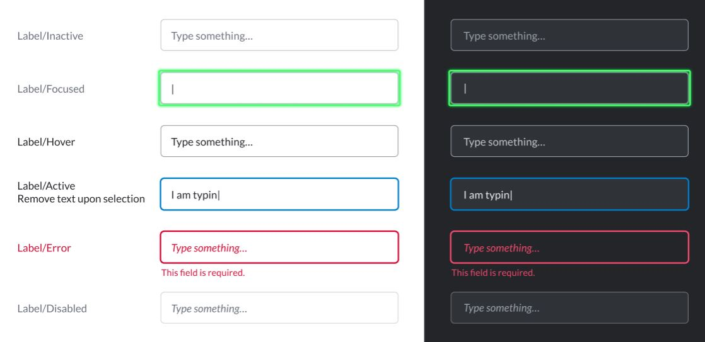

# Text Field

Text input fields are the most common elements in a form. Symphony provides two types of elements for text input fields: Text fields are for a single-line input; and [Text area](text-area.md) is for multi-line input.



## Attributes

| Attribute | Type | Required? | Description |
| :--- | :--- | :--- | :--- |
| `name` | String | Yes | Identifies the text field. |
| `placeholder` | String | No | Specifies a short hint that describes the expected value of the input field. |
| `required` | Boolean | No | If `true`, it specifies that the input field must be filled out before submitting the form. Accepted values; `true` and `false`. |
| `masked` | Boolean | No | If `true`, it creates a masked text field with hide/show options when its value is "true". For more information, refer to Masked Text Field. |
| `maxlength` | Integer | No | The `maxlength` attribute allows you to specify a maximum number of characters that the user can input. |
| `minlength` | Integer | No | The `minlength` attribute allows you to specify a minimum number of characters that the user can input. |
| `pattern` | String | No | Regex String to match for input validation |
| `pattern-error-message` | String | If `pattern` is defined, the `pattern-error-message` attribute is mandatory. | Error message returned to user if `pattern` parameter matches user input |

## Using Input Validation

With Symphony v20.6, bot developers can use Regex to validate `text fields` and `text areas` using the `pattern` and `pattern-error-message` attributes.  
For more information and examples, refer to [Regular Expressions - Regex](../regular-expressions-regex.md).

## Rules and Limitations

* The text field has a max number of 128 characters. For larger texts, use [Text Area](text-area.md).
* The text field cannot have children tags but it can have a default text \(initial value\) between the `<text-field></text-field>` tags. See Examples below for more details.
* Text fields are grouped at a max of 4 per row, depending on the screen size. For more information, refer to [Alignment of input texts](alignment-of-input-texts.md).
* You can add a **default text** in your text field by including it between the `<text-field></text-field>` tags. Note that unlike the `placeholder` text, the **default text** will be sent with the form if not edited by the user. Refer to Examples for more information.
* Input Validation - Pattern: the max length for all attributes is set to 256.

## Examples

The following examples show text fields being used as follows:

* The first text field \(id1\) is required and has a **placeholder text** \("Input some text..."\). It has also a **default text** \("With initial value"\) which was included between the `<text-field></text-field>` tags. Note that the default text will be sent to the payload given that it was not deleted before submitting the form.
* The second text field \(id2\) is required. It contains a placeholder text and does not have a default text.
* The third text field \(id3\) is not required. It contains a placeholder text and does not have a default text.
* The fourth text field \(id4\) is required. It does not contain a placeholder or a default text.
* The fifth text field \(id5\) contains a placeholder text and an input validation \(pattern\). The input validation automatically makes the field required.
* The sixth text field \(id6\) contains a placeholder text and a minimum and maximum length. The length configuration automatically makes the field required.




```markup
<messageML>
  <form id="form_id">
    <text-field name="id1" placeholder="Input some text..." required="true">With initial value</text-field>
    <text-field name="id2" placeholder="Only placeholder" required="true"/>
    <text-field name="id3" placeholder="Not required"/>
    <text-field name="id4" required="true"/>
    <text-field name="id5" placeholder="With regex validation" pattern="^[a-zA-Z]{3,}$" pattern-error-message="Text must contain at least 3 letters."/>   
    <text-field name="id6" minlength="3" maxlength="4" placeholder="Min and max length"/>
         
    <button type="reset">Reset</button> 
    <button name="example-button" type="action">Submit</button> 
  </form>
</messageML>
```



```javascript
[
    {
        "id": "q6eUgG",
        "messageId": "NowSKCnJJBdPOXQyoPQg8X___pQDVWaBbQ",
        "timestamp": 1563312167294,
        "type": "SYMPHONYELEMENTSACTION",
        "initiator": {
            "user": {
                "userId": 7078106482890,
                "firstName": "User",
                "lastName": "Bot",
                "displayName": "User",
                "email": "user_bot@symphony.com",
                "username": "user_bot"
            }
        },
        "payload": {
            "symphonyElementsAction": {
                "actionStream": {
                    "streamId": "0YeiA-neZa1PrdHy1L82jX___pQjntU-dA"
                },
                "formStream": {
                    "streamId": "YuK1c2y2yuie6+UfQnjSPX///pQEn69idA=="
                },
                "formMessageId": "5iSJ+faXx/23Jkehx3lpSn///pQDVedXdA==5587",
                "formId": "form_id",
                "formValues": {
                    "action": "example-button",
                    "id1": "test",
                    "id2": "test",
                    "id3": "",
                    "id4": "test",
                    "id5": "abc",
                    "id6": "abcd"
                }
            }
        }
    }
]
```



