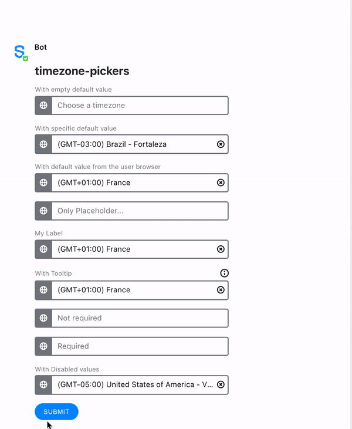

# Timezone Picker

Do you need users to pick a timezone as part of an interactive flow? With the Timezone Picker element, Symphony users can easily select a timezone from a selection of possible values. It is very accessible to users who can type in the country they wish to select the timezone from and the timezone picker filters the values appearing in the dropdown to the selection of possible matches \(see the examples in the bottom of the page\).

## MessageML tag

The Timezone Picker is represented by the **&lt;timezone-picker&gt;** tag, as you can see in the examples at the bottom of the page.

## Designs

You can see below the designs of the date picker.

For a list of all the available elements, refer to [Elements](./).

## Attributes


<table>
  <thead>
    <tr>
      <th style="text-align:left">Attribute</th>
      <th style="text-align:left">Type</th>
      <th style="text-align:left">Required?</th>
      <th style="text-align:left">Description</th>
    </tr>
  </thead>
  <tbody>
    <tr>
      <td style="text-align:left"><code>name</code>
      </td>
      <td style="text-align:left">String</td>
      <td style="text-align:left">Yes</td>
      <td style="text-align:left">Identifies the timezone picker.</td>
    </tr>
    <tr>
      <td style="text-align:left"><code>value</code>
      </td>
      <td style="text-align:left">
        <p>String</p>
        <p>Restricted to the <a href="https://en.wikipedia.org/wiki/List_of_tz_database_time_zones">tz database </a>timezones
          + empty string</p>
      </td>
      <td style="text-align:left">No</td>
      <td style="text-align:left">
        <p>Timezone displayed by default when the user receives or resets the form.</p>
        <p><em><br />Please note that if it is not defined by the developer, the value will be based on the user&apos;s browser data. You need to enter value=&quot;&quot; to enforce the timezone to be empty.</em>
        </p>
      </td>
    </tr>
    <tr>
      <td style="text-align:left"><code>title</code>
      </td>
      <td style="text-align:left">String (accepting <code>\n</code> for line break)</td>
      <td style="text-align:left">No</td>
      <td style="text-align:left">The description that will be displayed when clicking the tooltip icon
        located on top of the timezone picker Element.</td>
    </tr>
    <tr>
      <td style="text-align:left"><code>label</code>
      </td>
      <td style="text-align:left">String</td>
      <td style="text-align:left">Not required but it is recommend if <code>title</code> is defined</td>
      <td
      style="text-align:left">Definition of the label that will be displayed on top of the timezone
        picker Element.</td>
    </tr>
    <tr>
      <td style="text-align:left"><code>required</code>
      </td>
      <td style="text-align:left">Boolean (true or false)</td>
      <td style="text-align:left">No</td>
      <td style="text-align:left">If <code>true</code>, it specifies that a timezone must be picked by the
        user before submitting the form.</td>
    </tr>
    <tr>
      <td style="text-align:left"><code>placeholder</code>
      </td>
      <td style="text-align:left">String</td>
      <td style="text-align:left">No</td>
      <td style="text-align:left">
        <p>Specifies a short hint in the timezone picker input.
          <br />Accepts any string value but is overridden by the value if a value is
          defined: it will show only if value attribute is enforced to empty.</p>
        <p><em><br />Please note that a default placeholder is displayed as: &quot;Choose a timezone&quot;.</em>
        </p>
      </td>
    </tr>
    <tr>
      <td style="text-align:left"><code>disabled-timezone</code>
      </td>
      <td style="text-align:left">Array of Strings</td>
      <td style="text-align:left">No</td>
      <td style="text-align:left">
        <p>Items can be disabled from the timezone picker list so that the user cannot
          pick them.
          <br />See the examples below for more details.</p>
        <p></p>
        <p><b>Important</b>: single quote <code>&apos;</code> should wrap the array
          of strings</p>
        <p><em><br />Please note that if you want to propose only a list of a few timezones to the users, then a simple </em>
          <a
          href="dropdown-menu.md"><em>dropdown menu </em>
            </a><em>might be more adequate.</em>
        </p>
      </td>
    </tr>
  </tbody>
</table>

## Accessibility

For the purpose of accessibility, Symphony users can interact with the timezone picker with their keyboard:

* First, using "Tab" to enter the component
* Using "Enter", "Arrow-up", or "Arrow-down" to open the timezone list
* Using "Arrow-up" and "Arrow-down" to navigate in the list
* Using any key to erase the field and write in it
* Using "Enter" to set the selected timezone and close the list
* Using "Escape" to keep pre-selected value and close the list
* Finally using "Tab" to exit the component

## Rules and Limitations

* The max length of any timezone picker attribute is 256 except `disabled-timezone` attribute which max length is set to 1024 characters.
* All timezone values are displayed in English only
* You can add a **default timezone** in your text field by including it in the value parameter. Please note that unlike the `placeholder` text, the **default timezone** \(`value` attribute\) will be sent in the formReply when the form is submitted if not edited by the user.
* The timezone-picker will be allowed on the following versions of clients:
  * 20.14 for Client 2.0
  * 20.13 for Client 1.5


When the `value` attribute is not defined by the developer, please note that the **default value will be based on the user's browser data**.

_If you want however to force the default value to be displayed as empty for the user when sending the form, please enforce `value=""` in the messageML._


## Examples

The following examples show the timezone picker being used as follows:

* The first timezone-picker \(_init_\) shows how to display an **empty** timezone-picker \("With empty default value"\). Note in the messageML sent that value was enforced to empty with `value=""`.
* The second timezone-picker \(_specific\_value_\) shows how to display, by default, a **value specifically** chosen by the developer. Note that the default value would have been sent to the payload if it had not been deleted before submitting the form. You can see how users can remove a pre-selected value from the timezone-picker, thanks to the cross on the right side of the input.
* The third timezone-picker \(_default\_value_\) shows how to display, by **default**, **the user browser timezone value**. Note that the default value is sent to the payload when submitting the form.
* The fourth timezone-picker \(_placeholder_\) shows how a **placeholder text** \("Only Placeholder"\) is displayed in the timezone-picker. Please note the placeholder text is not sent in the payload if no value has been chosen by the enduser.
* The fifth timezone-picker \(_label_\) shows how a **label text** \("My Label"\) is displayed.
* The sixth timezone-picker \(_tooltip_\) shows how a **title text** \("My Tooltip/n With a second line"\) is inserted in the UI under the \(i\) icon, and how the text entered in the title parameter is displayed when the enduser clicks on the icon.
* The seventh timezone-picker \(_noreq_\) shows how a user can interact with a **non-required** field. Even if the field is empty \(only a placeholder text is present but does not count as a value\), it does not prevent the enduser from submitting the form.
* The eighth timezone-picker \(_req_\) shows the behaviour of the unique **required** field of the form, which cannot be submitted in case it is not filled; an error is displayed under the field in case the user submits the form with this field as empty.
* The ninth timezone-picker \(_disabled_\) shows how users interact with **disabled** values from the timezone-picker.





```markup
<messageML>
  <form id="form_id">
    <h2>timezone-pickers</h2>
      <timezone-picker name="init" value="" label="With empty default value" />
      <timezone-picker name="specific_value" value="America/Fortaleza" label="With specific default value" />
      <timezone-picker name="default_value" label="With default value from the user browser"/>
      <timezone-picker name="placeholder" placeholder="Only Placeholder..." value="" />
      <timezone-picker name="label" label="My Label" />
      <timezone-picker name="tooltip" label="With Tooltip" title="My Tooltip\n With a second line" />
      <timezone-picker name="noreq" placeholder="Not required" value="" />
      <timezone-picker name="req" required="true" placeholder="Required" value="" />
      <timezone-picker name="disabled" label="With Disabled values" value="America/Indiana/Vincennes" disabled-timezone='["America/Detroit", "America/Indiana/Marengo", "America/Indiana/Petersburg"]' />
      <button name="timezone-picker">Submit</button>
  </form>
</messageML>
```



```
[
    {
        "id": "0taiHA",
        "messageId": "6nZt52ETzcAeuTJKukhrxH___ofZ7Yl-bQ",
        "timestamp": 1615546447489,
        "type": "SYMPHONYELEMENTSACTION",
        "initiator": {
            "user": {
                "userId": 13056700580887,
                "firstName": "Thibault",
                "lastName": "Chays",
                "displayName": "Thibault Chays (DevX3)",
                "email": "thibault.chays@symphony.com",
                "username": "thibault.chays"
            }
        },
        "payload": {
            "symphonyElementsAction": {
                "stream": {
                    "streamId": "tp3eVYR3ZTyW7K7vmsmgYX___oq6-yN5dA",
                    "streamType": "ROOM"
                },
                "formMessageId": "Lj_jvoJ-UFtR3yHS2T3lPn___ofZ9beJbQ",
                "formId": "form_id",
                "formValues": {
                    "action": "timezone-picker",
                    "init": "",
                    "specific_value": "",
                    "default_value": "Europe/Paris",
                    "placeholder": "",
                    "label": "Europe/Paris",
                    "tooltip": "Europe/Paris",
                    "noreq": "",
                    "req": "Europe/London",
                    "disabled": "America/Indiana/Vincennes"
                }
            }
        }
    }
]
```



## Versions and Compatibility

| Main features introduced | Client release | Backward client-compatibility behavior \(e.g. external rooms\) | Agent needed to parse message sent by the bot |
| :--- | :--- | :--- | :--- |
| Initial release | 20.14 | ? | 20.12 |

## Annexe: list of values in the timezone

The possible values of the timezone-picker are restricted to the **Canonical values** only of the [tz database](https://en.wikipedia.org/wiki/List_of_tz_database_time_zones).

Please note in the examples above that the values are displayed to users according to the following rules:

* The country name only is displayed if there is only 1 timezone value in it \(see Israel\)
* A list of cities are displayed under their country title if this country owns different timezones \(see United States of America\)

