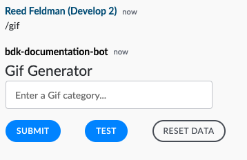
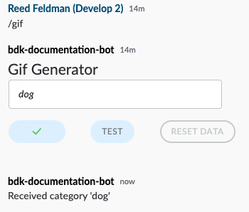

# Building an Interactive Bot using the BDK 2.0 for Java

## Prerequisites

### Complete the BDK 2.0 Bot Configuration guide:


[configure-your-bot-for-bdk-2.0-java.md](../../configuration/configure-your-bot-for-bdk-2.0-java.md)


## 1. Dive into the Code

The BDK 2.0 is a library of tools and intelligent API bindings that provides an ultra simplified configuration and authentication setup, intuitive message and room management, customizable message templating, and a new activities API that makes it easy to facilitate bot workflows.  The BDK 2.0 and bot project generated by the Symphony Bot Generator makes it super easy to get started! &#x20;

To begin let's open up the code generated for you by the Symphony Bot Generator in your favorite IDE.  Navigate to the `BotApplication.java` file:&#x20;



```java
package com.symphony.java;

import com.symphony.bdk.core.SymphonyBdk;
import com.symphony.bdk.core.service.datafeed.RealTimeEventListener;
import com.symphony.bdk.core.service.message.model.Message;
import com.symphony.bdk.gen.api.model.V4Initiator;
import com.symphony.bdk.gen.api.model.V4UserJoinedRoom;
import com.symphony.bdk.template.api.Template;

import org.slf4j.Logger;
import org.slf4j.LoggerFactory;

import static com.symphony.bdk.core.config.BdkConfigLoader.loadFromClasspath;
import static com.symphony.bdk.core.activity.command.SlashCommand.slash;
import static java.util.Collections.emptyMap;
import static java.util.Collections.singletonMap;

/**
 * Simple Bot Application.
 */
public class BotApplication {

  /** The Logger */
  private static final Logger log = LoggerFactory.getLogger(BotApplication.class);

  public static void main(String[] args) throws Exception {

    // Initialize BDK entry point
    final SymphonyBdk bdk = new SymphonyBdk(loadFromClasspath("/config.yaml"));

    // Register a "slash" activity
    bdk.activities().register(slash("/gif", false, context -> {
        Template template = bdk.messages().templates().newTemplateFromClasspath("/templates/gif.ftl");
        bdk.messages().send(context.getStreamId(), Message.builder().template(template).build());
    }));

    // Register a "formReply" activity that handles the Gif category form submission
    bdk.activities().register(new GifFormActivity(bdk.messages()));

    // Subscribe to 'onUserJoinedRoom' Real Time Event
    bdk.datafeed().subscribe(new RealTimeEventListener() {

      @Override
      public void onUserJoinedRoom(V4Initiator initiator, V4UserJoinedRoom event) {
        final String userDisplayName = event.getAffectedUser().getDisplayName();
        Template template = bdk.messages().templates().newTemplateFromClasspath("/templates/welcome.ftl");
        bdk.messages().send(event.getStream(),
            Message.builder().template(template, singletonMap("name", userDisplayName)).build());
      }
    });

    // finally, start the datafeed read loop
    bdk.datafeed().start();
  }
}
```



Let's take a closer look at the code responsible for sending Symphony Elements in our BotApplication.java:

```java
// Register a "slash" activity
bdk.activities().register(slash("/gif", false, context -> {
    Template template = bdk.messages().templates().newTemplateFromClasspath("/templates/gif.ftl");
    bdk.messages().send(context.getStreamId(), Message.builder().template(template).build());
}));

// Register a "formReply" activity that handles the Gif category form submission
bdk.activities().register(new GifFormActivity(bdk.messages()));
```

Here we are using the Activities API to register a new slash command that listens to "/gif".  To learn more about creating your own slash commands or how to leverage the Activities API, continue [here](../../../developer-tools/developer-tools/bdk-2.0-java/#activities-api). If an incoming message contains ("/gif), the bot builds a new message template which is provided out of the box for you:



```markup
<messageML>
    <h2>Gif Generator</h2>
    <form id="gif-category-form">

        <text-field name="category" placeholder="Enter a Gif category..."/>

        <button name="submit" type="action">Submit</button>
        <button name="test" type="action">Test</button>
        <button type="reset">Reset Data</button>

    </form>
</messageML>

```



The above freemarker template contains messageML that represents a Symphony Element. To learn more about Symphony Elements, continue [here](../../messages/overview-of-messageml/symphony-elements-1/). When a message is sent to the bot containing "/gif" the following Symphony Element is sent to the user in the conversation or stream in context:



Bots need someway to capture the data submitted within this form.  Bots can easily do so by registering a new type of Activity class:

```java
// Register a "formReply" activity that handles the Gif category form submission
bdk.activities().register(new GifFormActivity(bdk.messages()));
```

Open up your `GifFormActivity` class.  Here you will see that `GifFormActivity` extends the `FormReplyActivity` class.  A form activity is only triggered when an end-user replies or submits an _Elements_ form.  To learn more about creating your own `FormReplyActivity` classes, continue [here](../../../developer-tools/developer-tools/bdk-2.0-java/#form-activities).

```java
public class GifFormActivity extends FormReplyActivity<FormReplyContext> {

  private final MessageService messageService;

  public GifFormActivity(MessageService messageService) {
    this.messageService = messageService;
  }

  @Override
  public ActivityMatcher<FormReplyContext> matcher() {
    return context -> "gif-category-form".equals(context.getFormId())
        && "submit".equals(context.getFormValue("action"));
  }

  @Override
  public void onActivity(FormReplyContext context) {
    final String category = context.getFormValue("category");
    final String message = "<messageML>Received category '" + category + "'</messageML>";
    this.messageService.send(context.getSourceEvent().getStream(), Message.builder().content(message).build());
  }

  @Override
  protected ActivityInfo info() {
    return new ActivityInfo().type(ActivityType.FORM)
        .name("Gif Display category form command")
        .description("\"Form handler for the Gif Category form\"");
  }
}
```

Inside of the `GifFormActivity` class you will see an `ActivityMatcher matcher()` method:&#x20;

```java
@Override
  public ActivityMatcher<FormReplyContext> matcher() {
    return context -> "gif-category-form".equals(context.getFormId())
        && "submit".equals(context.getFormValue("action"));
  }
```

Using the `context` variable, your bot can access information about the context of the form submission including the form values and the form Id.  To learn more about using `FormReplyActivities`, continue [here](../../../developer-tools/developer-tools/bdk-2.0-java/#form-activities).

Inside of the `matcher()` function, the bot is performing a validation check.  If the `formId` of the submitted form is equal to `"gif-category-form"`, then the bot calls the `onActivity()` trigger function and executes its business logic.  If there is not a match, the bot does nothing and continues to listen for incoming events.  As we see in our `gif.ftl` template above, the `formId` matches, so the following `onActivity()` trigger function executed:

```java
@Override
  public void onActivity(FormReplyContext context) {
    final String category = context.getFormValue("category");
    final String message = "<messageML>Received category '" + category + "'</messageML>";
    this.messageService.send(context.getSourceEvent().getStream(), Message.builder().content(message).build());
  }
```

## 2.  Run your Bot

Run your bot and execute the following to see it in action:



## 3.  Next Steps

Above, we showed you a simple example of how to leverage the BDK 2.0 Symphony Elements to build an interactive bot.  To understand more advanced usage of the BDK 2.0, continue on to our dedicated BDK 2.0 Certification course:


[Broken link](broken-reference)

