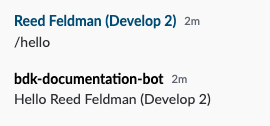

# Building a Chatbot using the BDK 2.0

## Prerequisites

### Complete the BDK 2.0 Bot Configuration guide:



## 1. Dive into the Code

BDK 2.0 is a library of tools and intelligent API bindings that provides an ultra simplified configuration and authentication setup, intuitive message and room management, customizable message templating, and a new activities API that makes it easy to facilitate bot workflows.  The BDK 2.0 and bot project generated by the Symphony Bot Generator makes it super easy to get started!  

To begin let's open up the code generated for you by the Symphony Bot Generator in your favorite IDE.  Navigate to the `BotApplication.java` file: 


Note:

As you can see below on line 32, we are leveraging the Activities API to register a slash command \("/gif"\).  While this functionality is provided out of the box, we will be building a new datafeed listener to keep it simple at first.  For a more in depth look at the provided activity and Activities API, continue [here](../../../developer-tools/developer-tools/bdk-2.0/#activities-api).   




```java
package com.symphony.java;

import com.symphony.bdk.core.SymphonyBdk;
import com.symphony.bdk.core.service.datafeed.RealTimeEventListener;
import com.symphony.bdk.core.service.message.model.Message;
import com.symphony.bdk.gen.api.model.V4Initiator;
import com.symphony.bdk.gen.api.model.V4UserJoinedRoom;
import com.symphony.bdk.template.api.Template;

import org.slf4j.Logger;
import org.slf4j.LoggerFactory;

import static com.symphony.bdk.core.config.BdkConfigLoader.loadFromClasspath;
import static com.symphony.bdk.core.activity.command.SlashCommand.slash;
import static java.util.Collections.emptyMap;
import static java.util.Collections.singletonMap;

/**
 * Simple Bot Application.
 */
public class BotApplication {

  /** The Logger */
  private static final Logger log = LoggerFactory.getLogger(BotApplication.class);

  public static void main(String[] args) throws Exception {

    // Initialize BDK entry point
    final SymphonyBdk bdk = new SymphonyBdk(loadFromClasspath("/config.yaml"));

    // Register a "slash" activity
    bdk.activities().register(slash("/gif", false, context -> {
        Template template = bdk.messages().templates().newTemplateFromClasspath("/templates/gif.ftl");
        bdk.messages().send(context.getStreamId(), Message.builder().template(template).build());
    }));

    // Register a "formReply" activity that handles the Gif category form submission
    bdk.activities().register(new GifFormActivity(bdk.messages()));

    // Subscribe to 'onUserJoinedRoom' Real Time Event
    bdk.datafeed().subscribe(new RealTimeEventListener() {

      @Override
      public void onUserJoinedRoom(V4Initiator initiator, V4UserJoinedRoom event) {
        final String userDisplayName = event.getAffectedUser().getDisplayName();
        Template template = bdk.messages().templates().newTemplateFromClasspath("/templates/welcome.ftl");
        bdk.messages().send(event.getStream(),
            Message.builder().template(template, singletonMap("name", userDisplayName)).build());
      }
    });

    // finally, start the datafeed read loop
    bdk.datafeed().start();
  }
}
```



To build a conversational workflow, add the following datafeed listener \(`onMessageSent`\) to your main bot class:

```java
bdk.datafeed().subscribe(new RealTimeEventListener() {
      @Override
      public void onMessageSent(V4Initiator initiator, V4MessageSent event) {
        if (event.getMessage().getMessage().contains("/hello")){
          bdk.messages().send(event.getMessage().getStream(), String.format("<messageML>Hello %s </messageML>", initiator.getUser().getDisplayName()));
        }
      }
    });
```

The above snippet is listening for all incoming messages that contain "/hello".  To see a full list of datafeed listeners provided by the BDK 2.0, navigate [here](../../../developer-tools/developer-tools/bdk-2.0/#datafeed-management).  If the message received by the bot contains "/hello", the bot will respond by sending a message to the stream or conversation in context.  Run your bot and let's see it in action:



As you can see, it's super easy to access the message, room, and user context from an incoming event.  The `V4Initiator` and `V4MessageSent` classes provide convenience methods that make it easy to orchestrate workflows.  For a more detailed overview of how to leverage the BDK 2.0's message, room, and user management classes, continue [here](../../../developer-tools/developer-tools/bdk-2.0/#user-message-and-room-management).

## 2.  Next Steps

Above, we showed you a simple example of how to leverage the BDK 2.0 to build a conversational bot.  To see more advanced usage of the BDK 2.0 in order to build complex financial workflows, continue on to our dedicated BDK 2.0 Certification course:

