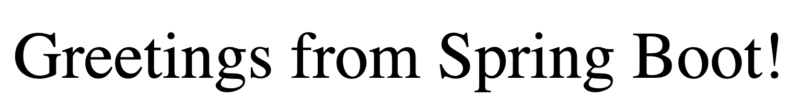
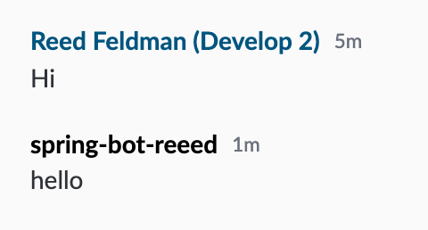

# Building a Headless Bot using the BDK 2.0

## Prerequisites

### Complete the BDK 2.0 Bot Configuration guide:


### Spring Boot Integration

Note that for this tutorial, we've configured our bot project using the Spring Boot integration provided out of the box by the BDK 2.0.  When generating your bot using the Symphony Bot Generator, simply select 'Spring Boot' when prompted to 'Select Your Framework'.



[configure-your-bot-for-bdk-2.0.md](../../configuration/configure-your-bot-for-bdk-2.0.md)


## 1. Dive into the Code

BDK 2.0 is a library of tools and intelligent API bindings that provides an ultra simplified configuration and authentication setup, intuitive message and room management, customizable message templating, and a new activities API that makes it easy to facilitate bot workflows.  The BDK 2.0 and bot project generated by the Symphony Bot Generator makes it super easy to get started! &#x20;

To begin let's open up the code generated for you by the Symphony Bot Generator in your favorite IDE.  Navigate to the `BotApplication.java` file:&#x20;



```java
package com.symphony.java;

import org.springframework.boot.SpringApplication;
import org.springframework.boot.autoconfigure.SpringBootApplication;

@SpringBootApplication
public class BotApplication {

    public static void main(String[] args) {
        SpringApplication.run(BotApplication.class, args);
    }
}
```



Notice how our `BotApplication` class is very simple.  The idea is you have Component classes (annotated by `@Component`) that do the bulk of the work (see the generated `GifSlashHandler` , `GifFormActivity`, and `OnUserJoinedRoomListener` classes) while the main entry point is meant to really simple.  The initialization of your bot project and auto-wiring of your beans (component classes) is taken care of by the BDK 2.0 Spring Boot stater through the `@SpringBootApplication` annotation.

The following Component class, for example, is provided out of the box by the BDK 2.0 and Symphony Bot Generator:

```java
package com.symphony.java;

import com.symphony.bdk.core.activity.command.CommandContext;
import com.symphony.bdk.core.service.message.MessageService;
import com.symphony.bdk.core.service.message.model.Message;
import com.symphony.bdk.spring.annotation.Slash;
import com.symphony.bdk.template.api.Template;

import org.springframework.stereotype.Component;

@Component
public class GifSlashHandler {

  private final MessageService messageService;
  private final Template template;

  public GifSlashHandler(MessageService messageService) {
    this.messageService = messageService;
    this.template = messageService.templates().newTemplateFromClasspath("/templates/gif.ftl");
  }

  @Slash(value = "/gif", mentionBot = false)
  public void onSlashGif(CommandContext context) {
    this.messageService.send(context.getStreamId(), Message.builder().template(this.template).build());
  }
}
```

To learn more about the BDK 2.0's Spring Boot Integration continue [here](../../../developer-tools/developer-tools/bdk-2.0/#springboot-integration) or to our dedicated BDK 2.0 Developer Certification course where you will learn in depth about how to build bots using the BDK 2.0 and Spring Boot:


[Broken link](broken-reference)


## 2.  Adding your own Functionality

For our headless bot workflow, we will create a RESTful Web Service that is able to handle HTTP GET/POST requests and read its JSON body payloads. Creating and bootstrapping our RESTful service is super easy since our bot application is already an integrated Spring Boot project.  To get started, lets define a simple `RestController` class for our bot:



```java
package com.symphony.java;

import com.symphony.bdk.gen.api.model.V4Message;
import org.springframework.web.bind.annotation.*;
import com.symphony.bdk.core.service.message.MessageService;


@RestController
public class HelloController {

    @GetMapping("/")
    public String index() {
        return "Greetings from Spring Boot!";
    }

}
```



Here we annotate our class with the `@RestController`annotation, and use the `@GetMapping` annotation to map the HTTP GET request from our base path to a specific handler method, `index()`.

Go ahead and start your bot application, and navigate to [https://localhost:8080](https://localhost:8080) in a web browser of you choice.  You should see the following displayed in your browser:



Now that we have a basic RESTful service setup, let's add some Symphony specific functionality.  Specifically, let's create another handler method that handles the following POST request and sends a message into a specific conversation or stream:

```java
curl -X POST \
  http://localhost:8080/notification/{streamId} \
  -H 'Content-Type: application/json' \
  -d '{"message":"<messageML>Hello</messageML>"}'

```

&#x20; To create this handler method, let's add to our existing `HelloController` class:

```java
package com.symphony.java;

import com.symphony.bdk.gen.api.model.V4Message;
import org.springframework.web.bind.annotation.*;
import com.symphony.bdk.core.service.message.MessageService;


@RestController
public class HelloController {

    private final MessageService messageService;

    public HelloController(MessageService messageService) {
        this.messageService = messageService;
    }

    @GetMapping("/")
    public String index() {
        return "Greetings from Spring Boot!";
    }

    @PostMapping("/notification/{streamId}")
    public V4Message postNotificationMessage(@PathVariable(value="streamId") String id, @RequestBody Notification notification){
        return messageService.send(id, notification.getMessage());
    }

}

```

* **Line 11**: Inject the BDK's provided `MessageService` (this is the equivalent as `bdk.messages()`)
* **Line 13-15**: Initialize `HelloController` with an instance of `MessageService`.&#x20;
* **Line 22-25**: Create another handler method, `postNotificationMessage()` for a POST request to "/notification/{streamId}"

The `postNotificationMessage()` handler expects a `streamId` path parameter and also a `Notification` (message)  as a part of the request body. &#x20;

Now the only missing detail here is that we do not have the `Notification` Java class into which the incoming JSON will be mapped by Spring Framework's `@RequestBody` annotation. To do so, create the following POJO:

```java
public class Notification {

    private String message;

    public String getMessage() {
        return message;
    }
}
```

Now, Spring will create an instance of `Notification` Java class, and will set object properties with the values specified in the JSON body. &#x20;

Run your bot once more and identify a streamID to use. &#x20;


To easily identify a streamID, create an IM conversation with your bot, and type a message.  Click on the timestamp next to the sender or recipients username and copy the streamID presented in the side panel.  For this exercise you must also encode your streamID. &#x20;

StreamID before encoding: n6Xl9xAZpvsJdaVPSZq8h3///omhaFQfdA==

StreamID after encoding: n6Xl9xAZpvsJdaVPSZq8h3\_\_\_omhaFQfdA

For more information on encoding your streamID, continue [here](../../messages/overview-of-messageml/#message-identifiers).


Send the following POST request using either curl or postman:

```java
curl -X POST \
  http://localhost:8080/notification/n6Xl9xAZpvsJdaVPSZq8h3___omhaFQfdA \
  -H 'Content-Type: application/json' \
  -d '{"message":"<messageML>hello</messageML>"}'

```

You should see the following in your designated stream or chatroom:



## 3.  Next Steps

Above, we showed you how to leverage the BDK 2.0 and the Spring Boot integration to build a headless bot.  To see more advanced usage of the BDK 2.0 and Spring Boot, continue on to our dedicated BDK 2.0 Developer Certification course:


[Broken link](broken-reference)

