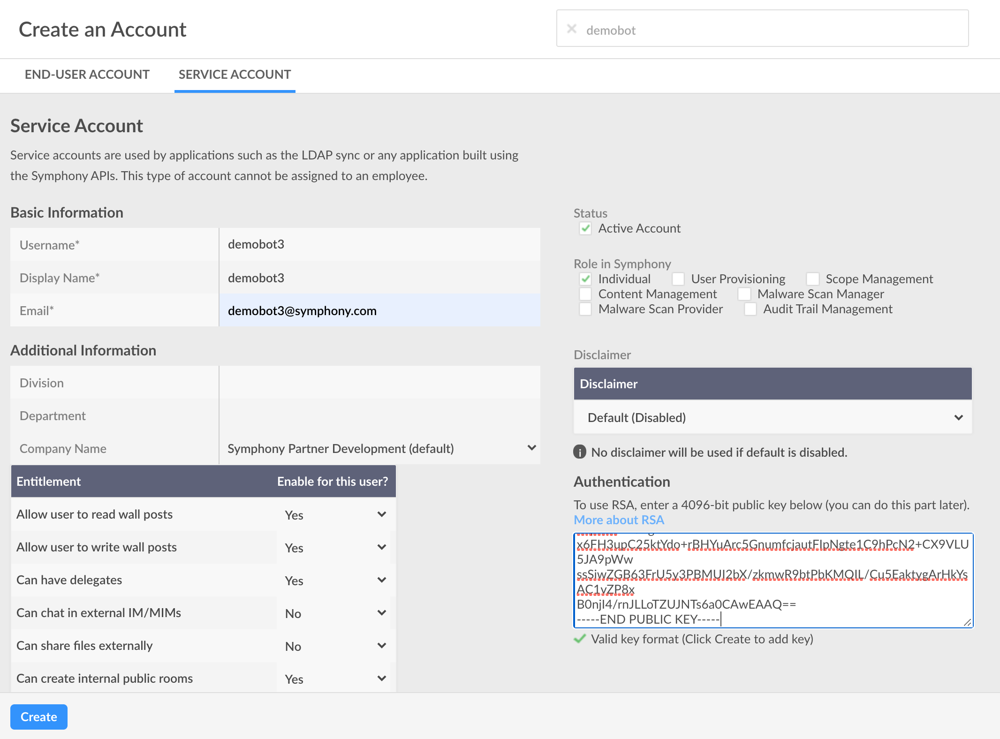
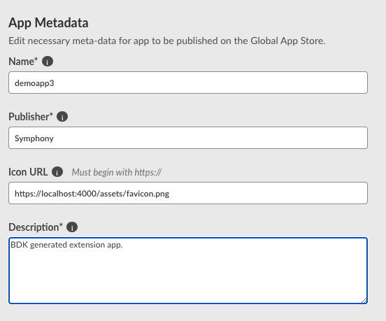
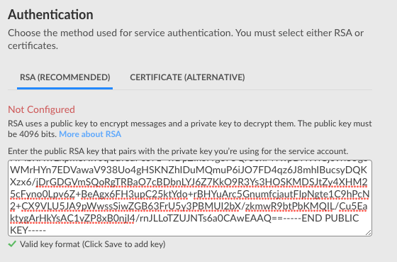
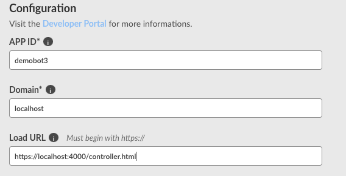

# Configure your App for BDK 1.0 Development

The following tutorial is a configuration guide for building authenticated extension apps using the Symphony BDK and the CLI Tool.

### Prerequisites

* Node
* Yarn
* Java 8
* Maven 3
* Git

#### Install Yarn:

```text
$ npm i -g yarn
```

#### Install the BDK

```text
$ npm i -g symphony-bdk-cli
```

#### Confirm all the dependencies are met:

```text
$ symphony-bdk-cli --check-dependencies
```

### 1.  Generate your Bot \(App Backend\)

Since we are configuring our app to be able to perform app authentication, our app must have a dedicated backend. Bots generated from the BDK are configured to easy act as your app's backend with minimal setup. As the developer all you have to do is share a unique appID and RSA private key across both your app's frontend and your app's backend \(generated bot\). Luckily the BDK CLI tool takes care of all of this setup:

To generate a new Bot project, enter the following:

```text
$ symphony-bdk-cli --bot
```

This will prompt with you a number of questions about your Bot and Pod configuration. Type in your bots metadata, use arrows to scroll, and press enter to move onto the next prompt.


Note: You will need to enter and record a unique app ID. This appID will be shared across your app's backend, frontend and will be registered on the pod itself. In this case, our appID is demobot3


```text
✔ All Dependencies are met!
Setting up a new Bot application
Please answer the following questions
? What's the bot project name? (required) demobot3
? What's the bot username? (required) demobot3
? What's the bot email address? (required) demobot3@symphony.com
? What's the base package? (required) com.symphony
? do you have an existing extension app?, if so what is the application ID decla
red in Symphony? demobot3
? Please Provide the Symphony Pod address this bot will serve develop2.symphony.
com
✔ Boilerplate accessed
✔ Boilerplate Installed
⠋ Generating bot RSA keys
Generating RSA private key, 4096 bit long modulus
.................++
......................................++
✔ Keys generated.
⠋ Installing dependencies  ✔ Ran install dependencies
✔ Installing dependencies
Project ready DONE
********************************************************************************************
Please find below the bot public key, it must be added to the bot user account
please visit: https://developers.symphony.com/restapi/docs/rsa-bot-authentication-workflow to learn more.
********************************************************************************************
-----BEGIN PUBLIC KEY-----
MIICIjANBgkqhkiG9w0BAQEFAAOCAg8AMIICCgKCAgEAvoCIUbiP/IXzgt1KVW0T
Z4VPQSm6n0ESCNTnBg8F35rWEE8dc615X2488T70/suCvb2J4YJcPb5kH+Ztw+Zv
Su7RxDzl0zBQMT3PKo0bNfr3XCLgXfzK1AP4Ed0nPZjGUuai4v8L6efLq8wMakIh
3DW0aVelW56E//KOOQN7EmpO/ryI2jdKB5zvzqbH9K9xHm7HNuHD7Witz27fyNp6
sZEYdFYgl2A119U1c/b6G+BhYxQn4LwkYmLbxRrHYd8Er8JDQ1i0W4B2gLkHGAPX
i2nT6L9JvhlxsvquR5OTsYeaIkPPT7ZM3flhC86VLD0VRLFMmi1aykLROkNMbRNw
Expm3Xw0qCuTedPco7z+wDpZIkorYge75Qr60xMYwpDHWlGjcVri55gcWMrHYn7E
DVawaV938Uo4gHSKNZhIDuMQmuP6iJO7FD4qz6J8mhIBucsyDQKXzx6/jDrGDGVm
SQoRgTRBaO7cBDbnLYJ6Z7KkO9R3Ys3HOSKMDSJtZy4XHM25cFyno0Lpv6Z+BeAg
x6FH3upC25ktYdo+rBHYuArc5GnumfcjautFIpNgte1C9hPcN2+CX9VLU5JA9pWw
ssSiwZGB63FrU5y3PBMUI2bX/zkmwR9btPbKMQIL/Cu5EaktygArHkYsAC1vZP8x
B0njI4/rnJLLoTZUJNTs6a0CAwEAAQ==
-----END PUBLIC KEY-----
```

Upon completion, the BDK CLI tool has created a public/private RSA key pair, a configuration and requirements file, as well as some default commands/datafeed event listeners.

## 2.  Configure your Bot on the Pod

Once you have your generated Bot scaffold, the next step is to configure your Bot user:

Ensure that you or your admin has created a corresponding service account on the admin portal of your Symphony Pod. Additionally, you must upload the generated public key onto the service account created.

Copy the entire contents of this public key including the dashes on either side, and handoff to your system admin or upload directly to the pod and click save:


Note: The Bot username and Bot email address entered to the CLI tool must match exactly the Basic Information shown in the Pod below.




Click 'Create' and open your generated Bot code in your favorite Java IDE and navigate to the bot-config.json file:

```text
{
  "sessionAuthHost": "develop2.symphony.com",
  "sessionAuthPort": 443,
  "keyAuthHost": "develop2.symphony.com",
  "keyAuthPort": 443,
  "podHost": "develop2.symphony.com",
  "podPort": 443,
  "agentHost": "develop2.symphony.com",
  "agentPort": 443,
  "appId": "demobot3",
  "appPrivateKeyPath": "certs/",
  "appPrivateKeyName": "demobot3_privatekey.pkcs8",
  "botPrivateKeyPath": "certs/",
  "botPrivateKeyName": "demobot3_privatekey.pkcs8",
  "botUsername": "demobot3",
  "authTokenRefreshPeriod": "30",
  "authenticationFilterUrlPattern": "/secure/",
  "showFirehoseErrors": false,
  "connectionTimeout": 45000,
  "botEmailAddress": "demobot3@symphony.com"
}
```

Confirm that the sessionAuthHost, keyAuthHost, and agentHost matches the correct Pod, Key Manager, and Agent endpoints respectfully. Additionally, confirm that the botUsername, and botEmailAddress matches the information entered in the admin portal on the Pod.

## 3.  Generate you App \(App Frontend\)

To generate a new App project, enter the following:

```text
$ symphony-bdk-cli --app
```

This will prompt with you a number of questions about your app and Pod configuration. Type in your app's metadata, use arrows to scroll, and press enter to move onto the next prompt.


Note: You will need to enter the unique app ID entered before. In this case, our appID is demobot3


```text
✔ All Dependencies are met!
This tool will guide you through the process to create an extension app template
Please answer the following questions
? What's the project name? (required) demoapp3
? What's the app Id? (required) demobot3
? What's your company name? (required) Symphony
? For running the app connected to the Backend, what's the backend ID? demobot3
? Please give a brief description of this extension app A sample extension app b
uilt on top of the BDK
✔ Boilerplate accessed
  ✔ Installing dependencies
Project ready DONE
```

Open your generated App project in your favorite IDE and navigate to the generated bundle.json file:



```javascript
{
  "applications": [
    {
      "type": "sandbox",
      "id": "demobot3",
      "name": "demoapp3",
      "blurb": "This is template integration app, using React Lib!",
      "publisher": "Symphony",
      "url": "https://localhost:4000/controller.html",
      "domain": "localhost",
      "iconUrl": "https://localhost:4000/assets/favicon.png"
    }
  ]
}
```



## 4.  Configure your App on the Pod

Once you have your generated App scaffold, the next step is to configure your Application on the Pod. Either you or your system administrator should navigate to the admin portal on the Pod and navigate to App Management -&gt; Add Custom App.

Next, fill in the App Metadata in your Pod as seen in your generated bundle.json file:



Next, paste the RSA public key from your generated bot project in the Authentication section:



Finally, populate the Configuration section and click 'Create'.



## 5.  Enable your App

Once you've configured and created your app on the Symphony Pod, the next step is to enable your app for a given set of users. In the admin portal of your Symphony Pod, navigate to 'App Settings' in the lefthand navigation bar. Find your newly created extension app, in this case 'demoapp3' and set the Global Status, Visibility, and installation fields as shown below:


Lastly, save your changes.

## 6.  Prepare and Launch the App Backend \(Bot\)

Open up your generated Bot code in your favorite Java IDE and navigate to the application.yaml file. Add the following `cors` attribute on line 18:



```text
server:
    port: 8080
    servlet:
        display-name: demobot3
        context-path: /demobot3
resources: src/main/resources
certs: certs
bot-config: '${resources}/bot-config.json'
logging:
    file: '${resources}/logs/demobot3.log'
    level:
        ROOT: INFO
        com.symphony.bdk.bot.sdk: DEBUG
        com.symphony.demobot3: DEBUG
samples:
    quote-command:
        api-key: your-key-here
cors:
    allowed-origin: https://localhost:4000
    url-mapping: /**
```



After configuring your backend, start up your Bot by running your BotApplication.java file. You will know your Bot has successfully started and authenticated if you see the following line in your console logs:

```text
2020-08-25 23:51:03,704 INFO [main] com.symphony.demobot3.BotApplication: Started BotApplication in 7.382 seconds (JVM running for 7.909)
```

## 7.  Prepare and Launch the App Frontend \(App\)

The generated BDK app template comes out of the box with some mock features that are useful for development. In order to give our app a production feel, we need to clean up and comment some of the scaffold code. In your generated app project, navigate to your controller.js file, and comment lines 55 - 60:



```javascript
extendedUserInfoService.getJwt().then((jwt) => {
    RestClient.setJwt(jwt);
    // RestClient.get('/v1/sym/rooms').then((response) => {
    //   window.botRooms = response.data;
    // });
    // RestClient.get('/v1/sym/bot-info').then((response) => {
    //   window.botUsername = response.data.username;
    // });
  });
```



Next, navigate to your app.js file and comment the develblock:



```javascript
 // These next lines will be removed on production
  /* develblock:start */
  // function sleep(ms) {
  //   return new Promise(resolve => setTimeout(resolve, ms));
  // }
  // MOCK_USER_SERVICE = {
  //   getJwt: () => new Promise(Resolve => Resolve('NO JWT')),
  // };
  // for (let i = 0; i < 10; i++) {
  //   console.log('Waiting for Symphony Mock...', i);
  //   if (window.SYMPHONY.remote.isMock) {
  //     console.log('Appjs Found it!');
  //     break;
  //   }
  //   await sleep(15);
  // }
  // console.log('APPJS GOT', window.SYMPHONY);
  /* develblock:end */
```



Once you've prepared your app project, it's time to run our app. You can do so by running the following command in your console:

```text
$ yarn start:dev
```

This command compiles the project and exposes the main files under port `:4000` - similar to `yarn start:mock`, but does not copy the Symphony Mock Client code to overwrite the Frontend APIs. It also does not boot up the mock JSON server. This is used for when you would like to open the frontend application through Symphony.

## 8.  Open your App

Navigate to your Symphony client, and click on 'Symphony Market' in the lefthand navigation. Locate your newly created app, 'demoapp3' and select 'ADD'. If successful, you will see your 'demoapp3' app and icon appear under the Applications tab in the lefthand nav.

To confirm that your app successfully authenticated, navigate to the console of your app backend \(running bot\) and check the logs. If you see the following, you app's backend has successfully authenticated:

```text
com.symphony.bdk.bot.sdk.extapp.authentication.AppAuthController {transactionId=b4cc827f-424f-41a0-93de-04f2aa355615}: App auth step 1: Initializing extension app authentication
authentication.SymExtensionAppRSAAuth {transactionId=416f676c-ecfc-4fa7-a148-d25785e195e2}: RSA extension app auth
com.symphony.bdk.bot.sdk.extapp.authentication.AppAuthController {transactionId=3ebae202-a6bf-4822-9363-3d6b0f0f140f}: App auth step 2: Validating tokens
com.symphony.bdk.bot.sdk.extapp.authentication.AppAuthController {transactionId=b2224c9d-9cac-4d3d-82ef-b4d886d2e98a}: App auth step 3: Validating JWT
```

Now that you have successfully authenticated and configured your extension app, navigate to one of the extension app tutorials to add custom business logic to your app:

