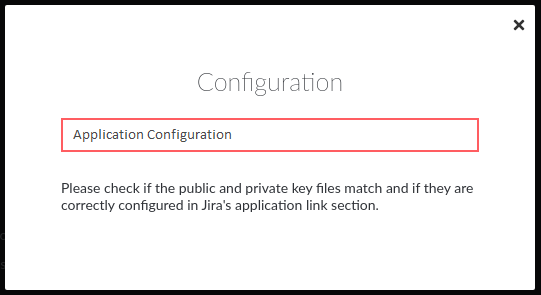

# Dialogs Service

Use the `dialogs` service to create modal windows (e.g. to open a modal window from a button registered at a room level).

The following methods are available on the `dialogs` service:

* show
* rerender
* hide

The following picture is an example of what you will be able to create with this service - this module will overlay onto the entire Symphony client window:



## show()

Presents a modal dialog to the user:

```javascript
function show(id, serviceName, template, data, options)
```

| Parameter   | Type   | Description                                                      |
| ----------- | ------ | ---------------------------------------------------------------- |
| id          | String | A unique id for the dialog.                                      |
| serviceName | String | The name of a local application-implemented service implemented. |
| template    | String | The extensionML for the dialog content.                          |
| data        | String | The data for the extensionML.                                    |
| options     | Object | The data for the extensionML                                     |

```javascript
    const dialogsService = SYMPHONY.services.subscribe("dialogs");
    dialogsService.show(
        "my-dialog",
        "hello:controller",
        `<dialog>
            <div class="container">
                <div class="header">
                    <h1>Configuration</h1>
                    <br/>
                    <div class="headerError">                              
                        <text id="title"/>
                    </div>
                    <p class="value">Please check if the public and private
                    key files match and if they are correctly configured in 
                    Jira's application link section.</p>
                </div>
            </div>
        </dialog>`,
        "undefined",
        {
            title: "Application Configuration"
        }
    );
```

## rerender()

Changes the contents of the dialog. This is usually invoked when the user has performed some action:

```javascript
function rerender(id, template, data)
```

| Parameter | Type   | Description                                  |
| --------- | ------ | -------------------------------------------- |
| id        | String | The id of the dialog that should be updated. |
| template  | String | The new extensionML content to display.      |
| data      | String | The data for the extensionML.                |

## close()

```javascript
function close(id)
```

| Parameters | Type   | Description                    |
| ---------- | ------ | ------------------------------ |
| id         | String | The id of the dialog to close. |
