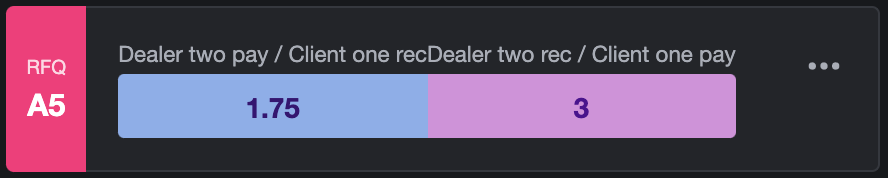

# Extension Applications + UI Toolkit

Some Extension applications contain a standalone frontend that is embedded within the Symphony client. While the Symphony client is agnostic to the implementation of your app's frontend, Symphony provides a UI toolkit containing a library of react components that help to build complex frontend applications rapidly. The UI Toolkit contains layout guides, forms, dropdown menus, complex financial charts, and more.


Note: This guide is an overview of how to leverage the Extension API and UI Toolkit in order to render custom frontend applications within the Symphony client. For an in depth reference of the Modules Service and Nav Service refer to the [Modules Service guide](../overview-of-extension-api/extension-api-services/modules-service.md) and [Applications-Nav Service guide](../overview-of-extension-api/extension-api-services/applications-nav-service.md) respectively.


## 1.  Subscribe and Add your App to the Left-Hand Navigation

In order to to add your Extension App to the left-hand navigation, Extension Apps must first subscribe to `applications-nav` service provided by the Extension API:

```javascript
const navService = SYMPHONY.services.subscribe('applications-nav');
```

After subscribing to this service, apps must then implement the `add()` method which adds a new navigation item to the Applications section of the left-hand navigation:

```javascript
const navSettings = {
        title: APP_NAV_BAR_TITLE,
        icon: "resources/assets/icon.png",
      };

navService.add(`${APP_ID}-nav`, navSettings, `${APP_ID}:controller`);
```

The `add()` method takes in the following parameters:

| Parameter | Description |
| :--- | :--- |
| id | A unique id for this navigation item \(must be unique across all navigation items of a given application\) |
| {title, icon} Object | **Either** the title of the left navigation item as a string **or** an object with the keys title and icon where the value of title is a string and the value of icon is the url of a 32x16 pixel sprite sheet |
| serviceName | The name of a local service implemented by your application that will be invoked when a user action is performed relating to the application navigation |

Next, you must implement the `select()` method on your application service in order to handle clicks on your application and subsequently the `focus()` method in order to have your application appear selected in the left-hand navigation:

```javascript
controllerService.implement({
        select(id) {
          if (id === `${APP_ID}-nav`) {
            navService.focus(`${APP_ID}-nav`);
          }
        },
```

## 2.  Bring your Extension Application into View

In order to bring your Extension Application into view, you must leverage the `modules` service. A module is a new window inside the Symphony client workspace, such as a chatroom or an instant message. In order for applications to occupy these UI spaces, applications must first subscribe to the `module` service:

```javascript
const modulesService = SYMPHONY.services.subscribe('modules');
```

After subscribing to this service, apps must then implement the `show()` method provided the `modules` service in order to bring an application into view:

```javascript
//url pointing to our iframe --> app.html
configUrl = "https://localhost:4000/path/to/your/app.html"

modulesService.show(
    APP_ID,
    { title: APP_TITLE, icon: "resources/assets/icon.png" },
    `${APP_ID}:controller`,
    configUrl,
    { canFloat: true },
  );
```

The `show()` method takes in the following parameters:

<table>
  <thead>
    <tr>
      <th style="text-align:left">Parameter</th>
      <th style="text-align:left">Description</th>
    </tr>
  </thead>
  <tbody>
    <tr>
      <td style="text-align:left">id</td>
      <td style="text-align:left">A unique id for this module (must be unique across all modules of a given
        application)</td>
    </tr>
    <tr>
      <td style="text-align:left">{title, icon} Object</td>
      <td style="text-align:left"><b>Either</b> the title of the module as a string
        <br /><b>or</b> an object with the keys <code>title</code> and <code>icon</code> where
        the value of <code>title</code> is a string and the value of <code>icon</code> is
        the url of a 32x16 pixel sprite sheet</td>
    </tr>
    <tr>
      <td style="text-align:left">serviceName</td>
      <td style="text-align:left">The name of a local service implemented by your application that will
        be invoked when a user action is performed relating to this module</td>
    </tr>
    <tr>
      <td style="text-align:left">iframe</td>
      <td style="text-align:left">The URL for the content of the module (must be an HTTPS URL)</td>
    </tr>
    <tr>
      <td style="text-align:left">options</td>
      <td style="text-align:left">
        <p>An object, which can contain:</p>
        <ul>
          <li><code>canFloat</code>: if set to true, a menu item will be added to the
            More menu (found under the (&#x2026;) on the module frame) that, when clicked,
            will pop the module out into its own browser window</li>
          <li><code>parentModuleId</code>: if set to the ID of a module opened by an
            application, the specified module will not be closed when this module is
            shown</li>
        </ul>
      </td>
    </tr>
  </tbody>
</table>

As shown above, the iframe of the module being rendered points to an `app.html` file. Inside this file is where you can include your app's custom javascript. A sample implementation of the `app.htm`l file provided by the BDK is shown below:

```markup
<!DOCTYPE html>
<html lang="en">
<head>
    <meta charset="UTF-8">
    <title>Template App</title>
    <!-- Include the extension app config-->
    <script type="text/javascript" src="config.js" charset="utf-8"></script>
</head>
<!--
See app.js for how the user's theme (light or dark) and font size (large, normal, small, xsmall) are detected and applied.
-->
<body>
    <!-- Include Symphony's Client Extension API javascript -->
    <script type="text/javascript" src="https://www.symphony.com/resources/api/v1.0/symphony-api.js" charset="utf-8"></script>
    <!-- React DOM root ID -->
    <div id="root"></div>
    <!-- Include the app view javascript. This file is generated when running the npm webpack commands.  -->
    <script type="text/javascript" src="app.bundle.js" charset="utf-8"></script>
</body>
</html>
```

## 3.  UI Toolkit

Now that we know how to bring our app view into focus, let's take a look at the library of react components provided by the UI Toolkit. To access a live version of this library, leverage the `symphony-bdk-cli` tool:

```text
$ symphony-bdk-cli --toolkit
```


Note: If you don't have the `symphony-bdk-cli` installed, continue to the [cli-tool](../../developer-tools/developer-tools/bdk-2.0/bdk-1.0/#cli-tool) guide.   


This will launch a live version of the UI Toolkit library reference in your default browser. In the left hand side of the storybook view, navigate to the 'Components' section for a detailed reference of the components themselves.

The UI Toolkit contains a number of different component groups including layouts, inputs, tables, and dedicated financial components. To use these components in your extension app, add the following to your `package.json`:

```markup
"symphony-bdk-ui-toolkit": "git+ssh://git@github.com:SymphonyPlatformSolutions/symphony-bdk-ui-toolkit.git#stage"
```

Once installed, you can import the library and begin creating custom views. For example, see how easy it is to leverage the UI toolkit to create an RFQ Quote Card component view:



```javascript
import React from 'react';
import QuoteCard from 'symphony-bdk-ui-toolkit';

const Quote = () => {
    return (
    <>
        <QuoteCard quoteShortCode="A5" colorIndex={1} panelData={{
            dealerName: 'Dealer two',
            dealerPayedValue: 1.75,
            clientName: 'Client one',
            clientPayedValue: 3
            }} productData={null}
        />
    </>
    );
};

export default Quote;
```



The following component will be rendered based on the above code:



## 4.  Creating Custom Views with the BDK


Note: The following React implementation is consistent with the Extension App implementation provided by the BDK. However, if you choose to not use react or the UI Toolkit, Symphony is agnostic to your app's frontend implementation. Since the app view is displayed within a hidden iframe, the implementation of your app's frontend is entirely up to you.


The `app.html` iframe is linked to a custom javascript file, `app.js`. This file is where you could implement your own custom rendering logic. In the case of the BDK, this file will act as the entry point into the react system:



```markup
import React from 'react';
import ReactDOM from 'react-dom';

ReactDOM.render(
        <Provider store={store}>
          <Routes userId={userId} jwtService={extendedUserInfoService || MOCK_USER_SERVICE} />
        </Provider>, document.getElementById('root'),
      );
```



This is linked to a `routes.js` file:



```markup
<Route
    exact
    path={`${LINK_PREFIX}/app.html`}
    component={LocationRouter}
    />
```



And subsequently the `LocationRouter` component:



```javascript
function route() {
  return <YourComponentHere />;
  }

const LocationRouter = () => route();
```



Whatever is returned by the `route()` function provided by the BDK will be rendered as the application view. For more information about how to pass props from your backend to your frontend in order to bring relevant data into your application view, please refer to the following tutorial:



Now that we understand the Extension API services needed to bring your application into view, the next step is to build out a react front end that can be rendered by your app. Continue to the following tutorials where we will go through a step by step tutorial of building out an FX Watchlist app using the BDK and react:


