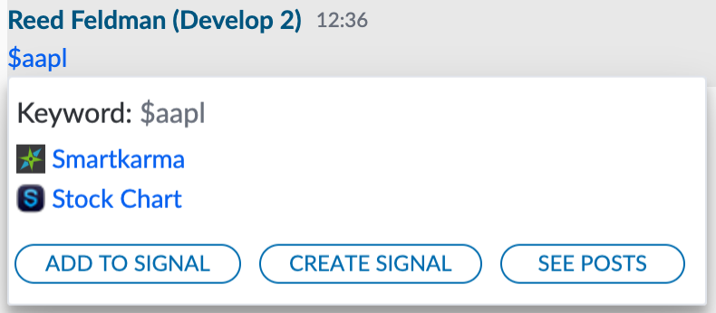
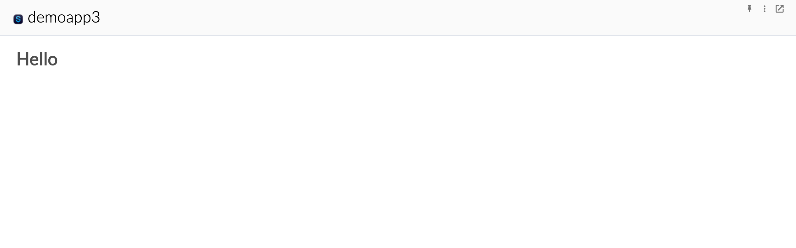
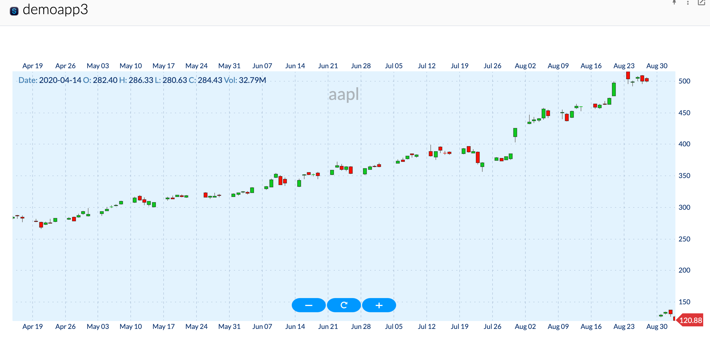

# Building an Extension App with \#hashtags & $cashtags

In this step by step tutorial, we will build an extension app that adds buttons to the hovercard that appears when an end user clicks on a stock ticker or Symphony $cashtag.  We will also demonstrate how to use the UI Toolkit provided by the BDK \(Bot Developer Kit\) in order to render a stock chart for that given stock symbol or ticker.  

## Prerequisites:

Complete the BDK App configuration guide:



## 1.  Dive into the Code

In this tutorial we will be building off the generated app + bot scaffolds provided by the BDK.  The BDK comes out of the box with a number of best practices as well as boiler plate code in order to streamline extension app development.  The following demonstrates the BDK's implementation for bootstrapping your extension app:

### Initialization:

In order to use the Client Extension API services, your app must include the `symphony-api.js` file as seen on line 11 of the `controller.html` file provided by the BDK:

```markup
<!DOCTYPE html>
<html lang="en">
<head>
    <meta charset="UTF-8">
    <title>Template -  controller</title>
    <!-- Include the extension app config-->
    <script type="text/javascript" src="config.js" charset="utf-8"></script>
</head>
<body>
    <!-- Include the Symphony Client Extensions API javascript -->
    <script type="text/javascript" src="https://www.symphony.com/resources/api/v1.0/symphony-api.js" charset="utf-8"></script>
    <!-- Include the app controller javascript. This file is generated when running the npm webpack commands. -->
    <script type="text/javascript" src="controller.bundle.js" charset="utf-8"></script>
</body>
</html>
```

In order to initialize the connection from your application's controller and views, your app must call the `SYMPHONY.remote.hello()` method.  This method returns an object containing the user's Symphony client theme name, font size, and any associated classes, including those for theme name, size, and condensed modules.  This method is located in the the `app.js` file provided out of the box by the BDK: 

```javascript
SYMPHONY.remote.hello().then((data) => {
    const themeSize = data.themeV2.size;
    const themeColor = data.themeV2.name;
    document.body.className = `symphony-external-app ${themeColor} ${themeSize}`;
    const appTheme = themeColor.toUpperCase() === THEME_TYPES.DARK
      ? THEME_TYPES.DARK
      : themeColor.toUpperCase() === THEME_TYPES.LIGHT
        ? THEME_TYPES.LIGHT
        : THEME_TYPES.LIGHT;
    window.themeColor = appTheme;
    window.themeSize = themeSize;
  }
```

### Connect:

Next, you must connect an application view to an existing application that has been registered with Symphony.  Additionally, you must subscribe the application to remote services provided by the Extension API and also register local services that will be used by your application remotely.  In order to connect your application, your app must call the `SYMPHONY.application.connect()` function, provided out of the box by the BDK in the `app.js` file: 

```javascript
SYMPHONY.application.connect(
      APP_ID,
      ['modules', 'applications-nav', 'ui', 'extended-user-info', 'extended-user-service', 'dialogs'],
      [`${APP_ID}:app`],
    )
```

## 2.  Authentication

In addition to the boilerplate setup for connecting, initializing and registering you application, the BDK also provides an out of the box implementation of app authentication.  App authentication is required for apps that wish to receive sensitive conversation and user data.  Even though the extension app constructed in this tutorial does not require app authentication, we will keep the provided implementation of app authentication by the BDK.  The sample implementation of App Authentication leverages a combined bot \(backend\) and app \(frontend\) architecture.  The out of the box authentication sequence can be found at the bottom of the `controller.js` file:

```javascript
authController
  .init()
  .then(() => bootstrap())
  .catch(e => console.error(e));  
```

And subsequently inside the `authentication/index.js` file:

```javascript
init() {
    return SYMPHONY.remote.hello()
      .then(this.authenticate)
      .then(this.registerAuthenticatedApp)
      .then(this.validateAppTokens)
      .then(this.getJwtFromSymph)
      .then(this.validateJwtToken)
      .catch((e) => {
        console.error(`Fail to register application ${this.appId}`);
        throw e;
      });
  }
```

To learn more about App Authentication please continue here:



## 3.  UI Service

In addition to the boilerplate code and implementation of app authentication, the BDK also provides a sample implementation of the methods described in our guide on [Extension Applications + \#hashtags & $cashtags](../planning-your-app/extension-applications-+-hashtags-and-usdcashtags.md).

The first step of creating an extension app that add a button to the \#hashtag or $cashtag hovercard is to subscribe to the UI Service as shown on line 48 of the controller.js file:

```javascript
const uiService = SYMPHONY.services.subscribe('ui');
```

 Once your app has subscribe to the UI Service, your app must register its UI extension by calling the `registerExtension()` function as shown on line 76 of the controller.js file:

```javascript
// UI extensions, for buttons EXAMPLE
  uiService.registerExtension(
    'cashtag',
    'buy-im',
    controllers[0],
    {
      label: 'Example In Chat button',
      icon: `${FRONTEND_SERVE_URL}${LINK_PREFIX}/assets/${APP_ICON_NAME}`,
      data: {},
    },
  );
```

In this implementation, the following extension is being registered:

<table>
  <thead>
    <tr>
      <th style="text-align:left">uiClass</th>
      <th style="text-align:left">id</th>
      <th style="text-align:left">serviceName</th>
      <th style="text-align:left">options</th>
    </tr>
  </thead>
  <tbody>
    <tr>
      <td style="text-align:left">cashtag</td>
      <td style="text-align:left">buy-im</td>
      <td style="text-align:left">demobot3:controller</td>
      <td style="text-align:left">
        <p>{</p>
        <p>label: &apos;Example In Chat Button&apos;,</p>
        <p>icon: LINK_TO_ICON</p>
        <p>data: {}</p>
        <p>}</p>
      </td>
    </tr>
  </tbody>
</table>

As we learned about in the [Extension Applications + \#hashtags & $cashtags](../planning-your-app/extension-applications-+-hashtags-and-usdcashtags.md) guide, the UI extension is first passed to the `filter()` function.  If this function evaluates as true, the UI extension will appear on the specified class. To make sure of this lets update the `filter()` function implemented to the following in your controller.js file:

```javascript
filter(type, id, data) {
      const parsedThreadId = parseStreamIdToBackend(data.threadId);
      switch (id) {
        case 'buy-im':
          return true;
        default:
          return false;
      }
    }
```

## 4. Run the code

The next step is to run the code and launch your app.  First run your bot \(app backend\) by running the BotApplication.java file.  Once your bot has successfully run, launch your app:

```javascript
$ yarn start:dev
```

Open your Symphony Client \(in our case develop2\) and make sure your app is installed.  Open a 1-1 IM with a Symphony user and type a '$' followed by any stock symbol \(e.g. $aapl\).  If successful, you should see the following when you hover over the $cashtag in the message:



## 5.  Adding our own Business Logic

### Grabbing the Ticker Symbol:

The next step in building this extension app is to add our own custom business logic, specifically the business logic that captures the stock ticker in context when the $cashtag hovercard is brought into view.  To do so update the provided implementation of the trigger\(\) method to the following:

```javascript
trigger(uiClass, id, payload, data) {
          showExtensionApp({ ticker: payload.entity.name.substring(1) });
          modulesService.focus(APP_ID);
        }
```

Here we are calling a the provided `showExtensionApp()` method provided out of the box by the BDK.  This method is defined in `services/controller/extension-app/index.js` and provides a sample implementation of the Extension API's `moduleService` in order to bring your application into view.   The `showExtensionApp()` function allows you to pass along a queryObject as a parameter.  In our case, we are grabbing the ticker name from the payload received in the `trigger()` method and passing that along as an argument to be used in our view.

### Creating the View:

The next step in building our extension app is to create our view.  Inside of the pages folder, create a subfolder called stock-chart.  Inside of this folder, create a new file called `index.js`.  Populate your file with the following: 



```javascript
import React from 'react';

const StockChart = ({ ticker }) => <h1>Hello</h1>

StockChart.defaultProps = {
  ticker: null,
}

StockChart.propTypes = {
  ticker: PropTypes.string
}

export default StockChart;
```



Next, update the route\(\) function inside of location-router.js to return your newly created react component, passing along the ticker symbol as a prop:

```javascript
import StockChart from './stock-chart';

//Boiler plate code//

function route() {
  const currentQuery = window.location.href.split('?')[1];
  const queryObj = getInnerQuery(currentQuery);
  console.log(queryObj);
  return <StockChart ticker={queryObj.ticker} />;

  }

```

Run your Bot + Extension Application and click on your custom button added to the $cashtag hovercard.  You should see the StockChart react component come into focus:  



### Rendering Financial Charts using the UI Toolkit

The Symphony BDK \(Bot Developer Kit\) provides a library of UI components, that helps you to build complex frontend applications rapidly.  Specifically, the UI Toolkit provides a series of financial components and charts that make is easy to build frontend financial applications.  In this tutorial, we will be using the `CandleStickChart` component provided by the UI Toolkit.  The `CandleStickChart` component takes in the following data format in order to render the data:

```javascript
[
  {
    "date": "2010-01-04",
    "open": 25.436282332605284,
    "high": 25.835021381744056,
    "low": 25.411360259406774,
    "close": 25.710416,
    "volume": 38409100,
    "split": "",
    "dividend": ""
  },
....
```

### Setting up the Backend:

Since our extension app is going to render a candlestick stock chart in real time, we need to fetch and clean data from a third party API.  In this tutorial, we will be using [alphavantage](https://www.alphavantage.co/) as our data provider.  

Once you have received your free API Token, you can leverage the API.  Specifically, we will be using data provided from the [Time Series Daily API](https://www.alphavantage.co/documentation/#daily) call.

Since we want to keep our data and our view separate, all of the interaction with AlphaVantage API, including the data cleaning will occur on our app's backend or running bot.  In your bot project, create a new `services` folder and add a class `DataService`.  Add the following to your `DataService` class:



```java
package com.symphony.demobot3.services;

import com.fasterxml.jackson.annotation.JsonIgnoreProperties;
import com.fasterxml.jackson.annotation.JsonProperty;
import com.symphony.bdk.bot.sdk.lib.restclient.RestClient;
import org.springframework.web.bind.annotation.GetMapping;
import org.springframework.web.bind.annotation.PathVariable;
import org.springframework.web.bind.annotation.RestController;

import java.util.Comparator;
import java.util.List;
import java.util.Map;
import java.util.stream.Collectors;

@RestController
public class DataService {

    private static final String dailyTickerUrl = "https://www.alphavantage.co/query?function=TIME_SERIES_DAILY&symbol=%s&apikey=%s";
    private static final String apiKey = "TLQ8D4O5EZGG4NO7";
    private RestClient restClient;

    public DataService(RestClient restClient){
        this.restClient = restClient;
    }

    @GetMapping("/stocks/{ticker}")
    public List<ChartData> getStockChartData(@PathVariable String ticker){
        String requestUrl = String.format(dailyTickerUrl, ticker, apiKey);
        StockDailyResult result = restClient.getRequest(requestUrl, StockDailyResult.class).getBody();
        Map<String, StockDailyEntry> timeSeries = result.getTimeSeries();

        return timeSeries.keySet().stream().map(date -> new ChartData(
                date,
                timeSeries.get(date).getOpen(),
                timeSeries.get(date).getHigh(),
                timeSeries.get(date).getLow(),
                timeSeries.get(date).getClose(),
                timeSeries.get(date).getVolume()
        ))
                .sorted(Comparator.comparing(ChartData::getDate))
                .collect(Collectors.toList());
    }
}

@JsonIgnoreProperties
class StockDailyResult {
    @JsonProperty("Time Series (Daily)")
    Map<String, StockDailyEntry> timeSeries;

    public Map<String, StockDailyEntry> getTimeSeries() {
        return timeSeries;
    }
}

class StockDailyEntry {
    @JsonProperty("1. open")
    String open;
    @JsonProperty("2. high")
    String high;
    @JsonProperty("3. low")
    String low;
    @JsonProperty("4. close")
    String close;
    @JsonProperty("5. volume")
    String volume;

    public float getOpen() {
        return Float.parseFloat(open);
    }

    public float getHigh() {
        return Float.parseFloat(high);
    }

    public float getLow() {
        return Float.parseFloat(low);
    }

    public float getClose() {
        return Float.parseFloat(close);
    }

    public float getVolume() {
        return Float.parseFloat(volume);
    }

    public void setOpen(String open) {
        this.open = open;
    }

    public void setHigh(String high) {
        this.high = high;
    }

    public void setLow(String low) {
        this.low = low;
    }

    public void setClose(String close) {
        this.close = close;
    }

    public void setVolume(String volume) {
        this.volume = volume;
    }
}

class ChartData {
    String date;
    float open;
    float high;
    float low;
    float close;
    float volume;


    public ChartData(String date, float open, float high, float low, float close, float volume) {
        this.date = date;
        this.open = open;
        this.high = high;
        this.low = low;
        this.close = close;
        this.volume = volume;

    }

    public String getDate() {
        return date;
    }

    public float getOpen() {
        return open;
    }

    public float getHigh() {
        return high;
    }

    public float getLow() {
        return low;
    }

    public float getClose() {
        return close;
    }

    public float getVolume() {
        return volume;
    }
}
```



In this class, we are passing along the stock symbol received from the frontend as captured in our $cashtag button, sending to the backend, and calling the API using the symbol as a query parameter.  The data returned is the format required in our `CandleStickChart` react component referenced above.

### Rendering the Data

Now that our backend `DataService` is setup, the next step is to render the data on the frontend.  Let's update or `StockChart` component to the following:

```javascript
import React from 'react';
import { useState, useEffect } from 'react';
import PropTypes from 'prop-types';
import {CandleStickChart, Box, useAutoFetch, CheckBox, Car, buildDateParser} from 'symphony-bdk-ui-toolkit';

const StockChart = ({ ticker }) => {
  const [ chartData, setChartData ] = useState({ loading: false });
  const apiUrl = `http://localhost:8080/demobot3/stocks/${ticker}`;

  useEffect(() => {
    fetch(apiUrl)
      .then(response => response.json())
      .then(json => {
        const formatteddata = json.map(entry => ({
          ...entry,
          date: new Date(entry.date)
        }));
        setChartData({
          loading: false,
          title: `${ticker}`,
          data: formatteddata
        });
      });
  }, []);

  return !chartData.data ? 'loading' : (

    <Box style={{ width: '100%', height: '500px', marginTop: '50px' }}>
      <CandleStickChart
        tickSizeX={10}
        loading={chartData.loading}
        data={chartData.data}
        title={chartData.title}
        hasGrid
        hasCrossHair
        hasOHLCTooltip
        hasTooltip
        hasZoom
        hasEdgeIndicator
      />
    </Box>
  );
}

StockChart.defaultProps = {
  ticker: null,
}

StockChart.propTypes = {
  ticker: PropTypes.string
}

export default StockChart;

```

Before this component is rendered, we make a `fetch()` call to the backend where the `DataService` class obtains the data from the API and performs its data cleaning.  Next we update or `chartData` to contain this data using react hooks.  Lastly, we pass our `chartData`  object to our `CandleStickChart` react component where it renders once the data is made available.  

Rerun your app backend \(bot\) and frontend applications.  Submit another message containing a stock $cashtag of your choosing and hover over it.  Select the button and notice a CandleStickChart containing realtime stock data brought into view:



If you see this view, then you have successfully completed the tutorial!  For a more detailed explanation of how to leverage the UI Toolkit, navigate here:

