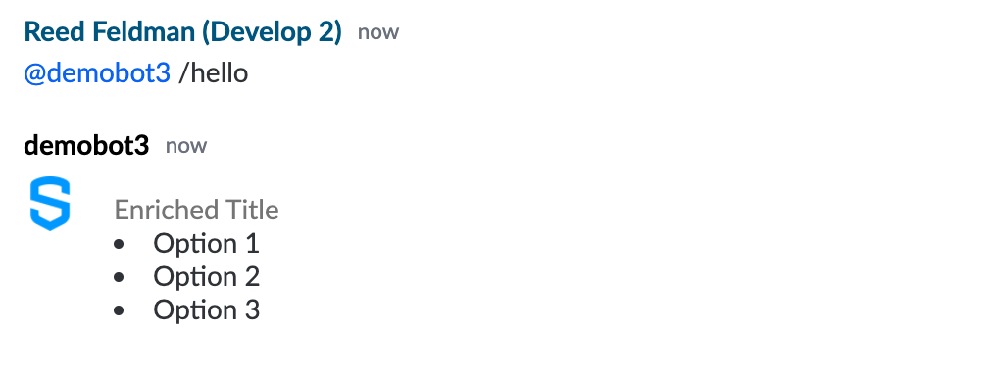
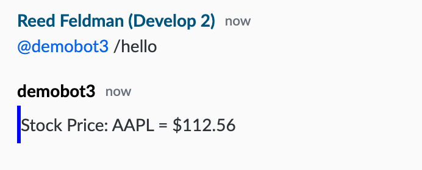

# Building an Extension App with Structured Objects

In this step by step tutorial, we will build an extension app that registers a custom renderer in order to dynamically display rich, inline structured objects as messages.  We will demonstrate how to leverage the provided implementation of the enricher service provided by the BDK and also how to create your own custom renderers.

## Prerequisites:

Complete the BDK App configuration guide:



## 1.  Dive into the Code

In this tutorial we will be building off of the generated app + bot project scaffolds provided by the BDK.  The BDK comes out of the box with a number of best practices as well as boiler plate code in order to streamline extension app development.  The following demonstrates the BDK's implementation for bootstrapping your extension app:

### Initialization:

In order to use the Client Extension API services, your app must include the `symphony-api.js` file as seen on line 11 of the `controller.html` file provided by the BDK:



```markup
<!DOCTYPE html>
<html lang="en">
<head>
    <meta charset="UTF-8">
    <title>Template -  controller</title>
    <!-- Include the extension app config-->
    <script type="text/javascript" src="config.js" charset="utf-8"></script>
</head>
<body>
    <!-- Include the Symphony Client Extensions API javascript -->
    <script type="text/javascript" src="https://www.symphony.com/resources/api/v1.0/symphony-api.js" charset="utf-8"></script>
    <!-- Include the app controller javascript. This file is generated when running the npm webpack commands. -->
    <script type="text/javascript" src="controller.bundle.js" charset="utf-8"></script>
</body>
</html>
```



In order to initialize the connection from your application's controller and views to the Symphony client, you app must call the `SYMPHONY.remote.hello()` method.  This method returns an object containing the user's Symphony client them name, font size, and any associated classes, including those for theme name, size, and condensed modules.  This method is located in the `app.js` file provided out of the box by the BDK:



```javascript
SYMPHONY.remote.hello().then((data) => {
    const themeSize = data.themeV2.size;
    const themeColor = data.themeV2.name;
    document.body.className = `symphony-external-app ${themeColor} ${themeSize}`;
    const appTheme = themeColor.toUpperCase() === THEME_TYPES.DARK
      ? THEME_TYPES.DARK
      : themeColor.toUpperCase() === THEME_TYPES.LIGHT
        ? THEME_TYPES.LIGHT
        : THEME_TYPES.LIGHT;
    window.themeColor = appTheme;
    window.themeSize = themeSize;
  }
```



### Connect:

Next, you must connect an application view to an existing application that has been registered with Symphony.  Additionally, you must subscribe the application to remote services provided by the Extension API and also register local services that will be used by your application remotely.  In order to connect your application, your app must call the Symphony.application.connect\(\) function, provided out of the box by the BDK in the `app.js` file:



```javascript
SYMPHONY.application.connect(
      APP_ID,
      ['modules', 'applications-nav', 'ui', 'extended-user-info', 'extended-user-service', 'dialogs'],
      [`${APP_ID}:app`],
    )
```



## 2.  Authentication

In addition to the boilerplate setup for connecting, initializing, and registering you application, the BDK also provides an out of the box implementation of app authentication.   App authentication is required for apps that wish to receive sensitive conversation and user data.  Even though the extension app constructed in this tutorial does not require app authentication, we will keep the implementation of app authentication provided by the BDK.  The sample implementation of app authentication leverages a combined bot \(app backend\) and app \(frontend\) architecture.  The out of the box authentication sequence can be found at the bottom of the `controller.js` file: 



```javascript
authController
  .init()
  .then(() => bootstrap())
  .catch(e => console.error(e));  
```



and subsequently inside the `authentication/index.js` file:

```javascript
init() {
    return SYMPHONY.remote.hello()
      .then(this.authenticate)
      .then(this.registerAuthenticatedApp)
      .then(this.validateAppTokens)
      .then(this.getJwtFromSymph)
      .then(this.validateJwtToken)
      .catch((e) => {
        console.error(`Fail to register application ${this.appId}`);
        throw e;
      });
  }
```

Upon completion of the above function, your extension application will be successfully authenticated.  For more information about app authentication, please continue here:



## 3.  Setup the Enricher Service

In addition to the boilerplate code and implementation of app authentication, the BDK also provides an implementation of the methods described in our guide on [Extension Applications + Structured Objects](../planning-your-app/extension-applications-+-structured-objects.md).

As a part of the boilerplate code, the BDK provides a `GeneralEnricher` class which handles service subscription, renderer registration, rendering logic, as well as any custom business logic you would like to introduce.  This class is instantiated in the `controller.js` file:



```javascript
//enricher section
const enricher = new GeneralEnricher(`${APP_ID}:enricher`);
enricher.init();
enricher.register();
```



Upon instantiating this class, we do a few things:



```javascript
constructor(name) {
    this.name = name;
    this.messageEvents = Object.keys(ENRICHER_EVENTS).map(
      key => ENRICHER_EVENTS[key].type,
    );
    this.implements = ['render', 'action'];
    SmsRenderer.register(partials, customTemplates);
  }
  
  init() {
    SYMPHONY.services.make(this.name, this, this.implements, true);
  }
```



1.  Specify the service name: `'${APP_ID}:enricher'`
2. Load in a dictionary of predefined structured objects, storing the entity id or entity `types` in an array, `messageEvents`.
3.  Specify which methods of the class will be available in the service by adding them to the `implements` array.  
4. Lastly, register your `customTemplates` with the `SmsRenderer`.  This customTemplates dictionary is where we are going to add our own custom templates as shown in Step 6.  


Note:  The SmsRenderer is a handlebars templating library provided by the BDK.  This library already has predefined template values including: SIMPLE, ALERT, INFORMATION, NOTIFICATION, TABLE, LIST, BADGE, and a series of complex RFQ templates.   


In order to render a message template using the `SmsRenderer` templating engine, implement the `SmsRenderer.renderAppMessage()` method:

```javascript
SmsRenderer.renderAppMessage(messageData, messageType)
```

Each template has a specific `messageType` and corresponding JSON schema \(`messageData`\).  The templates and their corresponding schemas can be found [here.](https://github.com/SymphonyPlatformSolutions/sms-sdk-renderer-node#common-elements)

Next, we subscribe to the `entity` service and register our list of structured object IDs or entity `types` :



```javascript
register() {
    const entity = SYMPHONY.services.subscribe('entity');
    this.messageEvents.forEach((element) => {
      entity.registerRenderer(element, {}, this.name);
    });
  }
```



## 4. Built in Renderer

Now that our list of entities or structured objects is registered, it's time to define our `render()` method provided by the `entity` service.  The render method is called each time a Structured Object ID or `type` matches the type specified in your `registerRenderer` function.  The implementation of the `render()` function provided by the BDK, performs some data validation, as well as creates a switch statement in which its cases correspond to the possible entity `types` .  For example, let's take a look at the `HELP_COMMAND` statement:



```javascript
case ENRICHER_EVENTS.HELP_COMMAND.type:
      template = SmsRenderer.renderAppMessage(
        {
          title: data.title,
          content: data.content,
        },
        SmsRenderer.smsTypes.LIST,
      );
      break;
```



This statement checks to see if the incoming structured object ID or entity `type` matches the HELP\_COMMAND.type defined in `entities.js`:



```javascript
HELP_COMMAND: {
    type: 'com.symphony.ms.template.helpCommand',
}
```




Note: The rest of the JSON schemas defined in the entity type dictionaries defined in the `ENRICHER_EVENTS` dictionary are sample data used for the mock server and is outside the scope of this tutorial.  


If there is in fact a match, calls the renderAppMessage\(\) method, passing along the correct JSON schema and templateType \(`SmsRenderer.smsTypes.LIST`\) as parameters:

## 5.  Rendering the Structured Objects

Now that we understand the BDK's implementation of the `GeneralEnricher` class as well as the `render()` method, let's test it out for ourselves.  Open up your app backend \(bot\) and navigate to the `HelloCommandHandler` class.  Update your `handle()` method to the following:



```java
public void handle(BotCommand command, SymphonyMessage response) {

    List<String> messages = Arrays.asList("Option 1", "Option 2", "Option 3");
    SampleObject sample = new SampleObject("Enriched Title", messages);
    response.setEnrichedTemplateFile("help-template", sample, "com.symphony.ms.template.helpCommand", sample, "1.0");
    
  }
```



We pass a default handlebars template, our newly created structured object, and our entity `type` to the `setEnrichedTemplateFile()` method.  The sample template we pass will not be used as long as a renderer that matches the entity type is registered on the client.  A default template can be as simple as the following `help-template.hbs` :



```markup
<div style="border-left:3px solid blue;">
  <p>Default Template</p>
</div>

```



In addition, create a SampleObject class to pass along as a structured object, the object must match the JSON schema provided in the `render()` method:

```java
import lombok.Data;
import lombok.NoArgsConstructor;

@NoArgsConstructor
@Data
public class SampleObject {

    private String title;
    private String content;

    public SampleObject(String title, String content) {
        this.title = title;
        this.content = content;
    }
```

Now start up your app and bot back end and type into an IM with the bot, `'@YOUR_BOTS_USERNAME /hello'` .  The bot will render your message + structured object accordingly:



## 6.  Create a Custom Renderer

To create a custom renderer, we first need to create a handlebars template within our app frontend.  For this example lets create a template called `sample-template.hbs` :

```markup
<div style="border-left:3px solid blue;">
    <p>Stock Price: {{message.text}}</p>
</div>

```

Import this template and add it to the `CUSTOM_TEMPLATE_NAMES` and `customTemplates` dictionaries:



```javascript
import SampleTemplate from './templates/base/sample-template.hbs';

const CUSTOM_TEMPLATE_NAMES = {
  MY_TEMPLATE: 'my-template',
  CURRENCY_QUOTE: 'currency-quote',
  SAMPLE_TEMPLATE: 'sample-template'
};

const customTemplates = {
  [CUSTOM_TEMPLATE_NAMES.MY_TEMPLATE]: MyTemplate,
  [CUSTOM_TEMPLATE_NAMES.CURRENCY_QUOTE]: CurrencyQuote,
  [CUSTOM_TEMPLATE_NAMES.SAMPLE_TEMPLATE]: SampleTemplate,
};
```



Next, add the `SAMPLE` entity and `type` to the `ENRICHER_EVENTS` in `entities.js` :

```javascript
SAMPLE: {
    type: 'com.symphony.ms.template.sample',
  }
```

Add to the switch statement inside the `render()` function and define the JSON schema to be injected into our `sample-template.hbs` message template:

```javascript
case ENRICHER_EVENTS.SAMPLE.type:
    console.log('inside of sample');
    template = SmsRenderer.renderAppMessage(
      {
        text: data.message
      },
      CUSTOM_TEMPLATE_NAMES.SAMPLE_TEMPLATE,
    );
    break;
```

### Update your Bot Code:

To see your newly created structured object richly displayed, let's update our bot's code to send a structured object that matches the entity `type` registered with the app.  Update the `handle()` function inside the `HelloCommandHandler` class to the following:

```julia
public void handle(BotCommand command, SymphonyMessage response) {
    List<String> messages = Arrays.asList("Option 1", "Option 2", "Option 3");
    SampleObject sample = new SampleObject("AAPL = $112.56", messages);
    response.setEnrichedTemplateFile("sample-template", sample,
            "com.symphony.ms.template.sample", sample, "1.0");
  }
```

Now start up your app and bot back end and type into an IM with the bot, `'@YOUR_BOTS_USERNAME /hello'` .  The bot will render your message + structured object accordingly:



