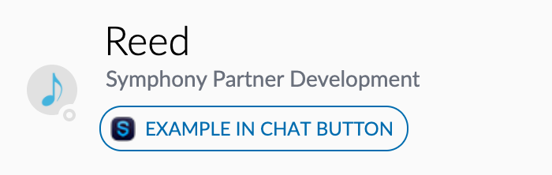

# Building an Extension App with UI Buttons

In this step by step tutorial, we will build an extension app that adds a button to 1-1 IMs.  

## Prerequisites:

Complete the BDK App configuration guide:



## 1.  Dive into the Code 

In this tutorial we will be building off of the generated app + bot project scaffolds provided by the BDK.  The BDK comes out of the box with a number of best practices as well as boiler plate code in order to streamline extension app development.  The following demonstrates the BDK's implementation for bootstrapping your extension app:

### Initialization:

In order to use the Client Extension API services, your app must include the `symphony-api.js` file as seen on line 11 of the `controller.html` file provided by the BDK:



```markup
<!DOCTYPE html>
<html lang="en">
<head>
    <meta charset="UTF-8">
    <title>Template -  controller</title>
    <!-- Include the extension app config-->
    <script type="text/javascript" src="config.js" charset="utf-8"></script>
</head>
<body>
    <!-- Include the Symphony Client Extensions API javascript -->
    <script type="text/javascript" src="https://www.symphony.com/resources/api/v1.0/symphony-api.js" charset="utf-8"></script>
    <!-- Include the app controller javascript. This file is generated when running the npm webpack commands. -->
    <script type="text/javascript" src="controller.bundle.js" charset="utf-8"></script>
</body>
</html>
```



In order to initialize the connection from your application's controller and views, your app must call the `SYMPHONY.remote.hello()` method.  This method returns an object containing the user's Symphony client theme name, font size, and any associated classes, including those for theme name, size, and condensed modules.  This method is located in the the `app.js` file provided out of the box by the BDK: 

```javascript
SYMPHONY.remote.hello().then((data) => {
    const themeSize = data.themeV2.size;
    const themeColor = data.themeV2.name;
    document.body.className = `symphony-external-app ${themeColor} ${themeSize}`;
    const appTheme = themeColor.toUpperCase() === THEME_TYPES.DARK
      ? THEME_TYPES.DARK
      : themeColor.toUpperCase() === THEME_TYPES.LIGHT
        ? THEME_TYPES.LIGHT
        : THEME_TYPES.LIGHT;
    window.themeColor = appTheme;
    window.themeSize = themeSize;
  }
```

### Connect:

Next, you must connect an application view to an existing application that has been registered with Symphony.  Additionally, you must subscribe the application to remote services provided by the Extension API and also register local services that will be used by your application remotely.  In order to connect your application, your app must call the SYMPHONY.application.connect\(\) function, provided out of the box by the BDK in the `app.js` file: 

```javascript
SYMPHONY.application.connect(
      APP_ID,
      ['modules', 'applications-nav', 'ui', 'extended-user-info', 'extended-user-service', 'dialogs'],
      [`${APP_ID}:app`],
    )
```

## 2.  Authentication

In addition to the boilerplate setup for connecting, initializing and registering you application, the BDK also provides an out of the box implementation of app authentication.  App authentication is required for apps that wish to receive sensitive conversation and user data such as this example app, that will add buttons to an IM.  The sample implementation of App Authentication leverages a combined bot \(backend\) and app \(frontend\) architecture.  The out of the box authentication sequence can be found at the bottom of the controller.js file:

```javascript
authController
  .init()
  .then(() => bootstrap())
  .catch(e => console.error(e));  
```

And subsequently to the authentication/index.js file:

```javascript
init() {
    return SYMPHONY.remote.hello()
      .then(this.authenticate)
      .then(this.registerAuthenticatedApp)
      .then(this.validateAppTokens)
      .then(this.getJwtFromSymph)
      .then(this.validateJwtToken)
      .catch((e) => {
        console.error(`Fail to register application ${this.appId}`);
        throw e;
      });
  }
```

Upon completion of the above function, your extension application will be successfully authenticated.  For more information about app authentication, please continue here:



## 3.  UI Service

In addition to the boilerplate setup code and implementation of app authentication, the BDK also provides a sample implementation of the methods described in our guide on [Extension Applications + UI Buttons](../planning-your-app/extension-applications-+-ui-buttons.md).

The first step of creating an extension app that adds a button to the IM module is to subscribe to the UI Service as shown on line 48 of the controller.js file:

```javascript
const uiService = SYMPHONY.services.subscribe('ui');
```

Once your app has subscribed to the UI Service, your app must register its UI extension by calling the `registerExtension()` function as shown on line 76 of controller.js:

```javascript
 // UI extensions, for buttons EXAMPLE
  uiService.registerExtension(
    'single-user-im',
    'buy-im',
    controllers[0],
    {
      label: 'Example In Chat button',
      icon: `${FRONTEND_SERVE_URL}${LINK_PREFIX}/assets/${APP_ICON_NAME}`,
      data: {},
    },
  );
```

In this example implementation, the following extension is being registered:

<table>
  <thead>
    <tr>
      <th style="text-align:left">uiClass</th>
      <th style="text-align:left">id</th>
      <th style="text-align:left">serviceName</th>
      <th style="text-align:left">options</th>
    </tr>
  </thead>
  <tbody>
    <tr>
      <td style="text-align:left">single-user-im</td>
      <td style="text-align:left">buy-im</td>
      <td style="text-align:left">demobot3:controller</td>
      <td style="text-align:left">
        <p>{</p>
        <p>label: &apos;Example In Chat Button&apos;,</p>
        <p>icon: LINK_TO_ICON</p>
        <p>data: {}</p>
        <p>}</p>
      </td>
    </tr>
  </tbody>
</table>

As we learned about in the [Extension Applications + UI Buttons](../planning-your-app/extension-applications-+-ui-buttons.md) guide, the UI extension is first passed to the `filter()` function.  If this function evaluates as true, the UI extension will appear on the specified class. To make sure of this lets update the `filter()` function implemented to the following in your controller.js file:

```javascript
filter(type, id, data) {
      const parsedThreadId = parseStreamIdToBackend(data.threadId);
      switch (id) {
        case 'buy-im':
          return true;
        default:
          return false;
      }
    }
```

## 4.  Run the Code

The next step is to run the code and launch your app.  First run your bot \(app backend\) by running the BotApplication.java file.  Once your bot has successfully run, launch your app:

```javascript
$ yarn start:dev
```

Open your pod \(in our case develop2\) and make sure your app is installed.  Open a 1-1 IM with a Symphony user and notice the button attached to the IM module.  If you see the following, that means your application is running successfully:

 



## 5.  Adding our own Business Logic

In the provided implementation of the `trigger()` function, the `openModal()` function is called when our 'Example' button is clicked.  This function leverages the dialog service, another service provided by the Extension API that enables apps to open modal windows from a registered button. 

Lets update the provided implementation of the trigger\(\) method to open the Symphony Platform Solutions Github page when the button is clicked:

```javascript
trigger(uiClass, id, payload, data) {
      switch (id) {
        case 'buy-im':
          window.open('https://github.com/SymphonyPlatformSolutions');
          break;
        default:
          break;
      }
    }
```

The bulk of your custom business logic for UI buttons and extensions will exist inside this `trigger()` method.  This is just one possible example of what you can build.  Other possible workflows could leverage buttons to create phone integrations, create redirect workflows, or create meeting/reminder workflows by leveraging third party services and APIs. 

