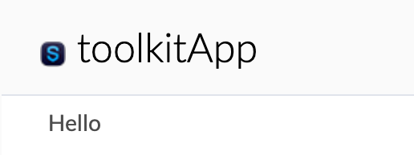
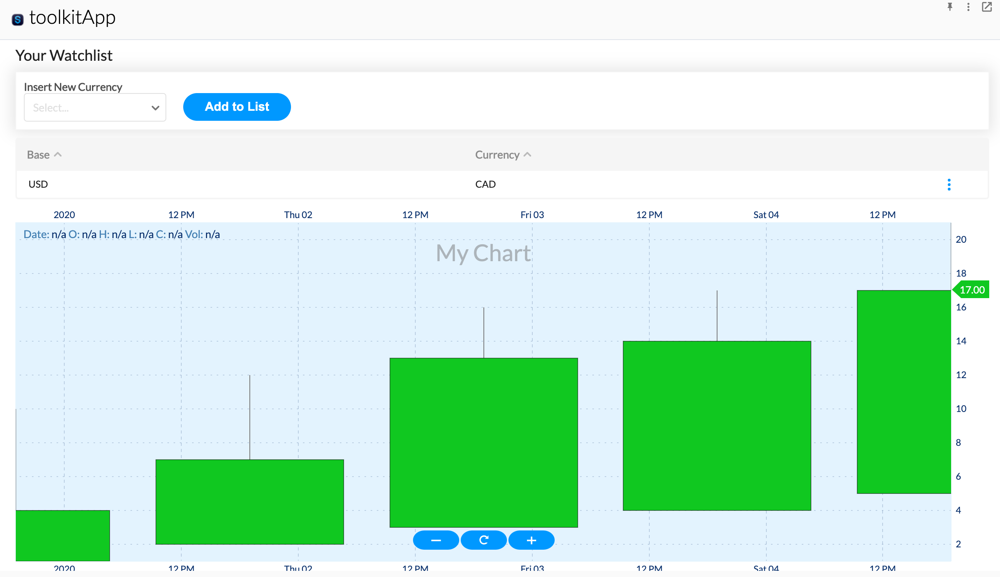
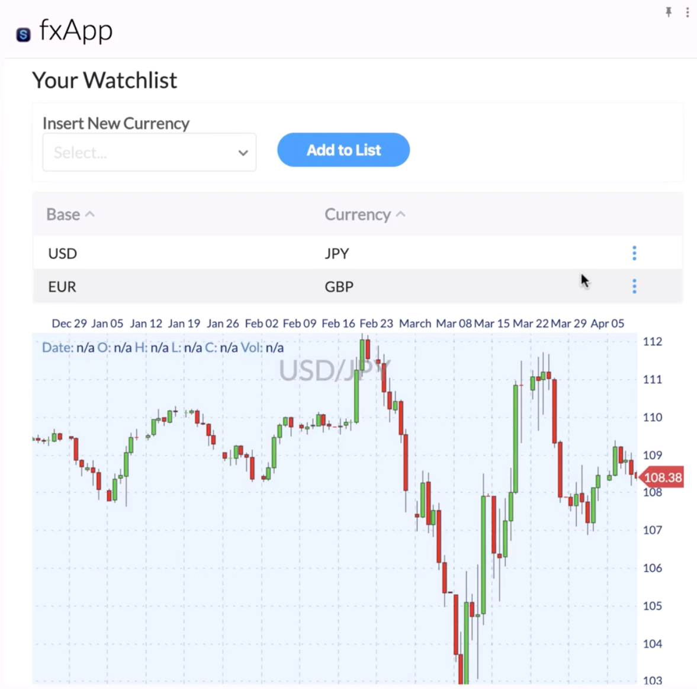

# Building an Extension App with UI Toolkit

In this step by step tutorial, we will build an FX Watchlist App, an extension app that allows users to keep track of FX (foreign exchange) swaps. We will demonstrate how to use the UI Toolkit provided by the BDK 1.0 (Bot Developer Kit) in order to display a list of FX swaps and to display a corresponding candleStick chart of the currency rates.

## Prerequisites:

Complete the BDK 1.0 App configuration guide to generate the app frontend and bot backend required to complete this tutorial:


[configure-your-app-for-bdk-development.md](../app-configuration/configure-your-app-for-bdk-development.md)


## 1.  Dive into the Code

In this tutorial, we will be building off the generated app + bot scaffolds provided by the BDK 1.0. The BDK 1.0 comes out of the box with a number of best practices as well as boiler plate code in order to streamline extension app development. The following demonstrates the BDK's implementation for bootstrapping your extension app:

### Initialization:

In order to use the services provided by the Client Extension API, your app must include the `symphony-api.js` file as seen on line 11 of the `controller.html` file provided by the BDK 1.0:



```markup
<!DOCTYPE html>
<html lang="en">
<head>
    <meta charset="UTF-8">
    <title>Template -  controller</title>
    <!-- Include the extension app config-->
    <script type="text/javascript" src="config.js" charset="utf-8"></script>
</head>
<body>
    <!-- Include the Symphony Client Extensions API javascript -->
    <script type="text/javascript" src="https://cdn.symphony.com/resources/api/v1.0/symphony-api.js" charset="utf-8"></script>
    <!-- Include the app controller javascript. This file is generated when running the npm webpack commands. -->
    <script type="text/javascript" src="controller.bundle.js" charset="utf-8"></script>
</body>
</html>
```



In order to initialize the connection from your application's controller and views, your app must call the `SYMPHONY.remote.hello()` method. This method returns an object containing the user's Symphony client theme name, font size, and any associated classes, including those for theme name, size, and condensed modules. This method is located in the the `app.js` file provided out of the box by the BDK 1.0:



```javascript
SYMPHONY.remote.hello().then((data) => {
    const themeSize = data.themeV2.size;
    const themeColor = data.themeV2.name;
    document.body.className = `symphony-external-app ${themeColor} ${themeSize}`;
    const appTheme = themeColor.toUpperCase() === THEME_TYPES.DARK
      ? THEME_TYPES.DARK
      : themeColor.toUpperCase() === THEME_TYPES.LIGHT
        ? THEME_TYPES.LIGHT
        : THEME_TYPES.LIGHT;
    window.themeColor = appTheme;
    window.themeSize = themeSize;
  }
```



For more information on initializing your extension application, continue here:


[initialization.md](../overview-of-extension-api/initialization.md)


### Connect:

Next, you must connect an application view to an existing application that has been registered with Symphony. Additionally, you must subscribe the application to remote services provided by the Extension API and also register local services that will be used by your application remotely. In order to connect your application, your app must call the `SYMPHONY.application.connect()` function, provided out of the box by the BDK 1.0 in the `app.js` file:

```javascript
SYMPHONY.application.connect(
      APP_ID,
      ['modules', 'applications-nav', 'ui', 'extended-user-info', 'extended-user-service', 'dialogs'],
      [`${APP_ID}:app`],
    )
```

For more information on connecting your extension application, continue here:


[register-and-connect.md](../overview-of-extension-api/register-and-connect.md)


## 2.  App Authentication

In addition to the boilerplate setup for connecting, initializing and registering you application, the BDK 1.0 also provides an out of the box implementation of app authentication. App authentication is required for apps that wish to receive sensitive conversation and user data. Even though the extension app constructed in this tutorial does not require app authentication, we will keep the provided implementation of app authentication by the BDK 1.0. The sample implementation of App Authentication leverages a combined bot (backend) and app (frontend) architecture. The out of the box authentication sequence can be found at the bottom of the `controller.js` file:

```javascript
authController
  .init()
  .then(() => bootstrap())
  .catch(e => console.error(e));
```

And subsequently inside the `authentication/index.js` file:

```javascript
init() {
    return SYMPHONY.remote.hello()
      .then(this.authenticate)
      .then(this.registerAuthenticatedApp)
      .then(this.validateAppTokens)
      .then(this.getJwtFromSymph)
      .then(this.validateJwtToken)
      .catch((e) => {
        console.error(`Fail to register application ${this.appId}`);
        throw e;
      });
  }
```

Upon completion of the above function, your extension application will be successfully authenticated. For more information about app authentication, please continue here:


[app-authentication](../app-authentication/)


## 3.  Creating a Simple React Component

Let's start by creating a simple React component to ensure that our app is rendering views properly.


Note: The following React implementation is consistent with the Extension App implementation provided by the BDK 1.0. However, if you choose to not use react or the UI Toolkit, Symphony is agnostic to your app's frontend implementation. Since the app view is displayed within a hidden iframe, the implementation of your app's frontend is entirely up to you.


Create a package called `fx-watchlist` inside of the pages directory of our generated app project. Subsequently, create a new React component called `FxWatchlist` in this pages directory:



```javascript
import React from 'react';

const FxWatchlist = () => <>Hello</>

export default FxWatchlist;
```



Next, navigate to the `location-router.js` file inside of the pages directory and be sure to return our new component:



```javascript
function route() {
  const currentQuery = window.location.href.split('?')[1];
  const queryObj = getInnerQuery(currentQuery);
  const currentPage = queryObj.page || 'app';
  switch (currentPage) {
    case 'config':
    case 'app':
    //return newly created component here:
      return <FxWatchlist />;
    case MODAL_IDS.EXAMPLE_MODAL.entity:
      return <ExampleModal data={queryObj.data.entityData} />;
    case MODAL_IDS.CURRENCY_QUOTE_MODAL.entity:
      return <CurrencyQuoteModal />;
    default:
      return <p>Oops! Page error.</p>;
  }
}
```



Let's test to make sure our new React component is properly being rendered. Start your app backend (bot) and your app frontend by running:

```javascript
$ yarn start:dev
```

Open up your Symphony client and install your extension app in the Application Marketplace if you haven't already done so. Click on your application in the lefthand navigation. You should see the following after your application loads:


Note: You may need to navigate to [https://localhost:4000](https://localhost:4000) and click 'Proceed to localhost (unsafe)' since we are using a self-signed certificate.




## 4.  Using the UI Toolkit

To launch the Symphony UI Toolkit run the following from your terminal:

```bash
$ symphony-bfk-cli --bot
```

For our FxWatchlist component, we will be leveraging the `Text`, `Card`, `Box`, `DecisionDropdown`, and `Button` components provided out of the box by the UI Toolkit.


Note: If you wish to see in further detail how this component was constructed and how to implement the UI Toolkit, navigate to our developer certification where we provide in depth videos explaining this FxWatchlist example: [Developer Certification ](https://learn.symphony.com)


### Building the Watchlist Component:

Let's add an intelligent dropdown to our FxWatchlist component:



```javascript
import React, { useState } from 'react';
import {
    Text, Card, Box, Button, DecisionDropdown
} from 'symphony-bdk-ui-toolkit';

const FxWatchlist = () => {
    const [ newCurrency, setNewCurrency ] = useState();
    const [ watchlistData, setWatchlistData ] = useState([]);

    const addToList = () => {
        const { base, value: currency } = newCurrency;
        if (!watchlistData.some(i => i.base === base && i.currency === currency)) {
            setWatchlistData(previous => [ ...previous, { base, currency } ]);
        }
        setNewCurrency();
    };

    const fxRefData = [{
        suboptions: [
            {
                label: 'USD Base',
                options: [
                    { label: 'USD/CAD', value: 'CAD', base: 'USD' },
                    { label: 'USD/JPY', value: 'JPY', base: 'USD' }
                ]
            },
            {
                label: 'EUR Base',
                options: [
                    { label: 'EUR/CHF', value: 'CHF', base: 'EUR' },
                    { label: 'EUR/GBP', value: 'GBP', base: 'EUR' }
                ]
            }
        ]
    }];

    return (
        <React.Fragment>
            <Text size="large" type="primary">Your Watchlist</Text>
            <Card>
                <b>Insert New Currency</b>
                <Box horizontal>
                    <DecisionDropdown onChange={setNewCurrency} value={newCurrency} data={fxRefData} />
                    <Button size="large" onClick={addToList}>Add to List</Button>
                </Box>
            </Card>
            { watchlistData.map((item, index) => <Box key={index}>{item.base}/{item.currency}</Box>) }
        </React.Fragment>
    );
};

export default FxWatchlist;
```



### Adding Table and Chart Components:

Lets now make out Fx-Watchlist component more presentable and add some sample data to make the component more realistic. In addition, lets use the `CandleStickChart` component also provided by the UI Toolkit in order to display our FX rates:



```javascript
import React, { useState } from 'react';
import {
    Text, Card, Box, Button, DecisionDropdown, Table, CandleStickChart
} from 'symphony-bdk-ui-toolkit';

const FxWatchlist = () => {
    const [ newCurrency, setNewCurrency ] = useState();
    const [ watchlistData, setWatchlistData ] = useState([]);
    const [ chartData, setChartData ] = useState({ loading: false });

    const handleRemove = (item) => {
        const { base, currency } = item.row.original;
        setWatchlistData(
            previous => previous.filter(i => !(i.base === base && i.currency == currency))
        );
    };

    const handleChart = (item) => {
        const { base, currency } = item.row.original;
        setChartData({
            loading: false,
            title: 'My Chart',
            data: [
                { date: new Date('2020-01-01'), open: 1, high: 10, low: 1, close: 4 },
                { date: new Date('2020-01-02'), open: 2, high: 12, low: 3, close: 7 },
                { date: new Date('2020-01-03'), open: 3, high: 16, low: 5, close: 13 },
                { date: new Date('2020-01-04'), open: 4, high: 17, low: 7, close: 14 },
                { date: new Date('2020-01-05'), open: 5, high: 21, low: 9, close: 17 }
            ]
        });
    };

    const actionsMenu = [
        { label: 'Chart', callback: handleChart, type: 'info' },
        { label: 'Remove', callback: handleRemove, type: 'error' }
    ];

    const addToList = () => {
        const { base, value: currency } = newCurrency;
        if (!watchlistData.some(i => i.base === base && i.currency === currency)) {
            setWatchlistData(previous => [ ...previous, { base, currency, actionsMenu } ]);
        }
        setNewCurrency();
    };

    const fxRefData = [{
        suboptions: [
            {
                label: 'USD Base',
                options: [
                    { label: 'USD/CAD', value: 'CAD', base: 'USD' },
                    { label: 'USD/JPY', value: 'JPY', base: 'USD' }
                ]
            },
            {
                label: 'EUR Base',
                options: [
                    { label: 'EUR/CHF', value: 'CHF', base: 'EUR' },
                    { label: 'EUR/GBP', value: 'GBP', base: 'EUR' }
                ]
            }
        ]
    }];

    const tableColumns = [
        { accessor: 'base', header: 'Base' },
        { accessor: 'currency', header: 'Currency' },
        {
            id: 'actions',
            sortable: false,
            width: 100,
            hasActions: true
        }
    ];

    const priceChart = (
        <Box style={{ width: '100%', height: '500px' }}>
            <CandleStickChart
                tickSizeX={10}
                loading={chartData.loading}
                data={chartData.data}
                title={chartData.title}
                hasGrid
                hasCrossHair
                hasOHLCTooltip
                hasTooltip
                hasZoom
                hasEdgeIndicator
            />
        </Box>
    );

    return (
        <React.Fragment>
            <Text size="large" type="primary">Your Watchlist</Text>
            <Card>
                <b>Insert New Currency</b>
                <Box horizontal>
                    <DecisionDropdown onChange={setNewCurrency} value={newCurrency} data={fxRefData} />
                    <Button size="large" onClick={addToList}>Add to List</Button>
                </Box>
            </Card>
            <Table columns={tableColumns} data={watchlistData} />
            { chartData.data && priceChart }
        </React.Fragment>
    );
};

export default FxWatchlist;
```



If you reload your app, and add an FX pair to you watchlist, you will be able to display a cascading chart of the FX you selected by clicking on the 'Chart' option for the watchlist item:



### Adding Real Data to the UI

To get some real data into our FxWatchlist app, let's use the FX\_DAILY endpoint provided by the Alphavantage API. Specifically, let's render some times series data for a specific currency pair. To do so, we need to create a data service on our app's backend (bot) in order to handle and process incoming data.

Navigate to your bot project and terminate your bot process for now. Next add a services package and new `DataService` class, which will act as our RestController:



```java
package com.symphony.toolkitbot.services;
import com.fasterxml.jackson.annotation.JsonIgnoreProperties;
import com.fasterxml.jackson.annotation.JsonProperty;
import com.symphony.bdk.bot.sdk.lib.restclient.RestClient;
import org.springframework.web.bind.annotation.GetMapping;
import org.springframework.web.bind.annotation.PathVariable;
import org.springframework.web.bind.annotation.RestController;
import java.util.Comparator;
import java.util.List;
import java.util.Map;
import java.util.stream.Collectors;

@RestController
public class DataService {

    private static final String fxDailyUrl = "https://www.alphavantage.co/query?function=FX_DAILY&from_symbol=EUR&to_symbol=USD&apikey=demo";
    private RestClient restClient;
    private static final String apiKey = "YOUR_API_KEY_HERE";

    public DataService(RestClient restClient){
        this.restClient = restClient;
    }

    @GetMapping("/fx-rate/{from}/{to}")
    public List<ChartData> getFxChartData(@PathVariable String from, @PathVariable String to) {
        String requestUrl = String.format(fxDailyUrl, from, to, apiKey);
        FxDailyResult result = restClient.getRequest(requestUrl, FxDailyResult.class).getBody();
        Map<String, FxDailyEntry> timeSeries = result.getTimeSeries();

        return timeSeries.keySet().stream().
                map(date -> new ChartData(
                    date,
                    timeSeries.get(date).getOpen(),
                    timeSeries.get(date).getHigh(),
                    timeSeries.get(date).getLow(),
                    timeSeries.get(date).getClose()
        ))
                .sorted(Comparator.comparing(ChartData::getDate))
                .collect(Collectors.toList());
    }

}

@JsonIgnoreProperties
class FxDailyResult {
    @JsonProperty("Time Series FX (Daily)")
    Map<String, FxDailyEntry> timeSeries;

    public Map<String, FxDailyEntry> getTimeSeries() {
        return timeSeries;
    }
}

class FxDailyEntry {
    @JsonProperty("1. open")
    String open;
    @JsonProperty("2. high")
    String high;
    @JsonProperty("3. low")
    String low;
    @JsonProperty("4. close")
    String close;

    public float getOpen() {
        return Float.parseFloat(open);
    }

    public float getHigh() {
        return Float.parseFloat(high);
    }

    public float getLow() {
        return Float.parseFloat(low);
    }

    public float getClose() {
        return Float.parseFloat(close);
    }

    public void setOpen(String open) {
        this.open = open;
    }

    public void setHigh(String high) {
        this.high = high;
    }

    public void setLow(String low) {
        this.low = low;
    }

    public void setClose(String close) {
        this.close = close;
    }

}

class ChartData {
    String date;
    float open;
    float high;
    float low;
    float close;


    public ChartData(String date, float open, float high, float low, float close, float volume) {
        this.date = date;
        this.open = open;
        this.high = high;
        this.low = low;
        this.close = close;

    }

    public ChartData(String date, float open, float high, float low, float close) {
    }

    public String getDate() {
        return date;
    }

    public float getOpen() {
        return open;
    }

    public float getHigh() {
        return high;
    }

    public float getLow() {
        return low;
    }

    public float getClose() {
        return close;
    }

}
```



Now that our app's backend is properly configured, let's navigate back to our App frontend and extend our `FxWatchlist` component to render this incoming data. Lets add to our `handleChart()` function to call our private API defined on our app's backend:



```javascript
const handleChart = (item) => {
        const { base, currency } = item.row.original;
        const apiUrl = `http://localhost:8080/fxbot/fx-rate/${base}/${currency}`;

        setChartData({ loading: true });

        fetch(apiUrl)
            .then(response => response.json())
            .then(json => {
                const formattedData = json.map(entry => ({ ...entry, date: new Date(entry.date) }));
                setChartData({
                    loading: false,
                    title: `${base}/${currency}`,
                    data: formattedData
                });
            });
    };
```



Reload your app and see the final result after selecting to display a chart:


