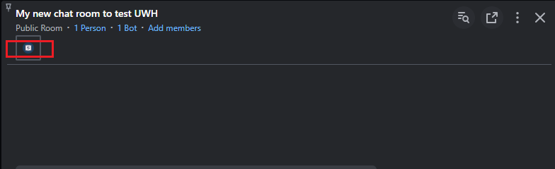

# Build an Extension App with App Views

This guide will provide an overview on how to use the Symphony App Developer Kit (ADK) to build an extension app that has app views. This app will add entries into the left navigation that will each launch a separate app view. The project will use React and ADK's React and Webpack configuration for app view generation.


**Prerequisite**: Install NodeJS first, either [directly](https://nodejs.org) or via [nvm](https://github.com/nvm-sh/nvm)


## Create Project

Create a working directory and initialize it using `npm`.

```bash
mkdir adk-example-views && cd $_
npm init -y
```

## Install Dependencies

Install the Symphony ADK, the ADK React and Webpack configurations, React itself, Symphony UI Toolkit for UI Components, Typescript, Webpack and the required loaders.



```bash
npm install \
  @symphony-ui/adk \
  @symphony-ui/adk-react \
  react \
  react-dom
npm install --save-dev \
  @symphony-ui/adk-webpack \
  @symphony-ui/uitoolkit-components \
  css-loader \
  style-loader \
  babel-loader \
  @babel/preset-react \
  webpack \
  webpack-cli \
  webpack-dev-server
```




```bash
npm install \
  @symphony-ui/adk \
  @symphony-ui/adk-react \
  react \
  react-dom
npm install --save-dev \
  @symphony-ui/adk-webpack \
  @symphony-ui/uitoolkit-components \
  css-loader \
  style-loader \
  ts-loader \
  typescript \
  webpack \
  webpack-cli \
  webpack-dev-server
```




Open the project directory in an editor of your choice

## Add Script Commands

Edit the `package.json` file, replacing the `scripts` section with the following:

```json
"scripts": {
  "start": "webpack-dev-server --mode=development",
  "build": "webpack --mode=production"
},
```

This adds two commands:

* `npm start` for starting the development web server
* `npm run build` to launch the production build process

## Add Configuration



Create a `.babelrc` file with the following contents:


```json
{
  "presets": [ "@babel/preset-react" ]
}
```


Create a `webpack.config.js` file with the following contents:


```javascript
const SymADKWebpack = require('@symphony-ui/adk-webpack');
const packageJson = require('./package.json');
const config = {
  devtool: 'source-map',
  module: {
    rules: [
      {
        test: /\.(js|jsx)$/,
        exclude: /node_modules/,
        loader: "babel-loader"
      },
      {
        test: /\.css$/,
        use: [
          'style-loader',
          'css-loader',
        ],
      },
    ],
  },
  resolve: {
    extensions: ['.js', '.jsx'],
  }
};
module.exports = SymADKWebpack(config, packageJson.name);
```




Create a `tsconfig.json` file with the following contents:


```json
{
  "compilerOptions": {
    "jsx": "react",
    "lib": ["ES2015", "DOM"],
  },
  "include": ["src/**/*"],
}
```


Create a `webpack.config.js` file with the following contents:


```javascript
const SymADKWebpack = require('@symphony-ui/adk-webpack');
const packageJson = require('./package.json');
const config = {
  devtool: 'source-map',
  module: {
    rules: [
      {
        test: /\.tsx?$/,
        use: 'ts-loader',
        exclude: /node_modules/,
      },
      {
        test: /\.css$/,
        use: [
          'style-loader',
          'css-loader',
        ],
      },
    ],
  },
  resolve: {
    extensions: ['.tsx', '.ts', '.js'],
  }
};
module.exports = SymADKWebpack(config, packageJson.name);
```




## Add Application Manifest

Each extension app requires a manifest (also known as the `bundle.json` file) to describe the application. Create a file named `bundle.json` with the following contents:


```json
{
  "applications": [
    {
      "type": "sandbox",
      "id": "adk-example",
      "name": "ADK Example",
      "description": "Symphony ADK",
      "blurb": "Symphony ADK",
      "publisher": "Symphony",
      "url": "https://localhost:4000/controller.html",
      "domain": "localhost"
    }
  ]
}
```


## Build the App

We are now ready to start building the app. Create a `src` directory and a file named `index.js` (or `index.ts` if you're using TypeScript) within it.


```javascript
import * as ADK from '@symphony-ui/adk';

ADK.start({ id: 'adk-example' }).then(() => {
  ADK.navigation.add('ADK View A', () => {
    ADK.modules.open('view-a', { title: 'ADK View A' });
  });
});

```


The code `ADK.start()` initializes the ADK with an app id (`adk-example`) that must correspond with the value provided in the `bundle.json` manifest from the previous step.\
\
Once the initialization is complete, we use `ADK.navigation.add()` to add an item to the left navigation bar. This item will have the label "ADK View A" and clicking on it will use `ADK.modules.open()` to open a module with the app view called `view-a`. This parameter can either be an actual navigational route (e.g. `view.html`) or a string that will correspond to a JavaScript or TypeScript file with the same name located in the `src/views` directory.

Let's proceed to build the app view itself in a file named `view-a.jsx` (or `view-a.tsx` if you're using TypeScript) within `src/views`.


```typescript
import * as React from 'react';
import * as ADKReact from '@symphony-ui/adk-react';
import { Badge, Icon } from '@symphony-ui/uitoolkit-components';
import { useClientTheme, useUserReferenceId } from '@symphony-ui/adk-react';
import './view-a.css';

const ViewA = () => {
  const { name: theme, layout } = useClientTheme();
  const userId = useUserReferenceId();

  return (
    <div className="main-view">
      <header>
        <h1>
          <Icon iconName="market-place" className="header-icon" />
          Welcome to ADK View A!
        </h1>
      </header>
      <main>
        <hr className='tk-my-2' />
        <h3>Meta Information</h3>
        <div>
          <strong>Theme</strong>: current theme is <Badge variant='positive'>{theme}</Badge> and <Badge variant='positive'>{layout}</Badge>
        </div>
        <div>
          <strong>User Reference Id</strong>: <Badge variant='positive'>{userId}</Badge>
        </div>
        <hr className='tk-my-2' />
      </main>
    </div>
  );
};

ADKReact.createView(<ViewA />, { id: 'adk-example' });
```


The contents of this app view are entirely arbitrary. You can choose not to use Symphony's UI Toolkit and employ other component libraries of your choice. The only required line here is calling `ADKReact.createView()` at the end, passing in your component and a configuration object pointing to the same app id as before.

For aesthetics, let's define some styling in `src/views/view-a.css`.


```css
.main-view {
  font-family: "Segoe UI", Roboto, sans-serif;
  margin: 1rem;
}
.main-view header .header-icon { margin-right: 1rem }
.main-view main {
  display: flex;
  flex-direction: column;
  gap: .5rem;
}
.main-view main hr { width: 100% }
```


## Start the App

We can now start the app using:

```bash
npm start
```

This starts a local development server on `https://localhost:4000`. Note that this is a TLS-enabled site because all extension apps need to be loaded from TLS-enabled sites. However, because this is a development server, the certificate is self-signed and not trusted by any browser.


Visit https://localhost:4000 in your browser to accept the security warning about the untrusted self-signed certificate. Skipping this step will cause the extension app to not load within Symphony in the next step.


## Load the App in Symphony

There are 2 ways to load an extension app into Symphony. For development purposes, we will be using the bundle injection method to temporarily load the app into the current session.


Beyond local development testing, you should get your pod administrator to create a corresponding app entry in the Admin Portal by uploading the `bundle.json` file.


We can now load the app by injecting the bundle URL as a parameter named `bundle` behind a pod URL. For example, if you are using the developer sandbox located at develop2.symphony.com, visit the following URL in your browser:

```
https://develop2.symphony.com/?bundle=https://localhost:4000/bundle.json
```

## Test the App

<figure><figcaption></figcaption></figure>

Acknowledge the warning about being in developer mode. You should notice that a new left navigation item appears and opens an app view when clicked on.

## Next Steps

Now that you have built a view-driven Extension App, you can proceed to build out your view and add more as required to complete your app.


[add-buttons-and-handlers-to-an-extension-app.md](add-buttons-and-handlers-to-an-extension-app.md)



[add-bdk-to-an-extension-app-to-get-user-identity.md](add-bdk-to-an-extension-app-to-get-user-identity.md)

