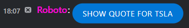
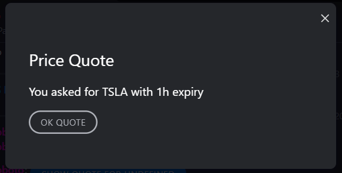

# Build an Extension App with Message Renderers

This guide will provide an overview on how to use the Symphony App Developer Kit (ADK) to build an extension app that handles custom message rendering. This app will look for incoming messages that match a specific type and replace their default rendering with a custom one.


**Prerequisite**: Install NodeJS first, either [directly](https://nodejs.org) or via [nvm](https://github.com/nvm-sh/nvm)


## Create Project

Create a working directory and initialize it using `npm`.

```bash
mkdir adk-example-basic && cd $_
npm init -y
```

## Install Dependencies

Install the Symphony ADK along with the webpack bundler.

```bash
npm install @symphony-ui/adk
npm install --save-dev @symphony-ui/adk-webpack webpack-cli webpack-dev-server
```

Open the project directory in an editor of your choice

## Add Script Commands

Edit the `package.json` file, replacing the `scripts` section with the following:

```json
"scripts": {
  "start": "webpack-dev-server --mode=development",
  "build": "webpack --mode=production"
},
```

This adds two commands:

* `npm start` for starting the development web server
* `npm run build` to launch the production build process

## Add Webpack Configuration

Create a file named `webpack.config.js` that will inject the ADK configuration into the webpack bundler.


```javascript
const SymADKWebpack = require('@symphony-ui/adk-webpack');
const package = require('./package.json');
module.exports = SymADKWebpack({}, package.name);
```


## Add Application Manifest

Each extension app requires a manifest (also known as the `bundle.json` file) to describe the application. Create a file named `bundle.json` with the following contents:


```json
{
  "applications": [
    {
      "type": "sandbox",
      "id": "adk-example",
      "name": "ADK Example",
      "description": "Symphony ADK",
      "blurb": "Symphony ADK",
      "publisher": "Symphony",
      "url": "https://localhost:4000/controller.html",
      "domain": "localhost"
    }
  ]
}
```


## Build the App

We are now ready to start building the app. Create a `src` directory and a file named `index.js` within it.


```javascript
import * as ADK from '@symphony-ui/adk';

ADK.start({ id: 'adk-example' }).then(() => {
  const quoteRenderer = (data) => ({
    template: `<entity><action class="tk-button tk-button--primary" id="quote" /></entity>`,
    actions: {
      quote: {
        label: 'Show Quote for ' + data.ticker,
        data: data.ticker
      },
    },
    extraData: '1h'
  });

  const actionHandler = (action, payload) => {
    const dialog = ADK.dialogs.show(
      `<dialog>
        <div class="container">
          <h1>Price Quote</h1>
          <p>You asked for <text id='data' /> with <text id='extraData' /> expiry</p>
          <p><action id="ok" class="tk-button tk-button--secondary" /></p>
        </div>
      </dialog>`,
      {
        data: payload,
        actions: {
          ok: {
            label: 'OK ' + action,
            action: () => dialog.close(),
          }
        },
        size: 'small'
      }
    );
  };

  ADK.messages.registerRenderer('adk.entity.quote', quoteRenderer, actionHandler);
});
```


The code `ADK.start()` initializes the ADK with an app id (`adk-example`) that must correspond with the value provided in the `bundle.json` manifest from the previous step.\
\
Once the initialization is complete, we use `ADK.messages.registerRenderer` to register a message renderer on the message type `adk.entity.quote`.

The `quoteRenderer` function returns an object defining the template to render as well as any action buttons and extra data. The template field uses [ExtensionML](../../ext-apps/overview-of-extension-api/extension-api-services/entity-service/message-format-extensionml.md), which supports a range of formatting options, action buttons as well as iframes. If action buttons are defined in the template, the `id` of each action button needs to correspond with a key in the `actions` field (e.g. `quote`). This key should reference an object with `label` and `data` fields. The `extraData` field can either be a primitive as in this example or an object.

The `actionHandler` then defines the callback to execute when the action buttons are clicked on. In this example, we use`ADK.dialogs.show` to launch a dialog, feeding in the previous `payload` as the dialog's `data`. Dialog allows the use of `<text />` references with `id`'s corresponding to data keys.

## Start the App

We can now start the app using:

```bash
npm start
```

This starts a local development server on `https://localhost:4000`. Note that this is a TLS-enabled site because all extension apps need to be loaded from TLS-enabled sites. However, because this is a development server, the certificate is self-signed and not trusted by any browser.


Visit https://localhost:4000 in your browser to accept the security warning about the untrusted self-signed certificate. Skipping this step will cause the extension app to not load within Symphony in the next step.


## Load the App in Symphony

There are 2 ways to load an extension app into Symphony. For development purposes, we will be using the bundle injection method to temporarily load the app into the current session.


Beyond local development testing, you should get your pod administrator to create a corresponding app entry in the Admin Portal by uploading the `bundle.json` file.


We can now load the app by injecting the bundle URL as a parameter named `bundle` behind a pod URL. For example, if you are using the developer sandbox located at develop2.symphony.com, visit the following URL in your browser:

```
https://develop2.symphony.com/?bundle=https://localhost:4000/bundle.json
```

## Test the App

<figure><figcaption></figcaption></figure>

Acknowledge the warning about being in developer mode.

We now need to send a test message that corresponds with the registered message type  `adk.entity.quote`. You can either do this in [Postman](../postman.md) or create a simple [BDK project](../../bots/getting-started/bdk.md). Assuming a Java BDK project was used, this is the sample code required to send a message with the custom message type:


```java
Map<String, ?> data = Map.of(
  "quote", Map.of(
    "type", "adk.entity.quote",
    "version", "1.0",
    "ticker", "TSLA"
  )
);
String msg = "<div class=\"entity\" data-entity-id=\"quote\">Hello</div>";
Message message = Message.builder().content(msg).data(data).build();
bdk.messages().send(streamId, message);
```


Once the message is sent, you should see that it renders as an action button. If the extension app is not installed, users will see the fallback text ("Hello") instead. You should use this text to hint to users that they should install your extension app in order to access further interactivty.

<div align="left">

<figure><figcaption></figcaption></figure>

</div>

Clicking on the button then lauches a dialog with the defined content.

<div align="left">

<figure><figcaption></figcaption></figure>

</div>
