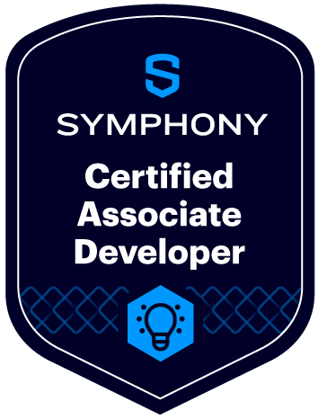

# Developer Certification

## Become a Symphony Certified Developer

Becoming a Symphony Certified Developer is a great way to validate your Symphony skills. When you become certified, you join an elite group of developers, and boost your career as demand for Symphony experts continues to grow!

The Symphony Developer Certification program is a series of online courses enabling developers to maximize the capabilities of Symphony’s API platform and developer tools. Learn about Symphony’s architecture and APIs and how to build solutions on our platform using the toolkit we use to build commercial enterprise integrations.

Check out our training center here:


[Broken link](broken-reference)


## Symphony Certified Associate Developer 


This is our foundation level certification where all developers start their journey.  On completion of this course developers can gain their Symphony Certified Associate Developer status.


### **Module: Symphony Development Fundamentals v2**

Learn about what bots and apps are, along with Symphony's architecture, security model, REST APIs and the developer journey.&#x20;

### How It works

Certification involves completing this module and successfully answering the quiz questions throughout the course.  The course is approximately 45 mins in length followed by the quiz questions.

* The program is free and open to technologists, Symphony service owners and developers alike.&#x20;
* Knowledge of the Symphony platform or development is not necessarily required.
* Symphony will provide a limited, shared sandbox environment for those who do not have a company test environment.&#x20;

Head over to our Developer Training Center to get started on this [course](https://learn.symphony.com/courses/fundamentals-v2).

## Symphony Certified Bot Developer  


This course has a pre-requisite requirement of completing the Symphony Development Fundamentals course and achieving a [Symphony Certified Associate Developer](untitled.md#symphony-certified-associate-developer) status.


After completing the [Symphony Development Fundamentals](untitled.md#module-symphony-development-fundamentals-v2) course you then have access to the Certified Bot Developer courses shown below.  These courses give developers experience in developing Symphony chat bots and applications using Symphony BDK tooling. &#x20;

We have language pathways for either Java or Python.  So please follow the respective guide below for [Java](untitled.md#module-developing-bots-using-bdk-2.0-for-java) or [Python](untitled.md#module-developing-bots-using-bdk-2.0-for-python).

### Module: Developing Bots using BDK 2.0 for Java 


Please follow this pathway if you're interested in learning more about our Java BDK 2.0


Takes a deeper dive into Symphony APIs, including hands-on examples built using our latest developer tool, the Symphony Bot Developer Kit (BDK) an in depth look into the latest Symphony developer tool, the Bot Developer Kit 2.0!

### How it works

Becoming a Symphony Certified Bot Developer involves completing this module and then passing the dedicated certification exam.  The course is approximately 180 mins in length followed by the certification exam which is 90 minutes.

* The program is free and open to all developers.
* Knowledge of the Symphony platform is not required, but exercises will require developers to access a Symphony environment.
* Symphony will provide a limited, shared sandbox environment for those who do not have a company test environment.&#x20;

Head over to our Developer Training Center to get started on this [course](https://learn.symphony.com/bundles/java-bot-developer).

### Module: Developing Bots using BDK 2.0 for Python 


Please follow this pathway if you're interested in learning more about our Python BDK 2.0


Takes a deeper dive into Symphony APIs, including hands-on examples built using our latest developer tool, the Symphony Bot Developer Kit (BDK) an in depth look into the latest Symphony developer tool, the Bot Developer Kit 2.0!

### How it works

Becoming a Symphony Certified Bot Developer involves completing this module and then passing the dedicated certification exam.  The course is approximately 180 mins in length followed by the certification exam which is 90 minutes.

* The program is free and open to all developers.
* Knowledge of the Symphony platform is not required, but exercises will require developers to access a Symphony environment.
* Symphony will provide a limited, shared sandbox environment for those who do not have a company test environment.&#x20;

Head over to our Developer Training Center to get started on this [course](https://learn.symphony.com/bundles/python-bot-developer).

## Symphony Certified Workflow Developer 


This course has a pre-requisite requirement of completing the Symphony Development Fundamentals course and achieving a [Symphony Certified Associate Developer](untitled.md#symphony-certified-associate-developer) status.


### Module: Implementing Workflows with WDK

This course showcases our latest Workflow Developer Kit (WDK) which uses a low-code development approach to building chat-bot applications. &#x20;

Developers are no longer required to manually type out code but rather use declarations to create applications.  Declarations are abstracted pieces of code which developers can manipulate to give access to the Symphony APIs to react on events and perform actions as common as sending messages to users.&#x20;

### How it works

Becoming a Symphony Certified Workflow Developer involves completing this module and then passing the dedicated certification exam.  The course is approximately 180 mins in length followed by the certification exam which is 90 minutes.

* The program is free and open to all developers.
* Knowledge of the Symphony platform is not required, but exercises will require developers to access a Symphony environment.
* Symphony will provide a limited, shared sandbox environment for those who do not have a company test environment.

Head over to our Developer Training Center to get started on this [course](https://learn.symphony.com/bundles/workflow-developer-certification).
