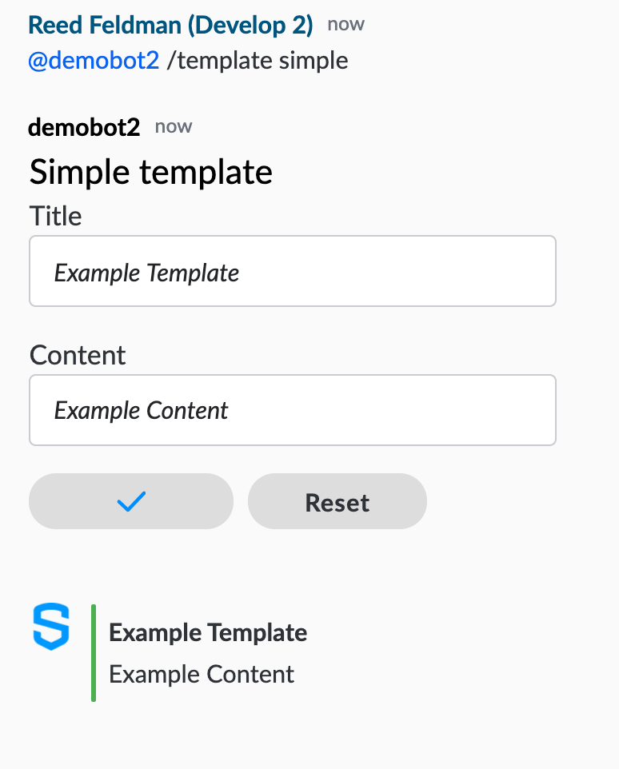

# Build an Interactive Bot using the BDK 1.0


Note: Symphony engineering has announced the End of Life (EOL) and support for our Java, Python and Node.js SDKs and Java BDK 1.0 (including CLI Tool & UI Toolkit) from March 2022.  Whilst limited support is still available for the .NET SDK.

\
We recommend you check out the latest version of the  Bot SDK (BDK 2.0) that comes with best practices, intelligent API bindings, and simplified authentication/configuration:

* [BDK 2.0 for Java](../../../bdk-2.0/)


## Prerequisites

Complete the BDK Bot Configuration guide:


[configure-your-bot-for-bdk.md](../configure-your-bot-for-bdk.md)


## 1. Dive into the Code

The Bot SDK provides all of the functionality as our regular Symphony SDKs such as easy to use authentication handlers, centralized configuration, convenient error handling, and API bindings so you can call the API directly in your bot's code. In addition, the Bot SDK also provides out-of-the-box Datafeed and event handling architecture that make it simple for your bot to handle different events.

The Bot SDK is also baked in with bot's best practices and provides a lot of convenient out-of-the-box code that can be used to bootstrap your bot quickly, including sending and receiving Symphony Elements. To illustrate these best practices and convenient boilerplate code, navigate to `TemplateHandler.java` inside your project directory. The different bot commands are shown in the `DESCRIPTIONS` dictionary:



```java
 private static final String[] DESCRIPTIONS = {
      "/template simple",
      "/template alert",
      "/template information",
      "/template notification",
      "/template list",
      "/template table"
  };
```



The `DESCRIPTIONS` dictionary defines the different bot commands that you can send to your bot. Each of these commands corresponds to a different Symphony Element or combination of multiple elements that make up a form. The Bot automatically follows our best practice naming convention of "@botusername /command" when prompting your Bot.

When a user prompts the bot with "@demobot2 /template simple", the bot will call pass my user input to the `displayElements()` function:



```java
public void displayElements(BotCommand command, SymphonyMessage elementsResponse) {
    Optional<SmsTypes> templateType = getTemplateType(command.getMessageEvent().getMessage());
    if (templateType.isPresent()) {
      Map<String, String> data = new HashMap<>();
      data.put("form-id", getElementsFormId());
      switch (templateType.get()) {
        case SIMPLE:
          elementsResponse.setTemplateFile(SIMPLE_TEMPLATE, data);
          break;
        case ALERT:
          elementsResponse.setTemplateFile(ALERT_TEMPLATE, data);
          break;
        case INFORMATION:
          elementsResponse.setTemplateFile(INFORMATION_TEMPLATE, data);
          break;
        case NOTIFICATION:
          elementsResponse.setTemplateFile(NOTIFICATION_TEMPLATE, data);
          break;
        case LIST:
          elementsResponse.setTemplateFile(LIST_TEMPLATE, data);
          break;
        case TABLE:
          elementsResponse.setTemplateFile(TABLE_TEMPLATE, data);
      }
    } else {
      Map<String, Object> data = new HashMap<>();
      data.put("botMention", "@" + getBotName());
      data.put("descriptions", DESCRIPTIONS);
      elementsResponse.setTemplateFile(INVALID_TEMPLATE, data);
    }
  }
```



Next, the bot will route the command to the `SIMPLE` case and render the handlebars template, simple-template.hbs:



```markup
<form id="{{form-id}}">
    <h3>Simple template</h3>
    <h6>Title</h6>
    <text-field masked="false" name="title" required="false"></text-field>
    <h6>Content</h6>
    <text-field masked="false" name="content" required="false"></text-field>
    <button name="simple" type="action">Confirm</button>
    <button type="reset">Reset</button>
</form>
```



As you can see, this handlebars template contains designated messageML tags that form Symphony Elements inside of a message.

## 2. Handle Your Action

When a user submits this form, the `handleAction()` is called and the form values collected:



```java
public void handleAction(SymphonyElementsEvent event, SymphonyMessage elementsResponse) {
    Map<String, Object> formValues = event.getFormValues();
    SmsTypes action = SmsTypes.valueOf(((String) formValues.get("action")).toUpperCase());
    formValues.remove("action");
    Map<String, Object> message = new HashMap<>();
    Object messageValue = null;
    switch (action) {
      case SIMPLE:
      case ALERT:
      case INFORMATION:
        messageValue = formValues;
        break;
      case NOTIFICATION:
        messageValue = handleNotification(formValues);
        break;
      case LIST:
        messageValue = handleList(formValues);
        break;
      case TABLE:
        messageValue = handleTable(formValues);
    }
    message.put("message", messageValue);
    elementsResponse.setTemplateFile(action.getName(), message);
  }
```



Afterwards the bot replies with the contents of the message. This illustrates how the BDK is able to handle elements events and parse the contents of the form itself. What you do with that data, is apart of your custom business logic and implementation. In this example, we simply reply back to the user with the input data.

## 3.  Run your Bot

Start up your Spring Application by running your BotApplication.java and test that your Interactive Bot works in a 1-1 IM by prompting and submitting a "simple" form:



Feel free to play around with the other commands to see how Symphony Elements can be useful to your workflow. To learn more about how your can add your own Symphony Elements and business logic to your workflow, navigate to our Developer Certification program:


[Broken link](broken-reference)

