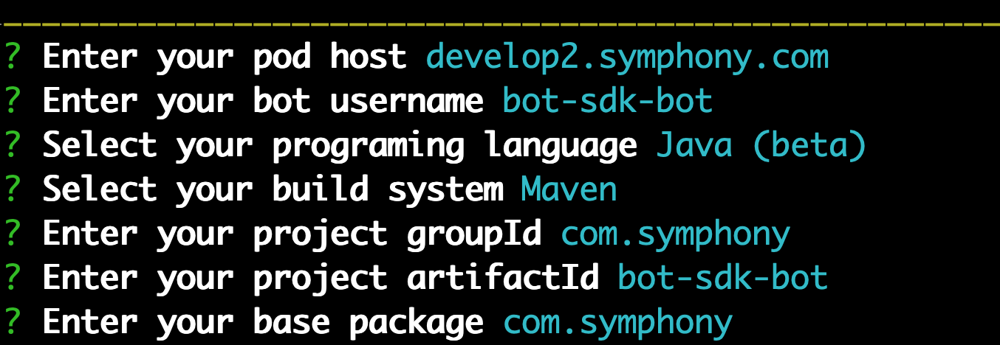

# BDK 2.0

## Summary

* Description
* Installation
* Configuration
* Authentication
* Datafeed Management
* Activities API
* Message + Room Management
* Messages Templating

## Description

The BDK 2.0 is the latest version of the Symphony Bot Developer Kit, a Java specific SDK that provides all of the basic support as our other SDKs including datafeed management, convenient error handling, and API bindings. With an ultra simplified configuration and authentication setup, intuitive message and room management, message templating and a new activities APIs, developing bots on Symphony has never been easier. Continue here to learn how the BDK 2.0 can help power your Symphony Bots, integration and workflow automations today!

## Installation

The easiest way to access the BDK 2.0 and build bots on top of the BDK 2.0 is through the Symphony Yeoman Generator.  

1.  **Install the Symphony Yeoman Generator:**

```text
$ npm i -g generator-symphony
```


Note: If you already have the Symphony Yeoman Generator installed, upgrade it by running the following: `npm update -g generator-symphony`


    2.  **Create a new directory and navigate inside:**

```text
$ mkdir bdk-bot && cd bdk-bot
```

    3.  Run the generator:

```text
$ yo symphony 2.0
```

You should see the following:


## Configuration

Once installed, the next step is to configure your new Symphony Bot using the Yeoman Generator.  In the command line, enter the information for your Symphony environment and Bot metadata.  For example:



After pressing enter, the Yeoman Generator will generate a RSA public/private key pair and generate your bot project scaffold.  Open your generated project in your Java IDE of choice and navigate to your generated `config.yaml` file: 


Note: In the generated config.yaml file, the BDK assumes your Symphony Pod, Agent, and Key Manager components are all access via the same host, port, and scheme.  




```yaml
host: develop2.symphony.com

bot:
  username: bot-sdk-bot
  privateKeyPath: /Users/reed.feldman/bdk-bot/src/main/resources/rsa/privatekey.pem
```



By the default this configuration file is generated, however you can customize this file to meet the specifications of your symphony environment.  The following configuration properties can be added to this `config.yaml` file: 

### Basic Configuration Structure

| Property | Description |
| :--- | :--- |
| `host` | component URL |
| `port` | component port available |
| `context` | component  context |
| `scheme` | https or http |
| `pod` | contains pod metadata including `host`, `port`, `scheme`, `context`, and `proxy` attributes |
| `bot` | contains bot metadata including `username`, `privateKeyPath`, `certificatePath`, and`certificatePassword`  |
| `app` | contains extension app metadata including `appId`, `privateKeyPath`, `certificatePath`, and `certificatePassword` |
| `ssl` | contains `trustStore` and `trustStore` password for SSL communication |

### Datafeed Configuration Structure

| Property | Description |
| :--- | :--- |
| `version` | version of the datafeed service to be used.  By default, the bot will use the datafeed v1 service. |
| `idFilePath` | the path to the file which will be used to persist a created datafeed id in case the datafeed service v1 is used |
| `retry` | the specific retry configuration can be used to override the global retry configuration.  If no retry configuration is defined, the global one will be used.   |

### Retry Configuration Structure

| Property  | Description |
| :--- | :--- |
| `maxAttempts` | maximum number of retry attempts that a bot is able to make |
| `multiplier` | after each attempt, the interval between two attempts will be multiplied by this factor |
| `initialIntervalMillis` | the initial interval between two attempts |
| `maxIntervalMillis` | the limit of interval between two attempts.  For example, if the current interval is 1000 ms, multiplier is 2.0 and the `maxIntervalMillis` is 1500 ms, then the interval for the next retry will be 1500 ms. |

An example customized configuration file is seen below:



```yaml
scheme: https
host: localhost.symphony.com
port: 8443

pod:
  host: dev.symphony.com
  port: 443

agent:
  context: agent

keyManager:
  host: dev-key.symphony.com
  port: 8444

sessionAuth:
  host: dev-session.symphony.com
  port: 8444

bot:
  username: bot-name
  privateKeyPath: path/to/private-key.pem
  certificatePath: /path/to/bot-certificate.p12
  certificatePassword: changeit

ssl:
  trustStorePath: /path/to/all_symphony_certs_truststore
  trustStorePassword: changeit

app:
  appId: app-id
  privateKeyPath: path/to/private-key.pem

datafeed:
  version: v1
  retry:
    maxAttempts: 6
    initialIntervalMillis: 2000
    multiplier: 1.5
    maxIntervalMillis: 10000

retry:
  maxAttempts: 6
  initialIntervalMillis: 2000
  multiplier: 1.5
  maxIntervalMillis: 10000
```



