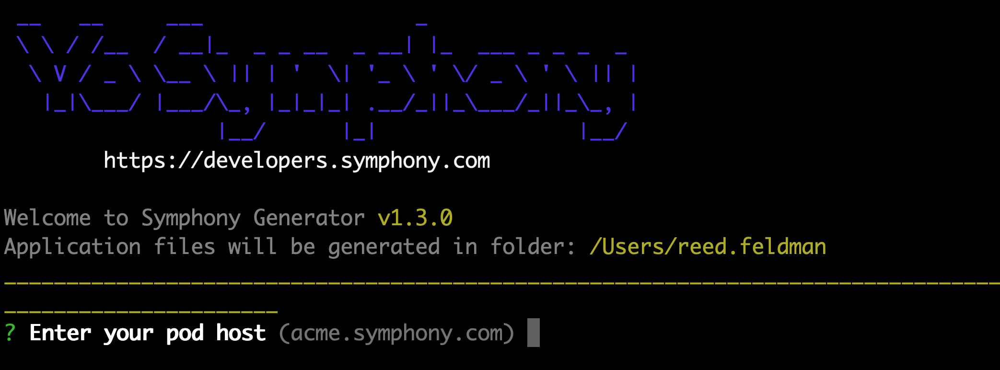
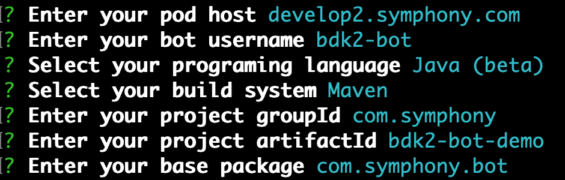

# BDK 2.0

## Summary

* [Description](bdk-2.0.md#description)
* [Installation](bdk-2.0.md#installation)
* [Configuration](bdk-2.0.md#configuration)
* [Authentication](bdk-2.0.md#authentication)
* [Datafeed Management](bdk-2.0.md#datafeed-management)
* [Managing Multiple Bots](bdk-2.0.md#managing-multiple-bots)
* [Activities API](bdk-2.0.md#activities-api)
* [User, Message, & Room Management](bdk-2.0.md#user-message-and-room-management)
* [Message Templating](bdk-2.0.md#message-templating)
* [SpringBoot Integration](bdk-2.0.md#springboot-integration)

## Description

The BDK 2.0 is the latest version of the Symphony Bot Developer Kit, a library of tools and intelligent API bindings that provides an ultra simplified configuration and authentication setup, intuitive message and room management, customizable message templating, and a new activities API that makes it easy to facilitate bot workflows. Continue here to learn how the BDK 2.0 can help power your Symphony Bots and integrations today!

## Installation

The easiest way to access the BDK 2.0 and build bots on top of the BDK 2.0 is through the Symphony Yeoman Generator.  

1.  **Install the Symphony Yeoman Generator:**

```text
$ npm i -g generator-symphony
```


Note: If you already have the Symphony Yeoman Generator installed, upgrade it by running the following: `npm update -g generator-symphony`


    2.  **Create a new directory and navigate inside:**

```text
$ mkdir bdk-bot && cd bdk-bot
```

    3.  Run the generator:

```text
$ yo symphony 2.0
```

You should see the following:



## Configuration

Once installed, the next step is to configure your new Symphony Bot using the Yeoman Generator.  In the command line, enter the information for your Symphony environment and Bot metadata.  For example:



After pressing enter, the Yeoman Generator will generate a RSA public/private key pair and generate your bot project scaffold.  Open your generated project in your Java IDE of choice and navigate to your generated `config.yaml` file: 


Note: In the generated config.yaml file, the BDK assumes your Symphony Pod, Agent, and Key Manager components are all access via the same host, port, and scheme.  




```yaml
host: develop2.symphony.com

bot:
  username: bdk2-bot
  privateKeyPath: /Users/reed.feldman/bdk-bot/src/main/resources/rsa/privatekey.pem
```



By the default this configuration file is generated, however you can customize this file to meet the specifications of your symphony environment.  The following configuration properties can be added to this `config.yaml` file: 

### Basic Configuration Structure

| Property | Description |
| :--- | :--- |
| `host` | component URL |
| `port` | component port available |
| `context` | component  context |
| `scheme` | https or http |
| `pod` | contains pod metadata including `host`, `port`, `scheme`, `context`, and `proxy` attributes |
| `bot` | contains bot metadata including `username`, `privateKeyPath`, `certificatePath`, and`certificatePassword`  |
| `app` | contains extension app metadata including `appId`, `privateKeyPath`, `certificatePath`, and `certificatePassword` |
| `ssl` | contains `trustStore` and `trustStore` password for SSL communication |

### Datafeed Configuration Structure

| Property | Description |
| :--- | :--- |
| `version` | version of the datafeed service to be used.  By default, the bot will use the datafeed v1 service. |
| `idFilePath` | the path to the file which will be used to persist a created datafeed id in case the datafeed service v1 is used |
| `retry` | the specific retry configuration can be used to override the global retry configuration.  If no retry configuration is defined, the global one will be used.   |

### Retry Configuration Structure

| Property  | Description |
| :--- | :--- |
| `maxAttempts` | maximum number of retry attempts that a bot is able to make |
| `multiplier` | after each attempt, the interval between two attempts will be multiplied by this factor |
| `initialIntervalMillis` | the initial interval between two attempts |
| `maxIntervalMillis` | the limit of interval between two attempts.  For example, if the current interval is 1000 ms, multiplier is 2.0 and the `maxIntervalMillis` is 1500 ms, then the interval for the next retry will be 1500 ms. |

An example customized configuration file is seen below:



```yaml
scheme: https
host: localhost.symphony.com
port: 8443

pod:
  host: dev.symphony.com
  port: 443

agent:
  context: agent

keyManager:
  host: dev-key.symphony.com
  port: 8444

sessionAuth:
  host: dev-session.symphony.com
  port: 8444

bot:
  username: bot-name
  privateKeyPath: path/to/private-key.pem
  certificatePath: /path/to/bot-certificate.p12
  certificatePassword: changeit

ssl:
  trustStorePath: /path/to/all_symphony_certs_truststore
  trustStorePassword: changeit

app:
  appId: app-id
  privateKeyPath: path/to/private-key.pem

datafeed:
  version: v1
  retry:
    maxAttempts: 6
    initialIntervalMillis: 2000
    multiplier: 1.5
    maxIntervalMillis: 10000

retry:
  maxAttempts: 6
  initialIntervalMillis: 2000
  multiplier: 1.5
  maxIntervalMillis: 10000
```



## Authentication

Authenticating your Bot is made simple when using the BDK 2.0.  Once you have your Bot and Symphony environment properly configured, the generated code provides an out of the box implementation for authenticating your Bot:



```java
final SymphonyBdk bdk = new SymphonyBdk(loadFromClasspath("/config.yaml"));
```



 By instantiating a new `SymphonyBdk` instance with your `config.yaml` file, the BDK loads in your config and authenticates your bot.  Once authenticated, your bot is ready to leverage the REST API to create rich automations and workflows on Symphony. 


Note:  You must have a corresponding service or Bot account setup on your Symphony instance before authenticating.  For more information navigate to the [Creating a Bot User](../../building-bots-on-symphony/configuration/creating-a-bot-user.md) guide.


### OBO Authentication

The BDK 2.0 also supports OBO \(On-Behalf-Of\) pattern of authentication, allowing an authenticated bot + extension application to perform operations on behalf of a given user.  The BDK's implementation makes it easy to perform the following operations on behalf of a given user:

* List the streams of a given user
* Initiate connection requests to and determine connection status with other users
* Get the presence state of other connected users
* Initiate IMs and MIMs with other users
* Send messages and attachments
* Set the context user's own presence

To leverage an OBO based workflow, simply instantiate an OBO Session in your Bot project.  The BDK 2.0 allows you to instantiate your OBO session from a username or user ID.  Once authenticated bots can perform any of the OBO workflows listed above:

```java
 // setup SymphonyBdk facade object
 final SymphonyBdk bdk = new SymphonyBdk(loadFromSymphonyDir("config.yaml"));
 
 //authenticate on-behalf-of a given user
 final AuthSession oboSessionUsername = bdk.obo("user.name");
 final AuthSession oboSessionUserId = bdk.obo(123456789L);
 
 // list streams OBO user "user.name"
 bdk.streams().listStreams(oboSessionUsername, new StreamFilter());
```

## Managing Multiple Bots

The BDK 2.0 makes it easy to manage multiple bot instances within a single project.  As long as you have unique configuration files that correspond to different service accounts, you can manage multiple bot instances from a centralized source.  To do so, simply instantiate multiple bot instances of the `SymphonyBDK` class within your bot project:

```java
// Bot #1
final SymphonyBdk bot1 = new SymphonyBdk(loadFromClasspath("/config_1.yaml"));

//Bot #2
final SymphonyBdk bot2 = new SymphonyBdk(loadFromClasspath("/config_2.yaml"));
```

## Datafeed Management

The BDK 2.0 provides an `DatafeedService` interface that makes it easier than ever for bots to manage real-time messages and events.  The `DatafeedService` interface provides the following methods for your bot to use: 

| Method | Descriptions |
| :--- | :--- |
| `start()` | Start the bot's datafeed |
| `stop()` | Stop the bot's datafeed |
| `subscribe(RealTimeEventListener)` | Subscribe a custom event listener class.  Inside this class is where the bulk of your business logic goes.   |
| `unsubscribe(RealTimeEventListener)` | Unsubscribe from a custom event listener class. |

For bots to listen to incoming events and messages, bots must subscribe to a custom `RealTimeEventListener`.  This `RealTimeEventListener` class must implement eventType methods \(e.g. `onMessageSent()`\) along with custom business logic inside.  

When a user sends a bot a message, the Bot will pick up the event from the datafeed and check to see if an implemented eventType method matches the eventType \(`MESSAGESENT`\) of the inbound event.  If there is a corresponding eventType method registered, the bot will execute the business logic inside of this eventType method.  Otherwise the Bot will not perform an action and will continue to listen for inbound events from the datafeed.  An example implementation is provided out of the box by the BDK 2.0:



```java
 // subscribe to "onMessageSent" real-time event
    bdk.datafeed().subscribe(new RealTimeEventListener() {

      @Override
      public void onMessageSent(V4Initiator initiator, V4MessageSent event) {
        // on a message sent, the bot replies with "Hello, {User Display Name}!"
        bdk.messages().send(event.getMessage().getStream(), "<messageML>Hello, " + initiator.getUser().getDisplayName() + "!</messageML>");
      }
    });
```



Below is a full list of methods provided by the `RealTimeEventListener` class and their corresponding eventTypes.  Implement the following methods in order to listen for a given Symphony event:

| Method | Event Type |
| :--- | :--- |
| onMessageSent\(\) | MESSAGESENT |
| onInstantMessageCreated\(\) | INSTANTMESSAGECREATED |
| onMessageSuppressed\(\) | MESSAGESUPPRESSED |
| onRoomCreated\(\) | ROOMCREATED |
| onRoomUpdated\(\) | ROOMUPDATED |
| onRoomDeactivated\(\) | ROOMDEACTIVATED |
| onRoomReactivated\(\) | ROOMACTIVATED |
| onUserRequestedToJoinRoom\(\) | USERREQUESTEDTOJOINROOM |
| onUserJoinedRoom\(\) | USERJOINEDROOM |
| onUserLeftRoom\(\) | USERLEFTROOM |
| onRoomMemberPromotedToOwner\(\) | ROOMMEMBERPROMOTEDTOOWNER |
| onRoomMemberDemotedFromOwner\(\) | ROOMMEMBERDEMOTEDFROMOWNER |
| onConnectionRequested\(\) | CONNECTIONREQUESTED |
| onConnectionAccepted\(\) | CONNECTIONACCEPTED |
| onSymphonyElementsAction\(\) | SYMPHONYELEMENTSACTION |
| onSharedPost\(\) | SHAREDPOST |

For more information on the Symphony datafeed continue here:



## Activities API

The BDK 2.0 provides a new Activities API, an interface that makes it easy to manage user-to-bot interactions or activities.  Specifically, the Activities API provides easy access to message and room context, initiator metadata, and an intuitive way to interact with the datafeed, making it easy for bots to listen and reply to different Symphony events.  The methods and logic provided by the Activities API allows for granular control over the entire user-to-bot interaction.  This encapsulated logic is easily reused, forming the discrete building blocks of a Symphony workflow automation.  

### Workflow API

While the Activities API gives developers granular control over the user-to-bot interaction, the Workflow API makes it easy to string together this sequence of activities in order to create a complete Symphony workflow automation.  The Workflow API gives developers developers control over how these activities fit together in a context-based way that is easy monitored.  With both tools in hand, building powerful, enterprise grade workflows has never been easier.       

### Registering Activities

In order to register activities with your bot instance, you must leverage the `ActivityRegistry` class:

```java
public static void main(String[] args) throws Exception {
    // Create BDK entry point
    final SymphonyBdk bdk = new SymphonyBdk(loadFromSymphonyDir("config.yaml"));
    // Access to the registry for activities
    final ActivityRegistry registry = bdk.activities();
  }
```

 There are two different types of activities supported by the BDK:

* **Command Activity**: an activity triggered when a message is sent in an IM, MIM, or Chatroom.
* **Form Activity**: an activity triggered when a user replies to an Elements form message.  

### Command Activities

A command-based activity is triggered when a message is sent in an IM, MIM, or Chatroom.  Using the Activities API allows developers to register commands in the following formats:

1.  `@bdk2-bot /buy` \(Slash command with a bot @mention\)



```java
final SymphonyBdk bdk = new SymphonyBdk(loadFromSymphonyDir("config.yaml"));

    bdk.activities().register(new SlashCommand("/buy",    // (1)
                                               true,        // (2)
                                               context -> { // (3)

      log.info("Hello slash command triggered by user {}", context.getInitiator().getUser().getDisplayName());
    }));
```



   2.  `/buy 1000 goog` \(Slash command without a bot @mention\)



```java
final SymphonyBdk bdk = new SymphonyBdk(loadFromSymphonyDir("config.yaml"));

    bdk.activities().register(new SlashCommand("/buy" + " (.+)",    // (1)
                                               false,        // (2)
                                               context -> { // (3)

      //log the ticker symbol entered by the user
      log.info(context.getTextContent().split(" ")[2]);
    }));
```



  3.  Listen for the word `'hello'` \(Not a Slash command  - Listen for a specific word\)



```java
public class BotApplication {

  public static void main(String[] args) throws Exception {
    // setup SymphonyBdk facade object
    final SymphonyBdk bdk = new SymphonyBdk(loadFromSymphonyDir("config.yaml"));
    // register Hello Command within the registry
    bdk.activities().register(new HelloCommandActivity());
    // finally, start the datafeed loop
    bdk.datafeed().start();
  }
}

class HelloCommandActivity extends CommandActivity<CommandContext> {

  private final MessageService messageService;

  @Override
  protected ActivityMatcher<CommandContext> matcher() {
    return c -> c.getTextContent().contains("hello"); // (1)
  }

  @Override
  protected void onActivity(CommandContext context) {
    log.info("Hello command triggered by user {}", context.getInitiator().getUser().getDisplayName()); // (2)
    this.messageService.send(context.getSourceEvent().getStream(), "<messageML> Hello " + context.getInitiator().getUser().getDisplayName()) + "</messageML>");

  }

  @Override
  protected ActivityInfo info() {
    final ActivityInfo info = ActivityInfo.of(ActivityType.COMMAND); // (3)
    info.setName("Hello Command");
    return info;
  }
}
```




Note: If you choose to create your own `CommandActivity` class, you must implement the `matcher()` and `onActivity()` methods provided by the `AbstractActivity` class.  For more information on the implementation of the `CommandActivity` class, continue [here](https://github.com/SymphonyPlatformSolutions/symphony-api-client-java/tree/master/symphony-bdk-core/src/main/java/com/symphony/bdk/core/activity/command).


### Form Activities

The Activities API also makes it easy for Bots to listen for elements form submissions.  Assume the following elements form has been posted into a room with the following attributes:

* formId = "hello-form"
* &lt;text-field&gt; name = "name"
* form contains an action button

```markup
<messageML>
    <h2>Hello Form</h2>
    <form id="hello-form"> <!-- (1) -->

        <text-field name="name" placeholder="Enter a name here..."/> <!-- (2) -->

        <button name="submit" type="action">Submit</button> <!-- (3) -->
        <button type="reset">Reset Data</button>

    </form>
</messageML>
```

In order to register a form activity or listen for an incoming elements form submission, Bots must register a class that extends the `FormReplyActivity` class:

```java
public class Example {

  public static void main(String[] args) throws Exception {
    // setup SymphonyBdk facade object
    final SymphonyBdk bdk = new SymphonyBdk(loadFromSymphonyDir("config.yaml"));
    // register Hello FormReply Activity within the registry
    bdk.activities().register(new HelloFormReplyActivity(bdk.messages()));
    // finally, start the datafeed loop
    bdk.datafeed().start();
  }
}

class HelloFormReplyActivity extends FormReplyActivity<FormReplyContext> {

  private final MessageService messageService;

  public HelloFormReplyActivity(MessageService messageService) {
    this.messageService = messageService;
  }

  @Override
  protected ActivityMatcher<FormReplyContext> matcher() {
    return c -> "hello-form".equals(c.getFormId()) && "submit".equals(c.getFormValue("action")); // (1)
  }

  @Override
  protected void onActivity(FormReplyContext context) {
    final String message = "Hello, " + context.getFormValue("name") + "!"; // (2)
    this.messageService.send(context.getSourceEvent().getStream(), "<messageML>" + message + "</messageML>");
  }

  @Override
  protected ActivityInfo info() {
    final ActivityInfo info = ActivityInfo.of(ActivityType.FORM);
    info.setName("Hello Form Reply Activity");
    return info;
  }
}
```


Note: If you wish to create your own `FormReplyActivity` class, you must implement the methods `matcher()`, `onActivity()` and `info()` methods provided by the `AbstractActivity` class.  For more information on the implementation fo the `FormReplyActivity` class, continue [here](https://github.com/SymphonyPlatformSolutions/symphony-api-client-java/blob/master/symphony-bdk-core/src/main/java/com/symphony/bdk/core/activity/form/FormReplyActivity.java).


As shown above, the Activities API makes it simple to manage incoming commands, elements form submissions, and access message context making it easy to manage bot-user interactions and create custom workflows.    

## User, Message, & Room Management

The BDK 2.0 provides easy access to message, room, and user context.  

As shown above, the BDK 2.0 makes it easy to create a datafeed and listen for events through the `RealTimeEventListener` class.  In addition, this class makes it easy to access user, message, and room data in context.  Each eventType method is implemented with instances of `V4Initiator` and `V4MessageSent` objects:

```java
public void onMessageSent(V4Initiator initiator, V4MessageSent event)
```

Use the `V4Initiator` class methods to access the the user data in context:

| Method | User Attribute |
| :--- | :--- |
| initiator.getUser\(\).getUserId\(\) | User ID |
| initiator.getUser\(\).getFirstName\(\) | First Name |
| initiator.getUser\(\).getLastName\(\) | Last Name |
| initiator.getUser\(\).getDisplayName\(\) | Display Name |
| initiator.getUser\(\).getEmail\(\) | Email |
| initiator.getUser\(\).getUsername\(\) | Username |

Use the `V4MessageSent` class methods to access message data in context:

| Method | Attribute |
| :--- | :--- |
| event.getMessage\(\).getMessageId | Message ID |
| event.getMessage\(\).getTimestamp\(\) | Message Timestamp |
| event.getMessage\(\).getMessage\(\) | Message Text |
| event.getMessage\(\).getSharedMessage\(\) | Shared Message |
| event.getMessage\(\).getData\(\) | Message Data |
| event.getMessage\(\).getAttachments\(\) | Message Attachments |

Use the `V4MessageSent` class methods to access stream data in context:

| Method | Attribute |
| :--- | :--- |
| event.getMessage\(\).getStream\(\).getStreamId\(\) | Stream ID |
| event.getMessage\(\).getStream\(\).getStreamType\(\) | Stream Type |
| event.getMessage\(\).getStream\(\).getRoomName\(\) | Room Name |
| event.getMessage\(\).getStream\(\).getMembers\(\) | Room Members |
| event.getMessage\(\).getStream\(\).getExternal\(\) | External |
| event.getMessage\(\).getStream\(\).getCrossPod\(\) | Cross Pod |

### Managing Context through Activities API

The Activities API also makes it easy to access relevant user, message, and stream data in context.  `CommandActivity` classes have access to to this data through the `CommandContext` class.  This class is instantiated with instances of `V4Initiator` and `V4MessageSent` objects.  Bots are able access to the user, message, and stream data in context through the same methods shown above.  Leverage these methods within the `onActivity()` method shown below: 

```java
@Override
  protected void onActivity(CommandContext context) {
    log.info("Hello command triggered by user {}", context.getInitiator().getUser().getDisplayName()); // (2)
  }
```

FormActivity classes have access to relevant user, form, and stream data through the `FormReplyContext` class.  This class is instantiated with instances of the `V4Initiator` and `V4SymphonyElementsAction` class. The `V4SymphonyElementsAction` class provides the following methods to access form data in context:

| Method | Attribute |
| :--- | :--- |
| context.getSourceEvent\(\).getStream\(\) | Elements Stream ID |
| context.getSourceEvent\(\).getFormMessageId\(\) | Elements Message ID |
| context.getSourceEvent\(\).getFormId\(\) | Elements Form ID |
| context.getSourceEvent\(\).getFormValues\(\) | Elements Form Values |

```java
@Override
  protected void onActivity(FormReplyContext context) {
    final String message = "You entered " + context.SourceEvnent().getFormValues() + ".";
    this.messageService.send(context.getSourceEvent().getStream(), "<messageML>" + message + "</messageML>");
  }
```

## Message Templating

The BDK 2.0 also supports custom and built in message templating.  The BDK 2.0 is agnostic to what templating library developers choose, with support for FreeMarker templates, handlebars, and more.  In order to use message templating, you must leverage the `TemplateEngine` class provided by the BDK.  Implement the `newBuiltInTemplate()` method to reuse an simple messageML template:

```java
protected void onActivity(CommandContext context) {
    try {
        if (context.getTextContent().equals("template")) {
            Template template = TemplateEngine.getDefaultImplementation().newBuiltInTemplate("simpleMML");
            final String templateMessage = template.process(new HashMap<String, String>() {{
                put("message", "This is a simple templated message");
            }});
            messageService.send(context.getStreamId(), templateMessage);
        }
    }
    
    catch (TemplateException te) {
                log.error(te.getMessage());
        }
}
```

If you wish to build your own custom message template, you must implement one of the `newTemplate()` methods provided by the `TemplateEngine` class: 

* `newBuiltInTemplate()`
* `newTemplateFromFile()`
* `newTemplateFromClasspath()`
* `newTemplateFromUrl()`

The following shows an implementation of the `newTemplateFromClasspath()` method: 

```java
protected void onActivity(CommandContext context) {
    try {
        if (context.getTextContent().equals("template2")){
            Template template2 = TemplateEngine.getDefaultImplementation().newTemplateFromClasspath("/templates/customTemplate.ftl");
            final String templateMessage2 = template2.process(new HashMap<String, String>(){{
                put("message", "Hello World");
            }});
            messageService.send(context.getStreamId(), templateMessage2);
        }
    }
    catch (TemplateException te) {
        log.error(te.getMessage());
    }
}
```

The corresponding FreeMarker template is shown below:



```markup
<messageML>${message} from custom template !</messageML>
```



## SpringBoot Integration

The BDK 2.0's SpringBoot integration provides a few out of the box class annotations, making it easy to configure your bot's datafeed listeners, and also register command activities.  To do so, you must create an entry point for your Bot by creating a  `BotApplication.java` class:

```java
@SpringBootApplication
public class BotApplication {

    public static void main(String[] args) {
        SpringApplication.run(Application.class, args);
    }
}
```

Now you can create a component for a simple bot applications through the `@Component` annotation:

```java
@Component
public class HelloBot {

  @Autowired
  private MessageService messageService;

  @EventListener
  public void onMessageSent(RealTimeEvent<V4MessageSent> event) {
    this.messageService.send(event.getSource().getMessage().getStream(), "<messageML>Hello!</messageML>");
  }
}
```

### @EventListener

The Core Starter uses [Spring Events](https://docs.spring.io/spring-framework/docs/current/javadoc-api/org/springframework/context/ApplicationEventPublisher.html) to deliver Real Time Events.

You can subscribe to any Real Time Event from anywhere in your application by creating a handler method that has to respect two conditions:

* Be annotated with [@EventListener](https://docs.spring.io/spring-framework/docs/current/javadoc-api/org/springframework/context/event/EventListener.html)
* Have a `com.symphony.bdk.spring.events.RealTimeEvent<T>` parameter

```java
@Slf4j
@Component
public class RealTimeEventsDemo {

  @EventListener
  public void onMessageSent(RealTimeEvent<V4MessageSent> event) {
    log.info(event.toString());
  }

  @EventListener
  public void onUserJoined(RealTimeEvent<V4UserJoinedRoom> event) {
    log.info(event.toString());
  }

  @EventListener
  public void onUserLeft(RealTimeEvent<V4UserLeftRoom> event) {
    log.info(event.toString());
  }
}
```

### @Slash

You can easily register a slash command using the `@Slash` annotation. Note that the `CommandContext` is mandatory to successfully register your command. If not defined, a `warn` message will appear in your application log:

```java
@Component
public class SlashHello {

  @Slash("/hello")
  public void onHello(CommandContext commandContext) {
    log.info("On /hello command");
  }

  @Slash(value = "/hello", mentionBot = false)
  public void onHelloNoMention(CommandContext commandContext) {
    log.info("On /hello command (bot has not been mentioned)");
  }
}
```

### Activities

Any service or component class that extends `FormReplyActivity` or `CommandActivity` will be automatically registered with thin the `ActivityRegistry`

```java
@Slf4j
@Component
public class GifFormActivity extends FormReplyActivity<FormReplyContext> {

  @Autowired
  private MessageService messageService;

  @Slash("/gif")
  public void displayGifForm(CommandContext context) throws TemplateException {
    this.messageService.send(context.getStreamId(), "/templates/gif.ftl", emptyMap());
  }

  @Override
  public ActivityMatcher<FormReplyContext> matcher() {
    return context -> "gif-category-form".equals(context.getFormId())
        && "submit".equals(context.getFormValue("action"))
        && StringUtils.isNotEmpty(context.getFormValue("category"));
  }

  @Override
  public void onActivity(FormReplyContext context) {
    log.info("Gif category is \"{}\"", context.getFormValue("category"));
  }

  @Override
  protected ActivityInfo info() {
    return new ActivityInfo().type(ActivityType.FORM)
        .name("Gif Display category form command")
        .description("\"Form handler for the Gif Category form\"");
  }
}
```

