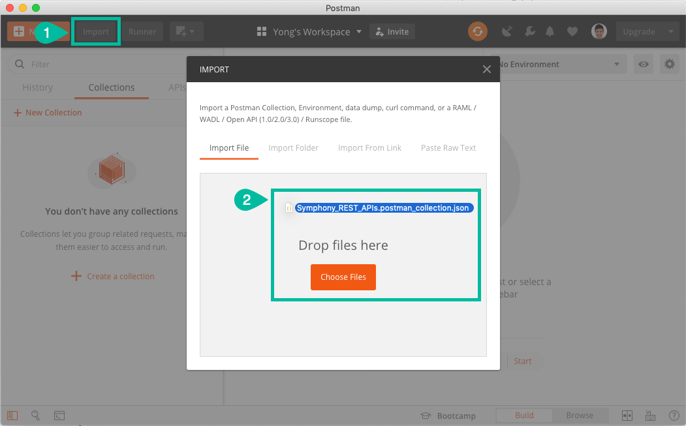
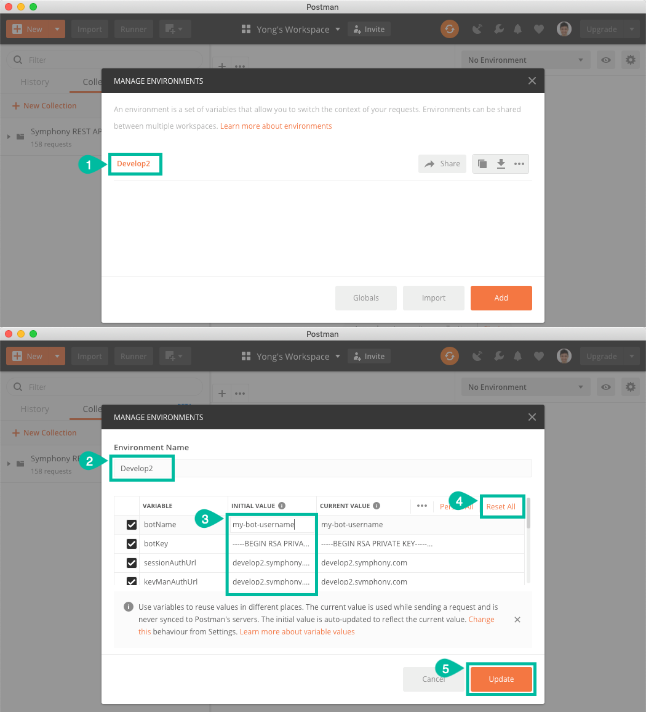
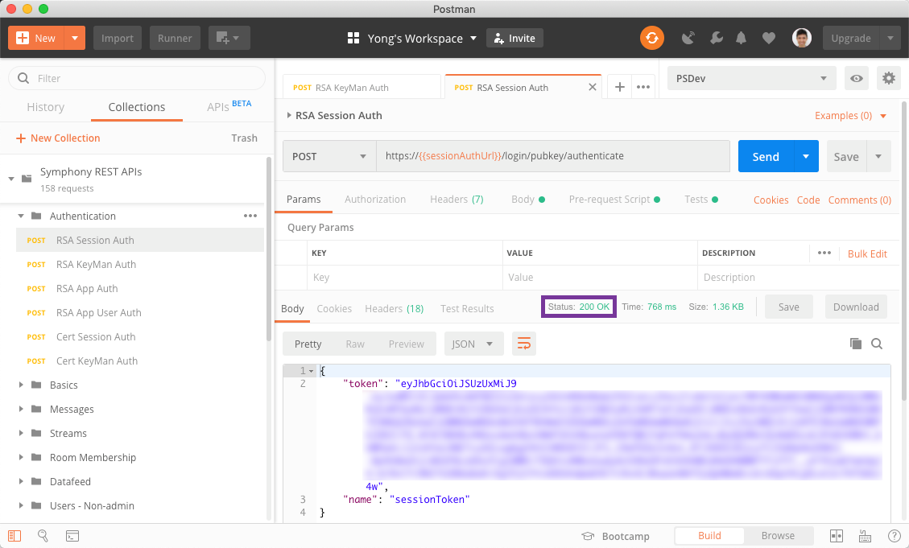
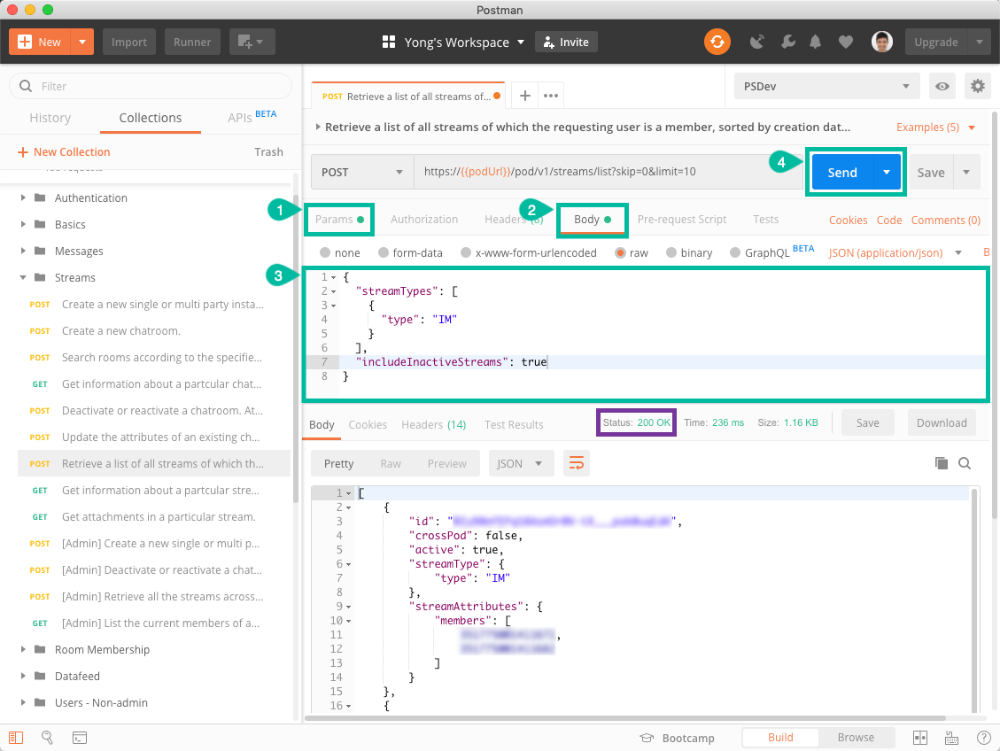

# Postman

Using Postman to invoke Symphony APIs allows you to quickly learn about the capabilities of Symphony's API suite as well as debug or troubleshoot any issues you may face when running bots or other integrations.

## Prerequisites

Before continuing, you will need the following:

* [Download and Install Postman](https://www.getpostman.com/downloads/)
* Your pod details:
  * Pod URL
  * Session Auth URL
  * Key Manager Auth URL
  * API Agent URL
* A generated [RSA key pair](../../building-bots-on-symphony/authentication/rsa-authentication.md)
* A service account created on your pod with the public key from above loaded

## Symphony Postman Collection

Click on the button below to launch Postman with the Symphony REST APIs collection and a sample environment.

If the button above does not work for you, download the following archive containing the Symphony Rest APIs collection and a sample environment configuration.

1. [Download Collection and Environment Here](https://filevault.symphony.com/index.php/s/LcoG9wZJcET6Pr4)
2. Unzip the archive
3. Launch Postman
4. Click on the **Import** button on the top-left
5. Drop both files from the unzipped archive into the import file window

## Update Environment Configuration

1. Click the gear button beside the environments selector dropdown
2. Select the sample Develop2 environment
3. Update the **Initial Value** column with your pod and bot details
4. Click the **Reset All** button to sync the **Current Value** column
5. Click **Update**, then close the manage environments dialog

## Run Collection

Try to perform Authentication &gt; RSA Session Auth and RSA KeyMan Auth. If any of them fail, check that your environment details are accurate:

Explore the rest of the collection and make requests by filling in the respective request parameters or body payloads and pressing the Send button. There is no need to manually copy and paste tokens from the authentication process as they are saved in the environment. If the tokens expire, simply redo the requests from step 1 above and try again.

