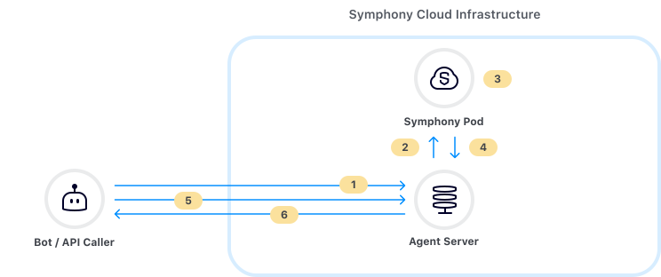

# Datafeed with SDKs


**Datafeed v1 Deprecation Notice**\
****\
****The legacy Datafeed v1 service will no longer be supported on **April 30, 2023**. Please read [here](datafeed-with-sdks.md#datafeed-v1-deprecation-notice) for more information on this transition.  Please reach out to your Technical Account Manager or to the Developer Relations team for more information.


## Overview of Datafeed

The Symphony datafeed provides a stream of real-time messages and events for all conversations that a bot is a member of. Any event that occurs within a bot's scope will be captured and delivered to the bot by the datafeed. The datafeed forms the basis of all interactive and conversational bot workflows as it allows bots to directly respond to Symphony messages and events.

## Datafeed Architecture

Symphony provides a Datafeed API that allows bots to easily [create](https://developers.symphony.com/restapi/reference#create-messagesevents-stream-v4) and [read](https://developers.symphony.com/restapi/reference#read-messagesevents-stream-v4) datafeeds.

Once a bot has created a datafeed, it has access to all of the [events](https://docs.developers.symphony.com/building-bots-on-symphony/datafeed/real-time-events) within its scope, acting as a secure channel between a bot and all activity happening in the Symphony Pod. Additionally, all messages and events within a bot's scope are encrypted by the Agent before reaching your bot. That way the bot is the only one who can access the contents of these events and messages being delivered.

The following illustrates the relationship between your bot, datafeed, and Symphony's components:



1. **Bot creates datafeed via Symphony’s REST API**
2. **Agent creates secure upstream connection with the Symphony Pod**
3. **End user sends a message to a bot in a chatroom**
4. **Pod delivers ‘MESSAGESENT’ event to Agent**
5. **Bot reads datafeed via REST API**
6. **Agent delivers ‘MESSAGESENT’ event payload to the Bot**

## Real-Time Events

Events are delivered to your bot via the datafeed as JSON objects. Each type of Symphony event corresponds to a different JSON payload.

For example, if a user sends your bot a message, an event of type `'MESSAGESENT'` will be delivered to your bot through the datafeed:

```javascript
{
    "id": "9rc1dr",
    "messageId": "Fd4Pc8xO5Vg6hVfzabFe2X___oyM1eXobQ",
    "timestamp": 1595365005847,
    "type": "MESSAGESENT",
    "initiator": {
        "user": {
            "userId": 344147139494862,
            "firstName": "Reed",
            "lastName": "Feldman",
            "displayName": "Reed Feldman (SUP)",
            "email": "reed.feldman@symphony.com",
            "username": "reedUAT"
        }
    },
    "payload": {
        "messageSent": {
            "message": {
                "messageId": "Fd4Pc8xO5Vg6hVfzabFe2X___oyM1eXobQ",
                "timestamp": 1595365005847,
                "message": "<div data-format=\"PresentationML\" data-version=\"2.0\" class=\"wysiwyg\"><p>hi</p></div>",
                "data": "{}",
                "user": {
                    "userId": 344147139494862,
                    "firstName": "Reed",
                    "lastName": "Feldman",
                    "displayName": "Reed Feldman (SUP)",
                    "email": "reed.feldman@symphony.com",
                    "username": "reedUAT"
                },
                "stream": {
                    "streamId": "IEj12WoWsfTkiqOBkATdUn___pFXhN9OdA",
                    "streamType": "IM"
                },
                "externalRecipients": false,
                "userAgent": "DESKTOP-43.0.0-10902-MacOSX-10.14.6-Chrome-83.0.4103.61",
                "originalFormat": "com.symphony.messageml.v2",
                "sid": "98202eac-dcf4-4b1e-a120-596db38319dc"
            }
        }
    }
}
```

Notice how each event returned by the datafeed has important metadata and attributes such as `messageId`, `timestamp`, (event) `type`, `initiator`, as well as the contents of the message itself inside of the payload object. Additionally, you can find the `streamID` corresponding to the message and also information regarding `externalRecipients`.

For a full list of the  JSON payloads corresponding to each event type, continue here:


[real-time-events.md](../../../building-bots-on-symphony/datafeed/real-time-events.md)


## Handling Datafeed Events with SDKs

Symphony SDKs come bootstrapped with a `DatafeedEventService` class that handles all of the logic for creating/reading datafeeds via the API, has best practices for maintaining datafeeds, and also provides event handling architecture that makes it easy to orchestrate complex workflows and introduce custom business logic to your bot.

As a bot developer, all you have to do is to implement event listener interfaces that are provided out-of-the-box by Symphony's SDKs. The `DatafeedEventService` event service does all of the heavy lifting and acts as the backbone of your bot or workflow.

After the `DatafeedEventService` creates/reads from the datafeed API, it categorizes each event based on its event type seen [here](https://docs.developers.symphony.com/building-bots-on-symphony/datafeed/real-time-events), and dispatches the event downstream to their appropriate event handler function. For example, if a user sends a message to a bot inside a **chatroom**, the event will be read by the datafeed, and dispatched to the `onRoomMessage()` function inside the `RoomListener` Interface.

The following diagram shows the event handling workflow:


1. **Bot creates datafeed via Symphony’s REST API**
2. **Agent creates secure upstream connection with the Symphony Pod**
3. **End user sends a message to a bot in a chatroom**
4. **Pod delivers ‘MESSAGESENT’ event to Agent**
5. **Bot reads datafeed via REST API**
6. **Agent delivers ‘MESSAGESENT’ event payload to the Bot**
7. **Bot routes event to appropriate event listener/handler**

Inside of `onRoomMessage()` is where you implement your own business logic such as accessing a database, connecting to an external API, or reply back to your user by leveraging the Symphony API/SDK methods:




```java
import clients.SymBotClient;
import listeners.IMListener;
import model.InboundMessage;
import model.OutboundMessage;
import model.Stream;

public class RoomListenerImpl implements RoomListener {
    public void onRoomMessage(InboundMessage message); {
        OutboundMessage msgOut = new OutboundMessage("Hello " + msg.getUser().getFirstName() + "!");
        this.botClient.getMessagesClient().sendMessage(msg.getStream().getStreamId(), msgOut);
    }
```





```python
import logging
from sym_api_client_python.clients.sym_bot_client import SymBotClient
from sym_api_client_python.listeners.room_listener import RoomListener
from sym_api_client_python.processors.sym_message_parser import SymMessageParser


class RoomListenerImpl(RoomListener):
    def __init__(self, sym_bot_client):
        self.bot_client = sym_bot_client
        self.message_parser = SymMessageParser()

    def on_room_msg(self, room_message):
        logging.debug('Room Message Received')

        first_name = self.message_parser.get_im_first_name(room_message)
        stream_id = self.message_parser.get_stream_id(room_message)

        message = f'<messageML>Hello {first_name}, hope you are doing well!</messageML>'
        self.bot_client.get_message_client().send_msg(stream_id, dict(message=message))
```




```javascript
  messages.forEach((message, index) => {
    let reply_message = 'Hello ' + message.user.firstName + ', hope you are doing well!!'
    Symphony.sendMessage(message.stream.streamId, reply_message, null, Symphony.MESSAGEML_FORMAT)
  })
}
```



```aspnet
public class MyRoomListener : RoomListener
    {
        private SymConfig symConfig;


        public void init(SymConfig symConfig)
        {
            this.symConfig = symConfig;
        }

        override public void onRoomMessage(Message message)
        {
            string FirstCommand = "";
            string SearchTerm = null;
            string SearchStatus = null;

            if (message.message.Contains("/form"))
            {
                    string fresponse = "";
                    fresponse += "<form id=\"form_id\">";
                    fresponse += "<text-field name=\"Question_Subject\" required=\"true\" placeholder=\"Ask a Question\" />";
                    fresponse += "<textarea name=\"comment\" placeholder=\"Add details (optional)\" required=\"false\"></textarea>";
                    fresponse += "<button type=\"reset\">Reset</button>";
                    fresponse += "<button name=\"submit_button\" type=\"action\">Submit</button>";
                    fresponse += "</form>";
                    sendMessage(message.stream.streamId, fresponse);
            }
        }

        private void sendMessage(String streamId, String messageText)
        {
            Console.WriteLine("streamId:" + streamId);
            OutboundMessage message = new OutboundMessage();
            message.message = "<messageML>"+messageText+"</messageML>";                
            RestRequestHandler restRequestHandler = new RestRequestHandler();
            string url = "https://" + this.symConfig.agentHost + "/agent/v4/stream/" + streamId + "/message/create";
            HttpWebResponse resp = restRequestHandler.executeRequest(message, url, false, WebRequestMethods.Http.Post, symConfig, true);

        }
    }
```



## Conversational Workflow

As you can see, the datafeed acts as the backbone of your Bot. In many cases your Bot will be waiting for events to come in through the datafeed, which it constantly 'reads'. When an event or message comes through the datafeed, your bot will 'listen' for the event, extract the relevant data from the JSON payload and kick off its intended workflow.

While you can write all of this datafeed logic yourself, our dedicated SDKs provide out-of-the-box datafeed support and event handling logic making it easy to bootstrap your bot and add custom business logic.
