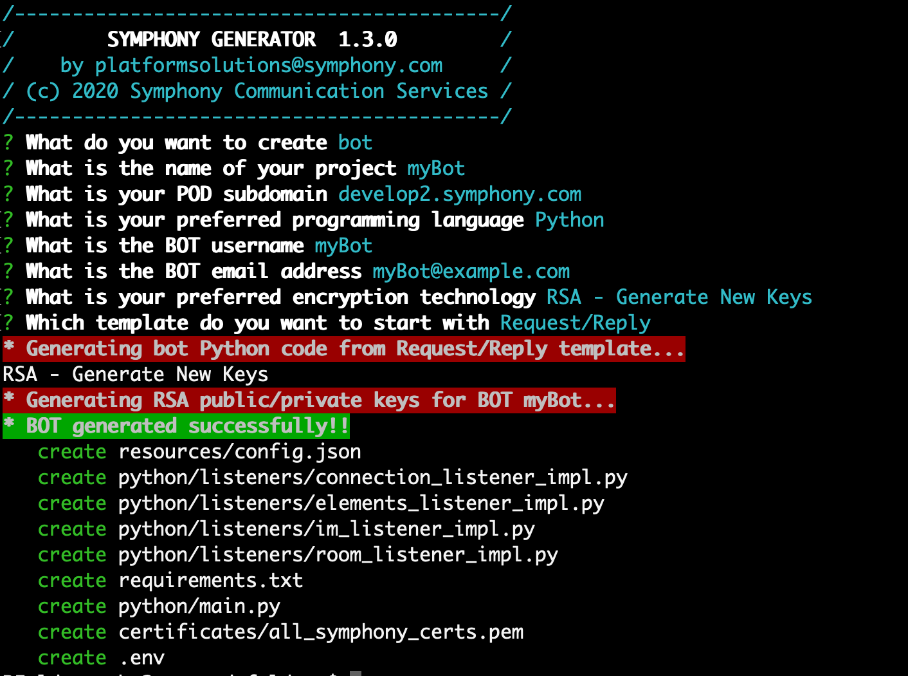

# Symphony Bot Generator

The Symphony Bot Generator is a yeoman based CLI tool that can be used to quickly generate Symphony bot and app project scaffolds. The Symphony Bot Generator is supported across 4 different languages:

* Java
* Python
* Node.js
* C#

## Quick Start

Install the Symphony Bot Generator:

```
$ npm i -g generator-symphony
```

Create a new directory and go into it:

```
$ mkdir myBot && cd myBot
```

Run Symphony BDK Generator and follow instructions in your terminal:

```
$ yo symphony
```

Configure your Bot and environment accordingly:



## Bot Generator 2.0 (Beta)

It is now possible to create BDK 2.0 projects through the Bot Generator. To do so and access the new menu simply run the following:

```
$ yo symphony 2.0
```


Note: At the moment the BDK Generator 2.0 and subsequent BDK 2.0 projects are only available in Java. Support for Python, Node.js and .NET are coming soon.

