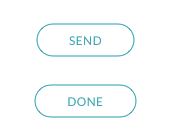
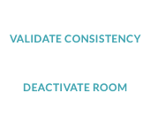
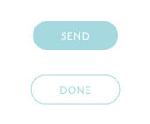
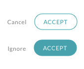
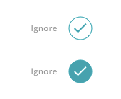

# Buttons


Note: For native support of Buttons, refer to [Symphony Elements](../../../building-bots-on-symphony/symphony-elements/). The following is built for extension applications looking to implement their own button or input logic.


Buttons change color depending on the user’s theming preferences. They are generally the same color as the theme accent color.

Buttons must include the following class to inherit the proper shape:

* `tempo-btn`

You can modify the style of a button by applying any of these additional classes:

* `tempo-btn--primary`
* `tempo-btn--secondary`
* `tempo-btn--link`
* `tempo-btn--disabled`

## General Recommendations

* Have only one primary button per screen or view that displays to the right of all other buttons and links.
* Have only one cancel action button per screen or view that displays to the left of all other buttons and links. Cancel action buttons must follow these design guidelines:
  * Are link style, text only, and gray in color.
  * Have a label of _Cancel_, _Remove_, _Ignore_, or similar text.
  * Are the last button on the left if buttons are horizontally aligned.
* Have up to two secondary buttons to the left of the primary button.
* Third-level buttons \(or tertiary buttons\) are generally icons or plain text links. Do not place third-level buttons inline with standard size buttons.
* Do not use compact buttons with standard size buttons. We recommend using compact buttons only when space prohibits the using standard size buttons.

## Primary

Use the Primary button style when there is a clear primary action on a page or for a message. Avoid displaying multiple primary buttons within the same context. We recommend that a primary button always displays to the right of any other buttons. The image below shows a Primary button style adjacent to a text link.

```markup
<div class="tempo-btn tempo-btn--primary">Button</div>
```


## Secondary

Use the Secondary button style when there are multiple actions of the same importance or some actions with less importance than a single primary action. You can align multiple secondary buttons vertically or horizontally on the interface. If you align multiple buttons in a horizontal row, we recommend a maximum of three buttons: one primary and two secondary.

```markup
<div class="tempo-btn tempo-btn--secondary">Button</div>
```



## Link

Link buttons are similar to secondary action buttons, while being more discreet. Use links for situations when there are many secondary actions, particularly when these actions are stacked, included in tables, or part of other interface elements within messages.

```markup
<div class="tempo-btn tempo-btn--link">Button</div>
```



## Disabled

Use the Disabled button style to show that an action is currently unavailable. You can use this style with the Primary, Secondary, and Link styles.

```markup
<div class="tempo-btn tempo-btn--<style> tempo-btn--disabled">Button</div>
```



## Cancel Action

Use this style for situations where a user can choose one of two actions: cancel and complete.


## Compact

You can apply the Compact style to the Primary, Secondary, and Link styles. This style reduces the button’s size for optimal display in compact environments.

**Note**: Do not use compact buttons with standard size buttons. We recommend using compact buttons only when space prohibits the use of standard size buttons.



## Icon Buttons

Use Icon buttons when there is limited space and the action can be represented by an icon, such as a checkmark. You can use the Icon style for Primary, Secondary, Disabled, and Compact buttons.



## Icon Action

Use the Icon Action style for situations where you don’t need a button; for example, a 5-star rating scale. Icon Actions must meet the following requirements:

* Format: .svg
* Size: 18 x 18 pixels
* Color: Black and white or color
* State: Normal is 54% opacity; Hover/Active is 87% opacity

