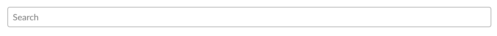

# Form Elements


Note: For native support of input fields and buttons, refer to [Symphony Elements](../../../building-bots-on-symphony/symphony-elements/).  The following is built for extension applications looking to implement their own button or input logic.  


Using form element styles will make your apps look native to the users. Things like theming and performance optimization will be applied automatically:

```markup
<input type="text" class="tempo-input-standard" placeholder="Search" />
```




