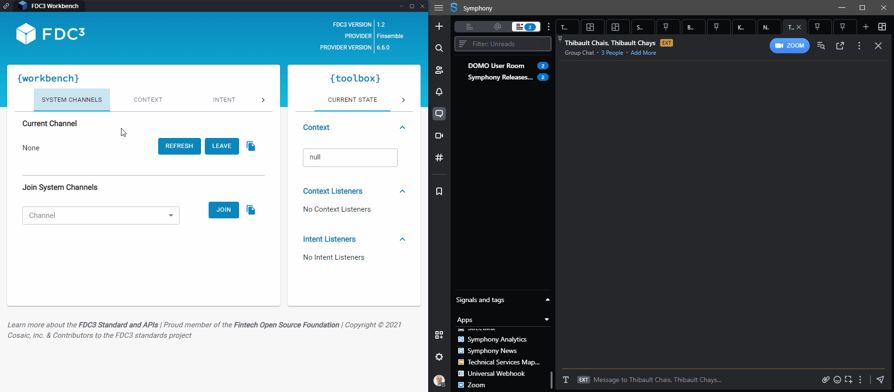

# FDC3 intents

## Inbound intents

### Start chat

Symphony will listen to _StartChat_ intents, that allow an app to initiate a chat on Symphony with an optional message, and an optional list of contacts.

When a _StartChat_ intent is received by Symphony, a modal opens where the user can review the list of recipients and the content of the message, and then send the message.

It is possible to attach a message context to the intent. The message may contain images, $cashtags, @mentions, as well as action buttons (more info [below](./#fdc3-action-buttons)), which on click will trigger a local intent with context data. The **format of the message** is presented [here](message-format.md).

It is possible to preset the list of contacts, who will be identified through their email addresses. When several contacts are listed, the message is sent to a group chat with all the contacts in the list.



#### Example: Simple example with a predefined recipient and message:



```javascript
fdc3.raiseIntent('StartChat', {
  "type": "fdc3.chat.initSettings",
  "message": {
    "text": {
      "text/markdown": "Hello there!"
    }
  },
  "members": {
    "type": "fdc3.contactList",
    "contacts": [
      {
        "type": "fdc3.contact",
        "id": {
          "email": "pierre.neu@symphony.com"
        }
      }
    ]
  }
});
```



 (1).png>)



#### FDC3 action buttons

Messages sent through the _StartChat_ intent can contain FDC3 action buttons with predefined intents and context data.

The FDC3 action buttons will be displayed as inline buttons in the message. When such a button is clicked, Symphony raises the predefined intent along with its context data.&#x20;

Read [here ](message-format.md)how to add FDC3 action buttons to your messages.

#### Intent return values

As part of the support of FDC3 version 2.0, the _StartChat_ intent now returns to the calling app the IDs of the chat conversations where the message has been sent. It is then possible to directly target these rooms in a further call, using the _Send Chat Message_ intent described below.

### Send chat message

Similar to _StartChat_, the _SendChatMessage_ intent allows to send a chat message directly in a specific chat in Symphony, by specifying the identifier of a chat room.

This works particularly well in combination with the _StartChat_ intent, which now returns the identifier of the chat conversations where the message has been sent.

#### **Example: Combining **_**Start chat**_** and **_**Send chat message**_

```javascript
// Start a chat and retrieve a reference to the chat room created
const intentResolution = await fdc3.raiseIntent("StartChat", {
  "type": "fdc3.chat.initSettings",
  "message": {
    "text": {
      "text/markdown": "Hello there!"
    }
  });  
const chatRoom = intentResolution.getResult();


//Some time later
let chatMessage: ChatMessage = {
    "type": "fdc3.chat.message",
    chatRoom,
    "message": "Another message to send in the room"
}
await fdc3.raiseIntent("SendChatMessage", chatMessage, intentResolution.source);
```

### View messages

Symphony now listens to _ViewMessages_ intents, that allow FDC3 apps to display in Symphony the list of chat messages that contain a specified **$cashtag** or **#hashtag**.

When a _ViewMessages_ intent is received, Symphony displays a modal with the Signal View, showing all matching messages.

#### **Example 1:** Display all received messages matching the $cashtag _$EURUSD_



```javascript
fdc3.raiseIntent('ViewMessages', {
    "type": "fdc3.searchCriteria",
    "contexts":[
	{
		"type": "fdc3.instrument",
		"id": {
			"ticker":"EURUSD"
		}
	}
});
```



<figure><figcaption><p>View all messages received that contained the specified cashtag.</p></figcaption></figure>



#### Example 2: Display all received messages containing the #hashtag _#SUP-15478_



```javascript
fdc3.raiseIntent('ViewMessages', {
  "type": "fdc3.searchCriteria",
  "contexts": [
    "#SUP-15478"
  ]
});
```



<figure><figcaption><p>View all messages received that contained the specified hashtag.</p></figcaption></figure>



## **Outbound intents**

### **View instrument (cashtag hovercard)**&#x20;

When hovering over $cashtags, an FDC3 _ViewInstrument_ action will be displayed.&#x20;

On click, Symphony will raise the _ViewInstrument_ intent, with the ticker as context data (fdc3.instrument).


### **View contact (user & profile hovercard)**

When hovering on a user mention or name in a Symphony chat, a profile hovercard is displayed, which now contains a new FDC3 **View contact** __ button.

On click, Symphony will raise the _ViewContact_ intent, with the user as context data (fdc3.contact).

<figure><figcaption></figcaption></figure>

The new action is also available from the profile pages.

<figure><figcaption></figcaption></figure>

### **Custom intents**

Symphony can trigger custom intents from in-chat FDC3 action buttons.&#x20;

When clicking such a button, Symphony raises the predefined intent with the attached context data to local apps.

Read [here ](message-format.md)how to add FDC3 action buttons in your chats.
