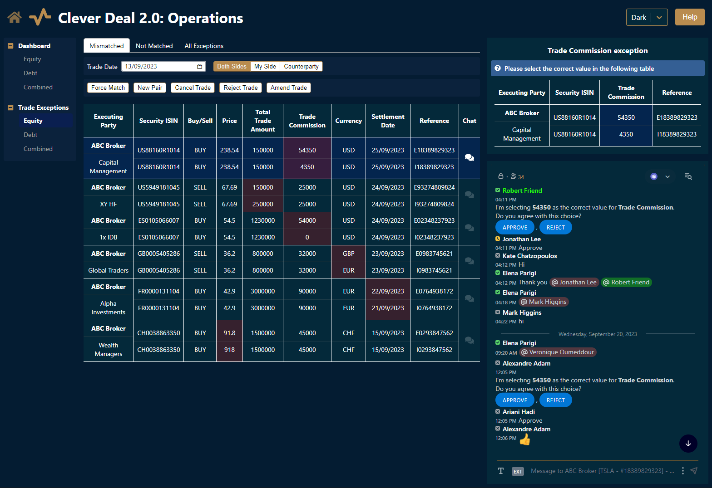
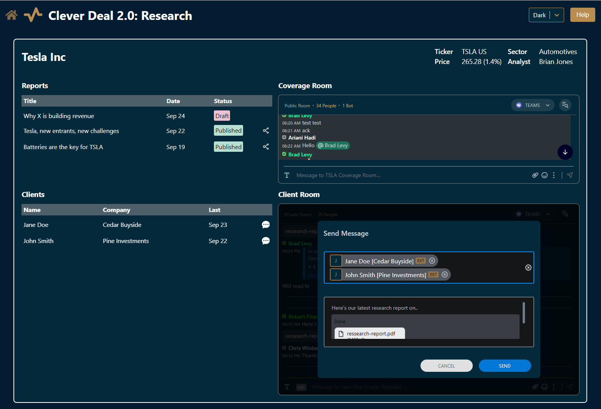
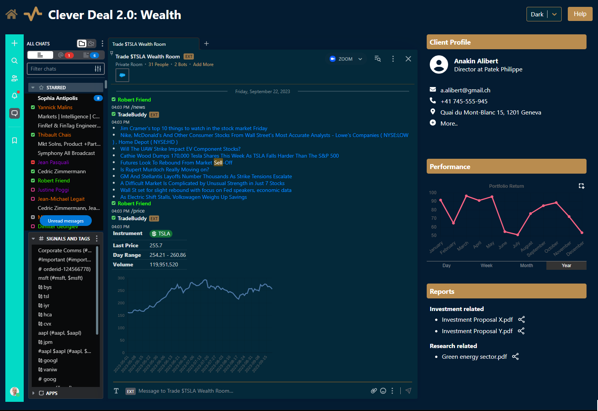

# Embedded Mode

<figure><figcaption>
<em>Example: Integration of a Symphony Messaging chat within a web app</em>
</figcaption></figure>

**Embedded Mode** allows you to embed Symphony Messaging within your application to provide full collaboration capabilities to your users. Your users can collaborate with half a million people across thousands of institutions on the Symphony network without leaving your platform. This allows you to add Symphony Messaging's secure and compliant chat capabilities to your application, unlocking instant external connectivity and workflow efficiency.


**Note: Embedded Mode** is available as an add-on to the Symphony Services, and is subject to additional charges, terms, and Symphony review of your Embedded Mode use case. Prior to using Embedded Mode in your Symphony Messaging environment(s), you will need to enter into an Embedded Mode-specific contract. Please reach out to [sales@symphony.com](mailto:sales@symphony.com) to review your use case, discuss the offering, its pricing or for any further information.


&#x20;_**Access**_ [_**this page**_](https://symphony.com/products/embedded-collaboration-platform/) _**to discover which workflows our Embedded Mode offering can unlock for you, or to contact Sales.**_

## Features

[Embedded Mode](https://symphony.com/solutions/embedded-collaboration-platform/) allows you to embed standalone Symphony Messaging chat modules inside your own websites or any of your solutions that support web views.

It also supports extensive customization and exposes APIs to create rooms or register for notifications.&#x20;

Some of the advanced features are only available for specific [plans](pricing-tiers.md).&#x20;

Access the [Resources ](./#resources)section, which provides some examples on GitHub, watch our recorded webinar with a live coding session, and get access to a sandbox.


Embedded Mode replaces the previous Embedded Chat Module, which is now deprecated.


### Supported browsers

The following browsers are supported:

* Edge 90+
* Chrome 90+

### Focus and Collaboration modes

The Symphony Messaging Embedded Mode supports two modes:

* **Focus**, where a single chat is displayed.&#x20;

In Focus mode, you can still display several chats on the screen, but each one will be placed in its own module.

* **Collaboration**, where the full list of chat conversations is displayed, allowing the user to switch chat conversations, create a room, search for users or rooms, view unread messages, etc.

When reduced to a width of less than 700px, the Collaboration mode window automatically enters Mini view for a better user experience. Some features, such as extension applications, signals and activity feed, are not available in Mini view mode.




<figure><figcaption>
<em>Embedded Mode - Focus: Single chat</em>
</figcaption></figure>



<figure><figcaption>
<em>In Collaboration mode, users can see a simplified version of the full Symphony Messaging app.</em>
</figcaption></figure>



_In Collaboration mode (Mini view), users can work in a narrow version of the Symphony Messaging desktop app._



**Recommended minimum view size:**

* **Focus** mode: Width 312px , Height 348px
* **Collaboration** mode: Width 350px , Height 500px

### Configuration parameters&#x20;

In addition to the **Focus** and **Collaboration** modes, it is also possible to configure other aspects of Embedded Mode. For more information, refer to the [Configuration parameters](configuration-parameters.md).

### How to load Embedded Mode

There are several ways to load Embedded Mode, depending on the technical constraints of your web app. For more information, refer to our [Get started](get-started.md) guide.

### Embedded Mode APIs

Once Embedded Mode is loaded, it offers a number of capabilities:

* Quickly **open an existing chat** or create one (more information [here](open-a-chat.md)).
* **Send a message** to an existing room or to a list of users (more information [here](broken-reference)).&#x20;
* Keep track of the chat activity, through a **notification feed** (more information [here](notifications.md)).
* Be informed if the **user is active or not** (more information [here](notifications.md#activity-notifications)).

### Support for extension applications

It is possible to load extension applications in Embedded Mode (more information [here](https://docs.developers.symphony.com/embedded-modules/embedded-mode/support-for-extension-applications)).

## Resources

#### Webinar

Watch our [webinar that introduces Embedded Mode and shows a live coding session](https://symphony.com/2022/09/07/build-a-bot-session-introduction-to-symphony-ecp-embedded-collaboration-platform/).

#### Examples

Get started by looking at few Embedded Mode examples in this [GitHub repository](https://github.com/SymphonyPlatformSolutions/ecp-examples).\
One of the examples, _index-webinar-demo.html_, is covered during the webinar and may be a very good starting point. The other examples assume you are familiar with the React framework.

The [Cleverdeal examples](https://github.com/SymphonyPlatformSolutions/ecp-examples/tree/master/AppExamples/CleverDeal.React) are a set of advanced Embedded Mode integrations covering four use cases: Investment, Operations, Research and Wealth. Hopefully one of them will give you a good starting point on how to integrate Embedded Mode in your own portal.

<figure><figcaption>
Investments
</figcaption></figure> <figure><figcaption>
Operations
</figcaption></figure> <figure><figcaption>
Research
</figcaption></figure> <figure><figcaption>
Wealth
</figcaption></figure>

#### Sandbox

You can access a sandbox version of Embedded Mode, where you can easily test the configuration parameters, the two modes (**Focus** or **Collaboration**), as well as initiate a new message. \
\
The sandbox is available at:\
`https://{your_pod_url}.symphony.com/embed/sandbox.html`

You can load a specific conversation by adding a `streamId` as a query parameter:\
`https://{your_pod_url}.symphony.com/embed/sandbox.html?streamId=r2z0c14BJnF9bfsUbZRPN3///oP8vpocdA==`

**Note:** You can update the configuration parameters using the settings wheel in the navigation bar. &#x20;

<figure><figcaption>
<em>The Embedded Mode sandbox is available for all Symphony Messaging instances and allows you to quickly test out the Embedded Mode settings.</em>
</figcaption></figure>

