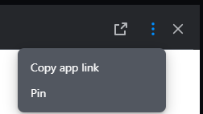

# User guide

## Setting up a new webhook in a chat room

1. First, add the Universal Webhook bot into the chat room, by clicking **Add members** at the top of the chat room, then searching for **Universal Webhook**.&#x20;


**Notes**:&#x20;

* The bot may be named differently, in that case please contact your admin to have the right name.
* The bot needs permission to send messages in the chat. If your chat is configured to prevent members from posting messages, then promote the bot as chat owner instead.


2. Once the bot is in the chat, **click on the Universal Webhook button** that appeared in the header of the chat room, as visible below:&#x20;

<figure><figcaption></figcaption></figure>


If you don't see the button in the chat header please check the following:

* You need to be an **owner** of the chat to configure a webhook.&#x20;
* You may not be entitled to the Universal webhook **app** - Check the Marketplace to see if the app is installed for you.
* Confirm with your admin that you added the **right bot** to the chat - It may be named differently than 'Universal Webhook'


3. A modal window opens that lists the webhooks already configured for this chat. Now, select **Add a webhook**.

<div align="left"><figure><figcaption></figcaption></figure></div>

4. Add a **name** for your webhook. Anything will do - this is so you can identify the webhook later.&#x20;
5. In the **Integrated service** field, indicate which service will be sending data to Symphony Messaging.

<div align="left"><figure><figcaption></figcaption></figure></div>

6. Select whether the service will send Raw Text, MessageML v2 (Symphony Messaging's markup language), or a JSON object in the **Webhook type** field.&#x20;

You can find the specifications of the MessageML v2 under the following link: [MessageML v2 Specifications](https://docs.developers.symphony.com/building-bots-on-symphony/messages/overview-of-messageml).

Also, note that your webhooks can contain attachments for any type you choose. This particular case is addressed at the end of this page.

<div align="left"><figure><figcaption></figcaption></figure></div>

### Testing a JSON mapping

If your service sends a JSON object, you will need to provide a template for mapping the JSON data to a readable format.

<div align="left"><figure><figcaption></figcaption></figure></div>

1. Enter your template and a sample of JSON data.
2. Click **Test** to see how your message will render.&#x20;

If your message is valid, the bot will send you the message in a direct chat. If not, an error message will advise you why your template or data is not valid.

<div align="left"><figure><figcaption></figcaption></figure></div>

## Authentication

### Unauthenticated webhooks

&#x20;In the **Security type** field, you can choose the security protocol that validates the incoming data.

If your Symphony Messaging Admin has permitted it, you will have an option for Unauthenticated Webhooks. In this case, incoming data will not be validated.

Symphony recommends using a security protocol to validate the data, even if you are not required to do so.

<div align="left"><figure><figcaption></figcaption></figure></div>

### Shared Secret authentication

If you choose 'Shared Secret,' your data will require a secret to be sent along with it under a custom header.

<div align="left"><figure><figcaption></figcaption></figure></div>

1. Choose a **custom header** for your webhook. Any data sent without this header will be rejected.
2. Enter a **secret value**. Universal Webhook will match this value with the value under the header you chose above to validate your webhook data.

### HMAC Secret authentication

If you choose 'HMAC Secret,' your data will require a secret to be sent along with it under a custom header. The value of the secret header will however be a hash that will be depend both on the content of the payload as well as on the pre-configured secret.

More precisely, Universal Webhook will use the HMAC SHA256 algorithm to compute a hash from the payload of your message and the secret key. Then it will match the result with the value of the custom header received in the webhook, which you will have also computed before sending in a similar way.&#x20;

If the values don't match, then the data will be rejected.

<figure><figcaption></figcaption></figure>

1. Choose a **custom header** to use for your webhook. The custom header name needs to be <mark style="color:red;">**lower case only**</mark>. Any data sent without this header will be rejected. Let's use `"authorisation"` for our example.
2. Enter a **secret value**. Let's use `"this is my secret"`
3. Build the text to be hashed: Take the value of the `message` property, remove the `<messageML>` tags, then wrap it in a JSON payload property:
   * For example message `<messageML>Hello world!</messageML>` would become `{"payload":{"message":"Hello world!"}}`
4. Using the HMAC SHA256 hash function, compute a hash of the text above using the secret `"this is my secret"` as secret key.
   * Using the sample secret defined above, you should obtain the following hash `8de567399a49f3ed91ed55435c0887c7c935413e01cbd7a2ac06dab1b04cc1c6`
5. Send the request to the webhook URL and specify in the http headers the custom header and the computed hash as value:&#x20;
6.

    <figure><figcaption><p>Example in Postman</p></figcaption></figure>
7. Universal Webhook will perform the same steps, compute the hash and compare it with the provided hash. If the values match, the message will be sent in the chat room.

## Integrating with your service

1. Click **Save and activate** to create your webhook.
2. **Copy** the provided URL and enter it where it is needed in your service's settings.

<div align="left"><figure><figcaption></figcaption></figure></div>

## Example with Postman

Consider this sample setup using Shared Secret validation.

<div align="left"><figure><figcaption></figcaption></figure></div>

1. Fill in the fields and click **Save and Activate**.
2. **Copy** the generated URI to provide to the service that will send data to the webhook.

<div align="left"><figure><figcaption></figcaption></figure></div>

3. In Postman, create a new POST method and paste in the URI.

<div align="left"><figure><figcaption></figcaption></figure></div>

4. In the Headers, enter the Shared Secret Header and the Secret to match the values from the webhook setup.

<div align="left"><figure><figcaption></figcaption></figure></div>

5. In the Body, enter a raw text or MessageML v2 message to send, then click the **Send** button.

<div align="left"><figure><figcaption></figcaption></figure></div>

<div align="left"><figure><figcaption></figcaption></figure></div>

After a moment, you should see a '200 OK' success indicator in Postman.

<div align="left"><figure><figcaption></figcaption></figure></div>

And in Symphony Messaging, Universal Webhook delivers your message.

<div align="left"><figure><figcaption></figcaption></figure></div>

## View your webhooks

Now, when you open the Universal Webhook Modal, all of the webhooks for the room will appear in a list.

From this list, you can deactivate, edit, or delete a webhook. Webhooks must be activated in order to work.

<div align="left"><figure><figcaption></figcaption></figure></div>

If you hover over the webhook name, an icon will appear.&#x20;

* Click this icon to copy the webhook URL to your clipboard.

<div align="left"><figure><figcaption></figcaption></figure></div>

* Click the webhook name to show the webhook history.

### View your webhook history

The webhook history view shows a high-level view of your webhook information, but doesn't expose your security secrets.

You are able to see all accepted and rejected requests over the last month. Filters will allow you to limit which requests you see.

* Click any item in the list of requests to expand it so you can see more information.
* Click the item again to collapse.

<div align="left"><figure><figcaption></figcaption></figure></div>

## Send attachments in Symphony Messaging

To attach files to a webhook, set the`Content-Type` header to `multipart/form-data` and add the attachments in the`attachment` field.\
You can also include a preview of the files that will be displayed directly in the chat conversation, using the `preview` field.

The way to attach files depends on the type of webhook used (MessageML v2, Raw text, or JSON). An example of each type is available below.

**MessageML example**

Example of a MessageML webhook with a file attached, in Postman.&#x20;

<figure><figcaption></figcaption></figure>

**Raw text example**

Despite the webhook being of type Raw text, please continue to set the content type to `multipart/form-data`, as you can see in the following example.

<figure><figcaption></figcaption></figure>

**JSON example**

With a JSON webhook, the message data needs to be added to the `data` field.&#x20;

Example in Postman:

<figure><figcaption></figcaption></figure>

Example in cURL:

```
curl --location 'https://corporate.symphony.com/universal-webhook/041daxxxxxxxc4eXYZ' \
--header 'secret: thisismysecret' \
--form 'data="{\"mydata\":\"This is a message\"}"' \
--form 'attachment=@"/C:/Users/pierre.neu/Downloads/image (19).png"'
```

Corresponding JSON template:

```xml

<messageML>
  ${entity['mydata']}
</messageML>
```

### Adding preview of the files

Postman request sample of MessageML v2 type with an attachment and its preview:

<div align="left"><figure><figcaption></figcaption></figure></div>

Display of the resulting message in a chat:

<div align="left"><figure><figcaption></figcaption></figure></div>

### **Limits of attachments**

Attachments are subject to the following limits:

* Max size of 1Mb;&#x20;
* It is recommended not to exceed 25 files;&#x20;
* It is possible to use a preview with the attachment; please note that an error will be returned if the number of previews doesn't match the number of attachments if any preview is present in a webhook;&#x20;
* You might get an error if you try to send attachments which type is not supported by your pod.
