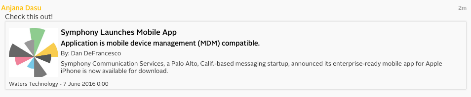
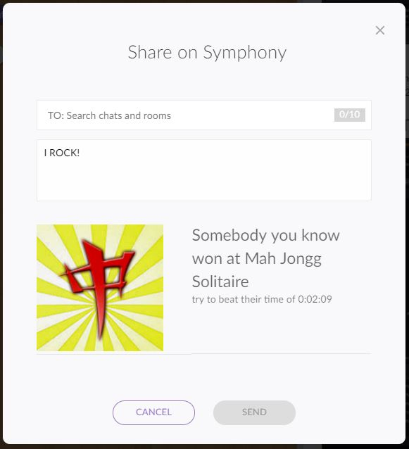

# Share Service

Use the `share` service to allow users to share content from your application into Symphony conversation:

```javascript
// To use the share service, you must subscribe to it from your application
var shareService = SYMPHONY.services.subscribe("share");
```

When the share function is invoked, a modal dialog is launched and populated with the shared object content (for example, the article options). The end user can then select conversations (IMs or chatrooms) into which to share the article.

Once the article is shared, it appears in the conversation view in a card format. The article will be linked either to a webpage (if the `href` option is provided) or deep linked into the app (if the `id` option is provided).



In order to view article contents in an application (for example, if the article `id` is provided), the user must have the application installed.

If the recipient of a shared article does not have the application installed, the user will be prompted to install the application (provided that the user's enterprise has that application enabled).

If the recipient of a shared article does not have the application installed, and the application is not enabled for the user's enterprise, the user can view the content via the link (if `href` is provided). If a link is not provided, the user will be notified that the article cannot be viewed because the application is disabled for the enterprise.

The following methods are available on the `share` service:

## share()

Launches the "Share on Symphony" modal from your application, allowing the user to share content from your application into a Symphony conversation (IM or chatroom):

```javascript
function share(type, content, options)
```

<table data-header-hidden><thead><tr><th width="123">Parameter</th><th width="98">Type</th><th width="106">Required</th><th>Description</th></tr></thead><tbody><tr><td>Parameter</td><td>Type</td><td>Required</td><td>Description</td></tr><tr><td>type</td><td>String</td><td>Yes</td><td>The type of content that is being shared.</td></tr><tr><td>content</td><td>Object</td><td>Yes</td><td>An object that describes the content being shared. For a list of objects see <a href="broken-reference">standard entities</a>.</td></tr><tr><td>options</td><td>Object</td><td>No</td><td>An object that describes options that can be used to enhance the share service</td></tr></tbody></table>

The following JavaScript shows an example of an article being shared:

```javascript
// This code will live in your application view.

// Assume there is a button element with id "share" on the application module
// If that button is clicked, launch the Share modal.

var shareButton = document.getElementById("share");

var articleContent = {
  title: "Symphony Launches Mobile App",
  subTitle: "Application is mobile device management (MDM) compatible.",
  blurb: "Symphony Communication Services, a Palo Alto, Calif.-based messaging startup, announced its enterprise-ready mobile app for Apple iPhone is now available for download.",
  date : new Date("07 June 2016").getTime() / 1000,
  publisher: "Waters Technology",
  author: "Dan DeFrancesco",
  id: "symphony-article",
  thumbnail: 'https://symphony.com/example/image.png',
  href: 'https://symphony.com'
};

var shareOptions = {
  prepopulateUsers: ['71811853190920', '71811853190903']
};

// Launch Symphony's share modal when the Share button is clicked
shareButton.addEventListener("click", function(){
  shareService.share(
    "article",
    articleContent,
    shareOptions
  );
});
```

The following table shows the article content:

<table data-header-hidden><thead><tr><th width="153">Field</th><th width="213">Required</th><th width="132">Format</th><th>Description</th></tr></thead><tbody><tr><td>Field</td><td>Required</td><td>Format</td><td>Description</td></tr><tr><td><code>title</code></td><td>Yes</td><td>String</td><td>The headline of the article</td></tr><tr><td><code>subTitle</code></td><td>No</td><td>String</td><td>The subtitle of the article</td></tr><tr><td><code>blurb</code></td><td>No</td><td>String</td><td>A summary of the article to display</td></tr><tr><td><code>date</code></td><td>No</td><td><a href="https://www.epochconverter.com/">Unix Epoch Timestamp</a></td><td>Date of publication</td></tr><tr><td><code>publisher</code></td><td>No</td><td>String</td><td>Name of the publisher</td></tr><tr><td><code>author</code></td><td>No</td><td>String</td><td>Name of the author</td></tr><tr><td><code>thumbnail</code></td><td>No</td><td>URL (could be a data url)</td><td>Image to be displayed - 106px-106px</td></tr><tr><td><code>id</code></td><td>Must provide either <code>id</code> or <code>href</code>, or both</td><td>String</td><td>An identifier used by the application to deeplink to the article</td></tr><tr><td><code>href</code></td><td>Must provide either <code>id</code> or <code>href</code>, or both</td><td>URL</td><td>URL to the article (opened in a new browser window)</td></tr></tbody></table>

The following table shows the share options:

<table data-header-hidden><thead><tr><th width="205">Field</th><th width="104">Required</th><th width="101">Format</th><th>Description</th></tr></thead><tbody><tr><td>Field</td><td>Required</td><td>Format</td><td>Description</td></tr><tr><td><code>prepopulateUsers</code></td><td>No</td><td>Array of strings</td><td><p>The users (UserIds) who will be listed initially as recipients in the share modal.<br></p><p><em>Available only for authenticated apps, and only for Client 2.0.</em></p><p><em>It is recommended to limit the number of pre-populated users so the Symphony end user can easily review the list of recipients before sharing.</em></p></td></tr></tbody></table>

## Sharing Third Party Content

The `share` function can also be used to share custom, third-party entity types. In this case, the `data` parameter must be populated with the following fields:

<table data-header-hidden><thead><tr><th width="176">Field</th><th>Description</th></tr></thead><tbody><tr><td>Field</td><td>Description</td></tr><tr><td>inputAutofill</td><td>Use this to fill the comment field in the share dialog to provide initial text. Cash tags and hash tags that are specified in the text will be converted to the correct entity.</td></tr><tr><td>plaintext</td><td>The markdown representation of the entity, supporting a limited set of markdown features. The value of this field will be displayed on mobile devices and other older clients.</td></tr><tr><td>presentationML</td><td>The default presentation of the entity using <a href="../../../bots/messages/overview-of-presentationml.md">presentationML</a>. This will be seen by everybody who does not have an app with a custom renderer for the given type.</td></tr><tr><td>entityJSON</td><td>The object being shared.</td></tr><tr><td>format</td><td>The format of the message being sent. This must be set to "com.symphony.messageml.v2".</td></tr></tbody></table>

The following JavaScript shows an example of a custom third party entity being shared:

```javascript
share : function(gameNbr, time)
{
    var fullTime = time;
    var hours = Math.floor(time / 60 / 60 / 1000);
    time -= hours * 60 * 60 * 1000;
    var minutes = Math.floor(time / 60 / 1000);
    time -= minutes * 60 * 1000;
    var seconds = Math.floor(time / 1000);
    var duration = hours.toString() + ':' + minutes.toString().pad(2, '0', 'left') + ':' + seconds.toString().pad(2, '0', 'left');

    var title = 'Somebody you know won at Mah Jongg Solitaire';
    var blurb = 'try to beat their time of ' + duration;
    var date = new Date().getTime() / 1000;
    var thumbnail = this.thumb;
    var id = JSON.stringify({gameNbr: gameNbr, time: fullTime});

    var presentationML =`
        <entity>
            <table><tr>
                <td></td>
                <td>
                    <h1>${title}</h1>
                    ${blurb}
                </td>
            </tr></table>
        </entity>`;

    var entityJSON = {
        date: date,
        thumbnail: thumbnail,
        results: id,
        time : time,
        gameNbr : gameNbr,
    };

    var data = {
        plaintext: `*${title}*\n${blurb}\n`,
        presentationML : presentationML,
        entityJSON: entityJSON,
        entity: {},
        format: 'com.symphony.messageml.v2',
        inputAutofill : 'I ROCK!',
    }
    this.shareService.share('com.symfuny.invite.won', data);
}
```

In this example, the following modal dialog is launched and populated with the shared object content:



## handleLink()

You must specify your own application service for handling clicks on shared articles using `handleLink` if you use the `id` field for deep linking articles into your application.

You must implement the `link` method on your application service in order to handle clicks on shared articles in conversations.

```javascript
// This code will live in your application controller.

// The application service that will be used to handle clicks on shared articles
var helloControllerService = SYMPHONY.services.register("hello:controller");

// Assume you have registered your application with the Symphony client and subscribed to the Share service.

shareService.handleLink("article", "hello:controller");

helloControllerService.implement({
    // You only need to implement this function if you intend to deeplink articles into your app by specifying an id for the article. If you use href, then article links will open in a new browser window.
  link: function(type, articleId) {
    if(type == "article") {
      // Implement this
      // For example, you might launch a new application module with a url that includes the articleId in the query parameters
      console.log("Article with id: " + articleId + " was clicked.");
    }    
  }
});
```
